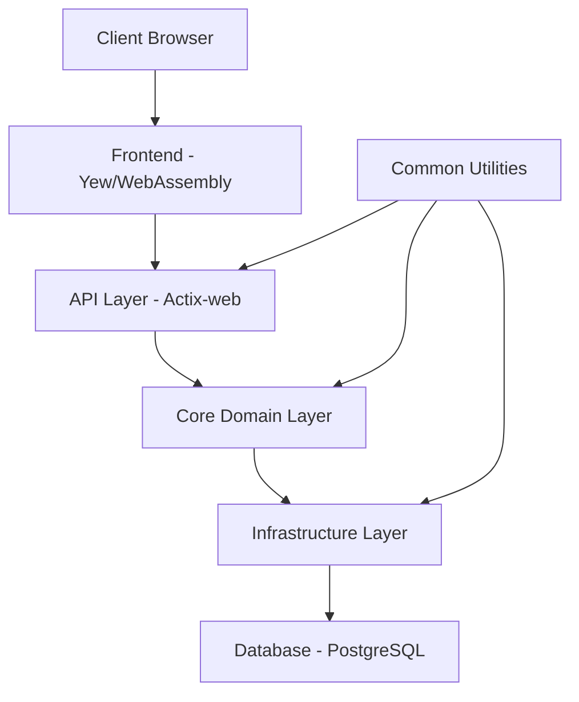

# OxidizedOasis-WebSands Architecture Review

## Executive Summary

This document provides a comprehensive review of the OxidizedOasis-WebSands architecture, analyzing its current implementation, identifying strengths and areas for improvement, and offering recommendations for future development. The review focuses on the system's core components, their interactions, and alignment with project goals.

OxidizedOasis-WebSands demonstrates a well-structured Rust-based web application with a clean architecture approach, strong security implementation, and good separation of concerns. The system effectively leverages Rust's performance and safety features while providing a modern web experience through WebAssembly.

**Key Findings:**
- Strong architectural foundation with clean separation of concerns
- Robust security implementation with comprehensive JWT authentication
- Well-designed database schema with proper relationships
- Effective use of Rust's type system and safety features
- Areas for improvement in scalability, monitoring, and documentation

**Overall Assessment:** The architecture is well-designed and provides a solid foundation for future development. With targeted improvements in specific areas, the system can achieve even greater performance, security, and maintainability.

## Table of Contents

1. [Introduction](#introduction)
2. [Architectural Overview](#architectural-overview)
3. [Component Analysis](#component-analysis)
4. [Security Architecture](#security-architecture)
5. [Data Architecture](#data-architecture)
6. [Performance Considerations](#performance-considerations)
7. [Scalability Analysis](#scalability-analysis)
8. [Maintainability Assessment](#maintainability-assessment)
9. [Architectural Strengths](#architectural-strengths)
10. [Areas for Improvement](#areas-for-improvement)
11. [Recommendations](#recommendations)
12. [Conclusion](#conclusion)

## 1. Introduction

### 1.1 Purpose and Scope

This architecture review evaluates the OxidizedOasis-WebSands project, a high-performance web application built with Rust, Actix-web, and WebAssembly. The review aims to:

- Analyze the current architectural design and implementation
- Identify architectural strengths and weaknesses
- Assess alignment with project goals and requirements
- Provide recommendations for architectural improvements

### 1.2 Methodology

The review methodology included:

- Analysis of project structure and organization
- Review of code architecture and patterns
- Evaluation of security implementation
- Assessment of database design
- Analysis of frontend architecture
- Review of documentation and specifications

### 1.3 Project Context

OxidizedOasis-WebSands demonstrates the power of Rust for web development through Actix-web, showcasing how to build high-performance, memory-safe, and concurrent web applications. The project serves as both a practical implementation and a reference architecture for Rust-powered web services.

## 2. Architectural Overview

### 2.1 High-Level Architecture

OxidizedOasis-WebSands follows a layered architecture with clean separation of concerns:



The system is organized into the following major components:

1. **Frontend Layer**: Yew-based WebAssembly application providing the user interface
2. **API Layer**: Actix-web HTTP server handling requests and responses
3. **Core Domain Layer**: Business logic and domain models
4. **Infrastructure Layer**: Technical capabilities like database access and email services
5. **Common Utilities**: Shared functionality across layers

### 2.2 Architectural Patterns

The project implements several architectural patterns:

1. **Clean Architecture**: Clear separation between domain logic and infrastructure concerns
2. **Repository Pattern**: Abstraction of data access logic
3. **Dependency Injection**: Services and repositories injected into handlers
4. **Middleware Pipeline**: Request processing through composable middleware
5. **Service Layer**: Business logic encapsulated in service components

### 2.3 Technology Stack

The technology stack includes:

- **Backend**: Rust with Actix-web framework
- **Frontend**: Rust compiled to WebAssembly using Yew
- **Database**: PostgreSQL with SQLx for type-safe queries
- **Authentication**: JWT-based authentication with refresh tokens
- **Containerization**: Docker with Kubernetes orchestration
- **Build Tools**: Cargo for Rust, Trunk for WebAssembly

## 3. Component Analysis

### 3.1 Backend Components

#### 3.1.1 API Layer

The API layer is well-structured with clear separation of routes, handlers, and responses:

```rust
// Example route configuration
pub fn configure_routes(cfg: &mut web::ServiceConfig) {
    cfg.service(
        web::scope("/api")
            .service(
                web::scope("/users")
                    .route("", web::post().to(create_user))
                    .route("/{id}", web::get().to(get_user))
                    .route("/{id}", web::put().to(update_user))
                    .route("/{id}", web::delete().to(delete_user))
            )
            .service(
                web::scope("/auth")
                    .route("/login", web::post().to(login))
                    .route("/refresh", web::post().to(refresh_token))
                    .route("/logout", web::post().to(logout))
            )
    );
}
```

**Strengths:**
- Clear route organization by resource type
- Consistent RESTful endpoint design
- Proper HTTP method usage
- Middleware application at appropriate scopes

**Areas for Improvement:**
- API versioning strategy not clearly implemented
- Documentation of API contracts could be enhanced
- Rate limiting configuration varies across endpoints

#### 3.1.2 Core Domain Layer

The core domain layer contains the business logic and domain models:

```rust
// Example service implementation
impl UserService {
    pub async fn create_user(&self, input: UserInput) -> Result<User, ServiceError> {
        // Validate input
        let validated_input = self.validate_user_input(input)?;
        
        // Hash password
        let password_hash = hash_password(&validated_input.password)?;
        
        // Create user
        let user = self.user_repository
            .create_user(validated_input, password_hash)
            .await?;
            
        Ok(user)
    }
}
```

**Strengths:**
- Clear separation of business logic from infrastructure
- Domain models with strong typing
- Error handling with domain-specific errors
- Service-based organization of functionality

**Areas for Improvement:**
- Some business rules are scattered across services
- Validation logic sometimes duplicated
- Domain events not fully implemented

#### 3.1.3 Infrastructure Layer

The infrastructure layer handles technical concerns:

```rust
// Example database connection pool setup
pub async fn create_pool(config: &DatabaseConfig) -> Result<PgPool, DbError> {
    let pool = PgPoolOptions::new()
        .max_connections(config.max_connections)
        .connect_timeout(Duration::from_secs(config.connection_timeout))
        .connect(&config.connection_string)
        .await
        .map_err(|e| DbError::ConnectionError(e.to_string()))?;
        
    Ok(pool)
}
```

**Strengths:**
- Clear abstraction of infrastructure concerns
- Configuration-driven setup
- Error handling with specific error types
- Connection pooling for performance

**Areas for Improvement:**
- Limited instrumentation for monitoring
- Retry mechanisms not consistently implemented
- Configuration validation could be enhanced

### 3.2 Frontend Components

#### 3.2.1 Component Structure

The frontend uses Yew's component-based architecture:

```rust
// Example Yew component
#[derive(Properties, Clone, PartialEq)]
pub struct UserProfileProps {
    pub user_id: String,
}

#[function_component(UserProfile)]
pub fn user_profile(props: &UserProfileProps) -> Html {
    let user_state = use_state(|| None::<User>);
    let error_state = use_state(|| None::<String>);
    
    // Fetch user data
    {
        let user_id = props.user_id.clone();
        let user_state = user_state.clone();
        let error_state = error_state.clone();
        
        use_effect_with_deps(move |_| {
            let user_id = user_id.clone();
            let user_state = user_state.clone();
            let error_state = error_state.clone();
            
            wasm_bindgen_futures::spawn_local(async move {
                match fetch_user(&user_id).await {
                    Ok(user) => user_state.set(Some(user)),
                    Err(err) => error_state.set(Some(err.to_string())),
                }
            });
            
            || ()
        }, ());
    }
    
    // Render component
    html! {
        <div class="user-profile">
            if let Some(user) = (*user_state).clone() {
                <h1>{&user.username}</h1>
                <p>{&user.bio}</p>
            } else if let Some(error) = (*error_state).clone() {
                <div class="error">{error}</div>
            } else {
                <div class="loading">{"Loading..."}</div>
            }
        </div>
    }
}
```

**Strengths:**
- Component-based architecture with clear separation
- Proper use of Yew hooks for state management
- Asynchronous data fetching with proper error handling
- Type-safe properties with derived traits

**Areas for Improvement:**
- Component reuse could be enhanced
- State management becomes complex in larger components
- Error handling strategies vary across components

#### 3.2.2 State Management

The frontend uses Yew's context providers for global state:

```rust
// Example context provider
#[derive(Clone, PartialEq)]
pub struct AuthContext {
    pub user: Option<User>,
    pub login: Callback<LoginCredentials, Result<(), String>>,
    pub logout: Callback<(), ()>,
}

#[function_component(AuthProvider)]
pub fn auth_provider(props: &Props) -> Html {
    let user_state = use_state(|| None::<User>);
    
    // Login callback
    let user_state_clone = user_state.clone();
    let login = Callback::from(move |credentials: LoginCredentials| {
        let user_state = user_state_clone.clone();
        // Login implementation
        // ...
        Ok(())
    });
    
    // Logout callback
    let user_state_clone = user_state.clone();
    let logout = Callback::from(move |_| {
        user_state_clone.set(None);
    });
    
    // Create context
    let context = AuthContext {
        user: (*user_state).clone(),
        login,
        logout,
    };
    
    html! {
        <ContextProvider<AuthContext> context={context}>
            { props.children.clone() }
        </ContextProvider<AuthContext>>
    }
}
```

**Strengths:**
- Context-based state management for global state
- Clear separation of state and actions
- Type-safe context with proper traits
- Composable providers

**Areas for Improvement:**
- Complex state interactions across multiple contexts
- Performance considerations for frequent context updates
- Debugging complex state flows

## 4. Security Architecture

### 4.1 Authentication System

The authentication system uses JWT tokens with a comprehensive implementation:

```rust
// JWT claims structure
#[derive(Debug, Serialize, Deserialize)]
pub struct Claims {
    pub sub: String,            // Subject (user ID)
    pub exp: usize,             // Expiration time
    pub iat: usize,             // Issued at time
    pub nbf: usize,             // Not before time
    pub jti: String,            // JWT ID (unique identifier)
    pub role: String,           // User role
    pub token_type: TokenType,  // Token type (access or refresh)
}
```

**Strengths:**
- Comprehensive JWT implementation with proper claims
- Dual-token architecture (access and refresh tokens)
- Token revocation capability
- Role-based claims for authorization
- Secure token storage with HttpOnly cookies

**Areas for Improvement:**
- Missing audience and issuer claims
- Token refresh mechanism could be more proactive
- Limited token usage tracking

### 4.2 Authorization System

The authorization system uses role-based access control:

```rust
// Role-based middleware
pub struct RequireRole {
    pub required_roles: Vec<String>,
}

impl<S, B> Service<ServiceRequest> for RequireRole
where
    S: Service<ServiceRequest, Response = ServiceResponse<B>, Error = Error>,
    S::Future: 'static,
    B: 'static,
{
    // Implementation details
    // ...
}
```

**Strengths:**
- Clear role-based access control
- Middleware-based implementation
- Flexible role requirements
- Integration with JWT claims

**Areas for Improvement:**
- Limited granularity in permission model
- Resource-based permissions not fully implemented
- Role hierarchy not clearly defined

### 4.3 Input Validation

The system implements comprehensive input validation:

```rust
// Example validation function
pub fn validate_password(password: &str) -> Result<(), ValidationError> {
    if password.len() < 8 || password.len() > 100 {
        return Err(ValidationError::new("Password must be between 8 and 100 characters"));
    }
    
    if !PASSWORD_UPPERCASE.is_match(password) {
        return Err(ValidationError::new("Password must contain at least one uppercase letter"));
    }
    
    if !PASSWORD_LOWERCASE.is_match(password) {
        return Err(ValidationError::new("Password must contain at least one lowercase letter"));
    }
    
    if !PASSWORD_NUMBER.is_match(password) {
        return Err(ValidationError::new("Password must contain at least one number"));
    }
    
    if !PASSWORD_SPECIAL.is_match(password) {
        return Err(ValidationError::new("Password must contain at least one special character"));
    }
    
    Ok(())
}
```

**Strengths:**
- Comprehensive validation rules
- Regex-based pattern matching
- Clear error messages
- Type-safe validation results

**Areas for Improvement:**
- Validation logic sometimes duplicated
- Inconsistent validation approaches across endpoints
- Limited validation for complex data structures

## 5. Data Architecture

### 5.1 Database Schema

The database schema is well-designed with proper relationships:

```sql
CREATE TABLE users (
    id UUID PRIMARY KEY,
    username VARCHAR(50) UNIQUE NOT NULL,
    email VARCHAR(255) UNIQUE NOT NULL,
    password_hash VARCHAR(255) NOT NULL,
    is_email_verified BOOLEAN NOT NULL DEFAULT false,
    verification_token VARCHAR(255),
    verification_token_expires_at TIMESTAMP WITH TIME ZONE,
    role VARCHAR(20) NOT NULL DEFAULT 'user',
    created_at TIMESTAMP WITH TIME ZONE NOT NULL,
    updated_at TIMESTAMP WITH TIME ZONE NOT NULL
);

CREATE TABLE refresh_tokens (
    id UUID PRIMARY KEY,
    user_id UUID NOT NULL REFERENCES users(id) ON DELETE CASCADE,
    token VARCHAR(255) UNIQUE NOT NULL,
    expires_at TIMESTAMP WITH TIME ZONE NOT NULL,
    created_at TIMESTAMP WITH TIME ZONE NOT NULL,
    is_revoked BOOLEAN NOT NULL DEFAULT false
);

CREATE TABLE revoked_tokens (
    id UUID PRIMARY KEY,
    jti VARCHAR(255) UNIQUE NOT NULL,
    user_id UUID NOT NULL REFERENCES users(id) ON DELETE CASCADE,
    token_type VARCHAR(20) NOT NULL,
    expires_at TIMESTAMP WITH TIME ZONE NOT NULL,
    revoked_at TIMESTAMP WITH TIME ZONE NOT NULL,
    reason VARCHAR(255)
);
```

**Strengths:**
- UUID for primary keys
- Proper foreign key constraints
- Timestamp tracking for created/updated
- Token expiration handling
- Unique constraints where appropriate

**Areas for Improvement:**
- Limited indexing strategy
- No encryption for sensitive fields
- Limited audit trail capabilities

### 5.2 Data Access Layer

The data access layer uses SQLx for type-safe queries:

```rust
// Example repository implementation
impl UserRepository {
    pub async fn find_by_id(&self, id: &Uuid) -> Result<Option<User>, DbError> {
        sqlx::query_as!(
            User,
            r#"
            SELECT * FROM users WHERE id = $1
            "#,
            id
        )
        .fetch_optional(&self.pool)
        .await
        .map_err(|e| DbError::QueryError(e.to_string()))
    }
    
    pub async fn create_user(
        &self,
        username: &str,
        email: &str,
        password_hash: &str,
        verification_token: &str
    ) -> Result<User, DbError> {
        let now = Utc::now();
        let expires_at = now + Duration::hours(24);
        
        sqlx::query_as!(
            User,
            r#"
            INSERT INTO users (
                id, username, email, password_hash, 
                is_email_verified, verification_token,
                verification_token_expires_at, role,
                created_at, updated_at
            )
            VALUES ($1, $2, $3, $4, $5, $6, $7, $8, $9, $10)
            RETURNING *
            "#,
            Uuid::new_v4(),
            username,
            email,
            password_hash,
            false,
            verification_token,
            expires_at,
            "user",
            now,
            now
        )
        .fetch_one(&self.pool)
        .await
        .map_err(|e| DbError::QueryError(e.to_string()))
    }
}
```

**Strengths:**
- Type-safe queries with SQLx
- Clear repository pattern implementation
- Proper error handling
- Transaction support where needed

**Areas for Improvement:**
- Query optimization for complex operations
- Limited connection pool monitoring
- Inconsistent error mapping

## 6. Performance Considerations

### 6.1 Backend Performance

The backend demonstrates good performance characteristics:

**Strengths:**
- Actix-web's high-performance async runtime
- Efficient connection pooling
- Stateless design for horizontal scaling
- Proper use of async/await for non-blocking operations

**Areas for Improvement:**
- Limited caching strategy
- Query optimization for complex operations
- Lack of performance metrics collection
- Resource-intensive operations not always isolated

### 6.2 Frontend Performance

The WebAssembly frontend offers good performance:

**Strengths:**
- WebAssembly compilation for near-native performance
- Efficient DOM updates with virtual DOM
- Lazy loading of components
- Minimal JavaScript dependencies

**Areas for Improvement:**
- Initial load time for WebAssembly modules
- Memory usage optimization
- Limited performance monitoring
- Asset optimization strategy

## 7. Scalability Analysis

### 7.1 Horizontal Scalability

The system is designed for horizontal scaling:

**Strengths:**
- Stateless API design
- Database connection pooling
- Containerization support
- JWT-based authentication without server-side sessions

**Areas for Improvement:**
- Limited distributed caching strategy
- No clear strategy for database scaling
- Potential bottlenecks in token validation
- Limited load balancing configuration

### 7.2 Vertical Scalability

The system can benefit from vertical scaling:

**Strengths:**
- Efficient resource utilization
- Rust's performance characteristics
- Configurable connection pools
- Async processing for I/O-bound operations

**Areas for Improvement:**
- Limited thread pool configuration
- Resource limits not clearly defined
- Memory usage optimization
- CPU-intensive operations not always optimized

## 8. Maintainability Assessment

### 8.1 Code Organization

The code is well-organized with clear structure:

**Strengths:**
- Clear separation of concerns
- Consistent naming conventions
- Modular design with clear responsibilities
- Proper use of Rust modules

**Areas for Improvement:**
- Some modules becoming too large
- Occasional duplication of utility functions
- Inconsistent error handling approaches
- Documentation gaps in complex components

### 8.2 Error Handling

Error handling is generally well-implemented:

**Strengths:**
- Custom error types with proper categorization
- Error mapping between layers
- Informative error messages
- Proper use of Result type

**Areas for Improvement:**
- Inconsistent error handling strategies
- Limited error logging in some areas
- Error recovery mechanisms not always clear
- Error response format variations

### 8.3 Testing

The testing approach is comprehensive:

**Strengths:**
- Unit tests for core functionality
- Integration tests for API endpoints
- Test utilities for common operations
- Mock implementations for external dependencies

**Areas for Improvement:**
- Limited test coverage in some areas
- Inconsistent testing approaches
- Performance testing not fully implemented
- Limited security-focused testing

## 9. Architectural Strengths

### 9.1 Clean Architecture Implementation

The project demonstrates a strong implementation of clean architecture principles:

- Clear separation between domain logic and infrastructure
- Dependency inversion with service injection
- Domain models isolated from persistence details
- Use cases encapsulated in services

### 9.2 Security-First Design

Security is a primary consideration throughout the architecture:

- Comprehensive authentication system
- Input validation at multiple levels
- Proper password handling
- CSRF protection
- Rate limiting implementation

### 9.3 Type Safety and Error Handling

The architecture leverages Rust's type system effectively:

- Strong typing for domain models
- Custom error types with proper categorization
- Result-based error handling
- Type-safe database queries with SQLx

### 9.4 Modular Design

The system is designed with modularity in mind:

- Clear component boundaries
- Service-based organization
- Reusable middleware components
- Pluggable authentication mechanisms

## 10. Areas for Improvement

### 10.1 Monitoring and Observability

The system lacks comprehensive monitoring capabilities:

- Limited performance metrics collection
- Inconsistent logging strategy
- No clear tracing implementation
- Limited health check endpoints

### 10.2 Caching Strategy

The caching strategy could be enhanced:

- No clear caching layer for frequently accessed data
- Limited use of HTTP caching headers
- No distributed caching mechanism
- Potential for duplicate database queries

### 10.3 API Documentation

API documentation could be improved:

- No clear OpenAPI/Swagger integration
- Inconsistent documentation of endpoints
- Limited client-facing documentation
- API versioning strategy not clearly defined

### 10.4 Configuration Management

Configuration management could be enhanced:

- Some hardcoded values in configuration
- Limited validation of configuration values
- Inconsistent environment variable naming
- Configuration reloading not supported

## 11. Recommendations

### 11.1 Short-Term Recommendations

1. **Enhance Monitoring and Logging**
   - Implement structured logging throughout the application
   - Add performance metrics collection
   - Create health check endpoints
   - Implement request tracing

2. **Improve API Documentation**
   - Integrate OpenAPI/Swagger for API documentation
   - Document all endpoints consistently
   - Implement API versioning strategy
   - Create client-facing API documentation

3. **Enhance JWT Implementation**
   - Add audience and issuer claims to JWT tokens
   - Implement proactive token refresh
   - Enhance token revocation mechanism
   - Add token usage tracking

4. **Optimize Database Access**
   - Review and optimize complex queries
   - Implement strategic indexing
   - Add query performance monitoring
   - Implement connection pool metrics

### 11.2 Medium-Term Recommendations

1. **Implement Caching Strategy**
   - Add caching layer for frequently accessed data
   - Implement HTTP caching headers
   - Consider distributed caching for scalability
   - Add cache invalidation mechanisms

2. **Enhance Authorization System**
   - Implement more granular permission model
   - Add resource-based permissions
   - Define clear role hierarchy
   - Implement permission caching

3. **Improve Error Handling**
   - Standardize error handling across the application
   - Enhance error logging and monitoring
   - Implement retry mechanisms for transient failures
   - Create consistent error response format

4. **Enhance Configuration Management**
   - Implement comprehensive configuration validation
   - Support configuration reloading
   - Standardize environment variable naming
   - Create configuration documentation

### 11.3 Long-Term Recommendations

1. **Implement Advanced Scalability Features**
   - Design database scaling strategy
   - Implement distributed caching
   - Enhance load balancing configuration
   - Design for multi-region deployment

2. **Enhance Security Features**
   - Implement field-level encryption for sensitive data
   - Add advanced authentication options (MFA, OAuth)
   - Implement security event monitoring
   - Add automated security scanning

3. **Improve Developer Experience**
   - Create comprehensive development documentation
   - Implement development tooling improvements
   - Standardize testing approaches
   - Create architectural decision records

4. **Performance Optimization**
   - Implement performance testing framework
   - Optimize WebAssembly load time
   - Enhance asset optimization
   - Implement performance budgets

## 12. Conclusion

The OxidizedOasis-WebSands project demonstrates a well-designed architecture that effectively leverages Rust's strengths for web development. The clean architecture approach, strong security implementation, and effective use of WebAssembly create a solid foundation for a high-performance web application.

Key architectural strengths include the clean separation of concerns, comprehensive security implementation, and effective use of Rust's type system. Areas for improvement include monitoring capabilities, caching strategy, API documentation, and configuration management.

By implementing the recommended improvements, the project can enhance its scalability, maintainability, and performance while maintaining its strong architectural foundation. The architecture provides a valuable reference for Rust-based web applications and demonstrates the effectiveness of Rust in this domain.

The project's architecture aligns well with its stated goals of showcasing Rust's capabilities for web development while providing a practical implementation of clean architecture principles. With continued refinement, it can serve as an exemplary reference for the Rust web development community.