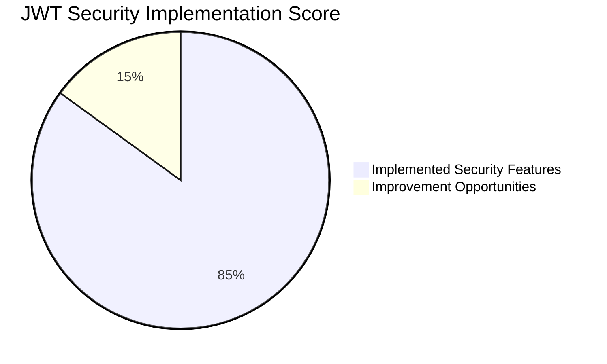
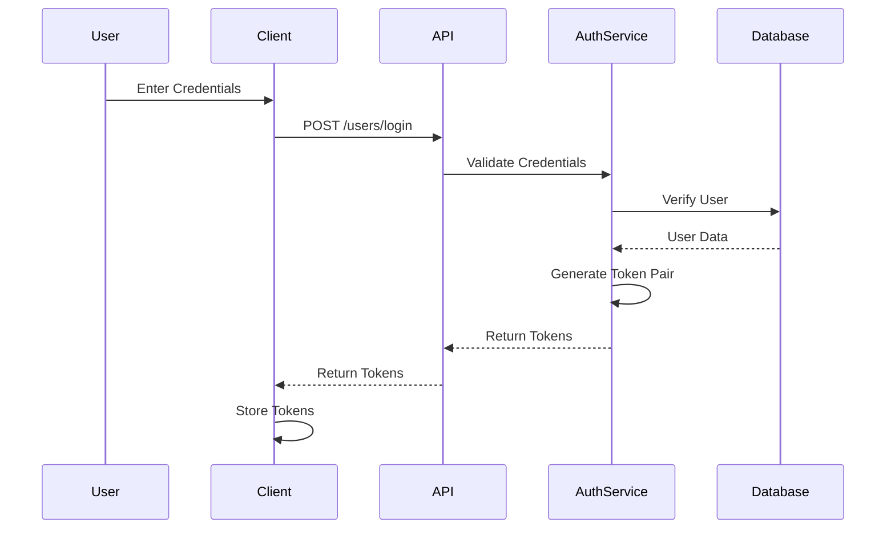
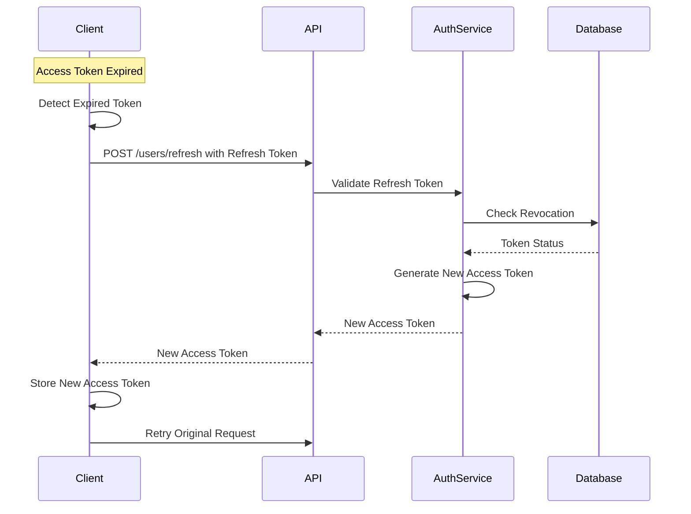
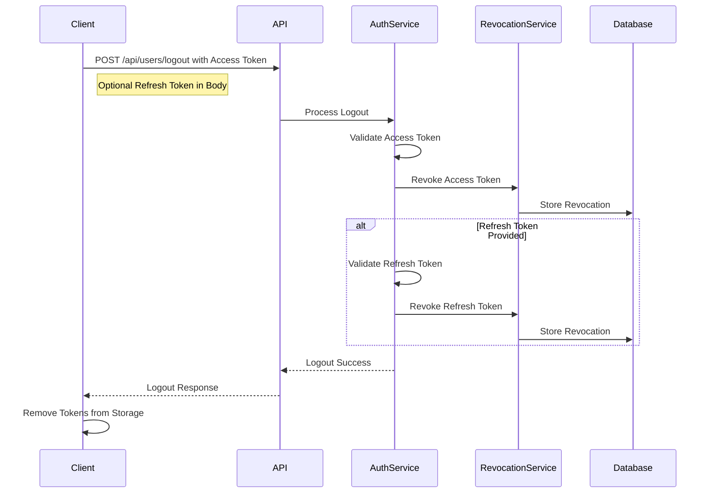
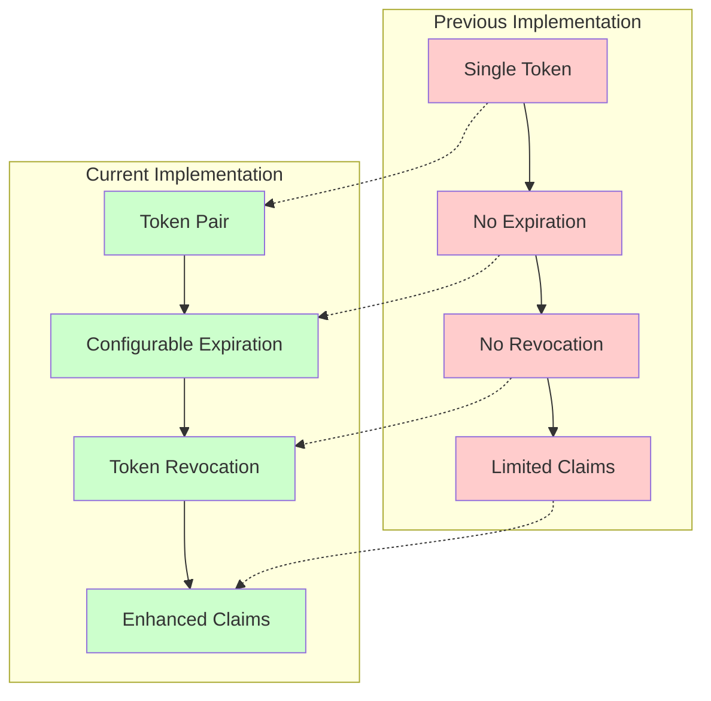
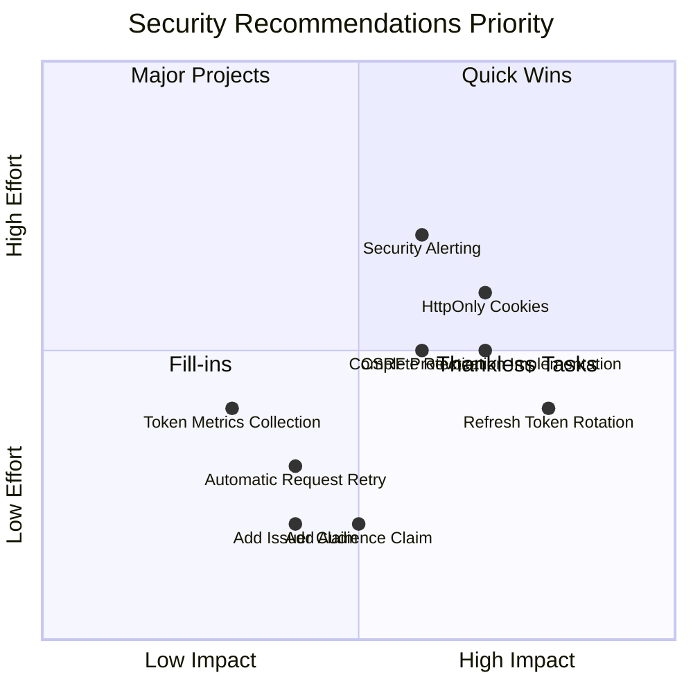

# JWT Refresh Mechanism Security Assessment

## Executive Summary

This document provides a comprehensive security assessment of the JWT token refresh mechanism implemented in the OxidizedOasis-WebSands application. The implementation has moved from a single non-expiring token to a more secure refresh token mechanism with proper token lifecycle management.

**Overall Security Rating: 8.5/10**



The JWT refresh mechanism significantly improves the application's security posture by implementing industry best practices for token-based authentication. This assessment identifies both strengths and potential areas for improvement in the current implementation.

## 1. Implementation Overview

The JWT refresh mechanism consists of the following key components:

1. **Dual-Token Architecture**: Separate access and refresh tokens
2. **Enhanced JWT Claims**: Comprehensive security-related fields
3. **Token Validation**: Thorough validation process
4. **Token Revocation**: Database-backed revocation system
5. **Frontend Token Management**: Client-side token handling

### 1.1 Component Ratings

| Component | Rating | Justification |
|-----------|--------|---------------|
| Token Architecture | 9/10 | Excellent dual-token system with appropriate lifetimes |
| Claims Structure | 9/10 | Comprehensive security claims including JTI, NBF, and role |
| Token Validation | 8/10 | Thorough validation with type checking and revocation verification |
| Token Revocation | 7.5/10 | Good database-backed system but incomplete implementation |
| Frontend Security | 7/10 | Functional but uses localStorage instead of more secure alternatives |
| API Security | 8.5/10 | Well-designed endpoints with rate limiting |
| Logging & Monitoring | 8.5/10 | Comprehensive logging of security events |

```mermaid
radar
    title Component Security Ratings
    variables
        Token Architecture
        Claims Structure
        Token Validation
        Token Revocation
        Frontend Security
        API Security
        Logging & Monitoring
    values
        9
        9
        8
        7.5
        7
        8.5
        8.5
```

## 2. Detailed Analysis

### 2.1 Token Architecture

The implementation uses a dual-token architecture with short-lived access tokens and longer-lived refresh tokens. This is a significant improvement over the previous single token approach.

**Key Features:**
- Access tokens with 30-minute default lifetime
- Refresh tokens with 7-day default lifetime
- Configurable expiration times via environment variables
- Clear separation of token types

**Security Benefits:**
- Minimizes the window of opportunity for token misuse
- Reduces the impact of token theft
- Provides a mechanism for token renewal without re-authentication
- Allows for token revocation

### 2.2 JWT Claims Structure

The JWT claims structure includes comprehensive security-related fields:

```json
{
  "sub": "user-uuid",
  "exp": 1614556800,
  "iat": 1614553200,
  "nbf": 1614553200,
  "jti": "unique-token-id",
  "role": "user",
  "token_type": "access"
}
```

**Key Features:**
- Subject claim (sub) for user identification
- Expiration time (exp) for token lifetime
- Issued at time (iat) for token tracking
- Not before time (nbf) to prevent premature use
- JWT ID (jti) for unique token identification
- Role claim for authorization
- Token type differentiation

**Security Benefits:**
- Prevents token reuse through unique identifiers
- Enables fine-grained access control through roles
- Provides temporal validity constraints
- Supports token revocation through JTI tracking

### 2.3 Token Validation Process

The token validation process is thorough and includes multiple security checks:

1. Decode token and verify signature
2. Validate expiration time
3. Validate not-before time
4. Verify token type matches expected type
5. Check token against revocation database
6. Return claims if all checks pass

**Security Benefits:**
- Ensures token integrity and authenticity
- Prevents use of expired or premature tokens
- Prevents token type misuse (e.g., using refresh token as access token)
- Allows for token revocation

### 2.4 Token Revocation System

The token revocation system provides a mechanism to invalidate tokens before their natural expiration:

```sql
CREATE TABLE revoked_tokens (
    id uuid PRIMARY KEY,
    jti VARCHAR(255) UNIQUE NOT NULL,
    user_id uuid NOT NULL,
    token_type VARCHAR(20) NOT NULL,
    expires_at TIMESTAMP WITH TIME ZONE NOT NULL,
    revoked_at TIMESTAMP WITH TIME ZONE NOT NULL DEFAULT CURRENT_TIMESTAMP,
    reason VARCHAR(255),
    CONSTRAINT revoked_tokens_user_id_fkey FOREIGN KEY (user_id)
        REFERENCES users (id) ON DELETE CASCADE
);
```

**Key Features:**
- Database-backed revocation system
- Token metadata storage (type, expiration, reason)
- Automatic cleanup of expired revoked tokens
- Foreign key relationship to user

**Security Benefits:**
- Allows immediate invalidation of compromised tokens
- Supports user logout functionality
- Enables security incident response
- Provides audit trail for token revocation

### 2.5 Frontend Token Management

The frontend implementation handles token storage and refresh operations:

**Key Features:**
- Separate storage for access and refresh tokens
- Automatic token refresh capability
- Proper token removal on logout
- Server-side token revocation on logout

**Security Concerns:**
- Use of localStorage for token storage (vulnerable to XSS)
- No automatic retry of failed requests after token refresh
- No proactive token refresh before expiration

## 3. Authentication Flows

### 3.1 Login Flow



### 3.2 Token Refresh Flow



### 3.3 Logout Flow



## 4. Security Improvement Comparison



The current implementation addresses several critical security weaknesses in the previous approach:

1. **Single Token → Token Pair**: Separates authentication concerns and reduces risk
2. **No Expiration → Configurable Expiration**: Limits token lifetime and exposure
3. **No Revocation → Token Revocation**: Enables invalidation of compromised tokens
4. **Limited Claims → Enhanced Claims**: Provides more security controls and information

## 5. OWASP Top 10 Compliance

| OWASP Category | Rating | Notes |
|----------------|--------|-------|
| A2:2021 - Cryptographic Failures | 9/10 | Strong JWT implementation with proper signature validation |
| A3:2021 - Injection | 9/10 | Proper input validation and parameterized queries |
| A5:2021 - Security Misconfiguration | 8/10 | Good configuration with environment variables |
| A7:2021 - Identification and Authentication Failures | 8.5/10 | Strong authentication with token refresh mechanism |
| A8:2021 - Software and Data Integrity Failures | 8/10 | Proper token validation and signature verification |

## 6. Security Recommendations

### 6.1 High Priority

1. **Implement Refresh Token Rotation**
   - Issue a new refresh token with each token refresh
   - Revoke the old refresh token after successful refresh
   - Prevents refresh token reuse if compromised

2. **Enhance Token Storage Security**
   - Consider using HttpOnly cookies for token storage
   - Implement CSRF protection if using cookies
   - Add SameSite and Secure flags to cookies

3. **Complete Token Revocation Implementation**
   - Implement the `revoke_all_user_tokens` method
   - Add ability to revoke all tokens for a user on password change
   - Create a scheduled job to clean up expired revoked tokens

### 6.2 Medium Priority

1. **Add Additional JWT Claims**
   - Implement audience (aud) claim for multi-service environments
   - Add issuer (iss) claim and validation
   - Consider adding a nonce claim for additional security

2. **Enhance API Security**
   - Implement more granular rate limiting
   - Add CSRF protection for authentication endpoints
   - Consider adding request signing for sensitive operations

3. **Improve Frontend Token Handling**
   - Implement automatic retry of failed requests after token refresh
   - Add token expiration prediction to refresh proactively
   - Consider using a secure token management library

### 6.3 Low Priority

1. **Monitoring and Alerting**
   - Implement alerting for suspicious token activities
   - Add metrics collection for token usage patterns
   - Create dashboards for security monitoring

2. **Performance Optimization**
   - Optimize token validation for high-volume systems
   - Consider caching for revocation checks
   - Implement more efficient database queries



## 7. Implementation Strengths

1. **Comprehensive Token Validation**
   - Multiple validation checks ensure token integrity
   - Type checking prevents token misuse
   - Revocation verification adds additional security layer

2. **Well-Designed API Endpoints**
   - Clear separation between public and protected routes
   - Rate limiting on authentication endpoints
   - Proper error handling and response formatting

3. **Thorough Logging**
   - Detailed logging of token creation, validation, and revocation
   - Different log levels for different event types
   - User-specific logging for accountability

4. **Configurable Token Lifetimes**
   - Environment variable configuration for token expiration
   - Appropriate default values (30 minutes for access, 7 days for refresh)
   - Flexibility for different security requirements

## 8. Implementation Weaknesses

1. **Frontend Token Storage**
   - Use of localStorage is vulnerable to XSS attacks
   - No secure storage alternative implemented
   - No CSRF protection for token endpoints

2. **Incomplete Revocation System**
   - `revoke_all_user_tokens` method is a placeholder
   - No automatic revocation on password change
   - No scheduled cleanup of expired tokens

3. **Limited JWT Claims**
   - No audience (aud) claim for multi-service environments
   - No issuer (iss) claim for additional validation
   - No nonce claim for replay protection

4. **Frontend Token Management**
   - No automatic retry of failed requests after token refresh
   - No proactive token refresh before expiration
   - Manual token management in frontend code

## 9. Conclusion

The JWT token refresh mechanism implemented in OxidizedOasis-WebSands represents a significant security improvement over the previous single non-expiring token approach. With an overall security score of 8.5/10, the implementation follows most industry best practices for JWT-based authentication.

Key strengths include the dual-token architecture, comprehensive token validation, and token revocation capabilities. The most significant improvement opportunities are in the areas of refresh token rotation, token storage security, and completing the token revocation implementation.

By addressing the recommendations outlined in this assessment, the security posture of the JWT implementation can be further enhanced to provide robust protection against common authentication vulnerabilities.

## Appendix: Token Lifecycle

```mermaid
stateDiagram-v2
    [*] --> Created: User Login
    Created --> Active: Token Issued
    Active --> Expired: Time Elapsed
    Active --> Revoked: User Logout
    Active --> Revoked: Admin Action
    Active --> Refreshed: Token Refresh
    Refreshed --> Active: New Access Token
    Expired --> [*]
    Revoked --> [*]