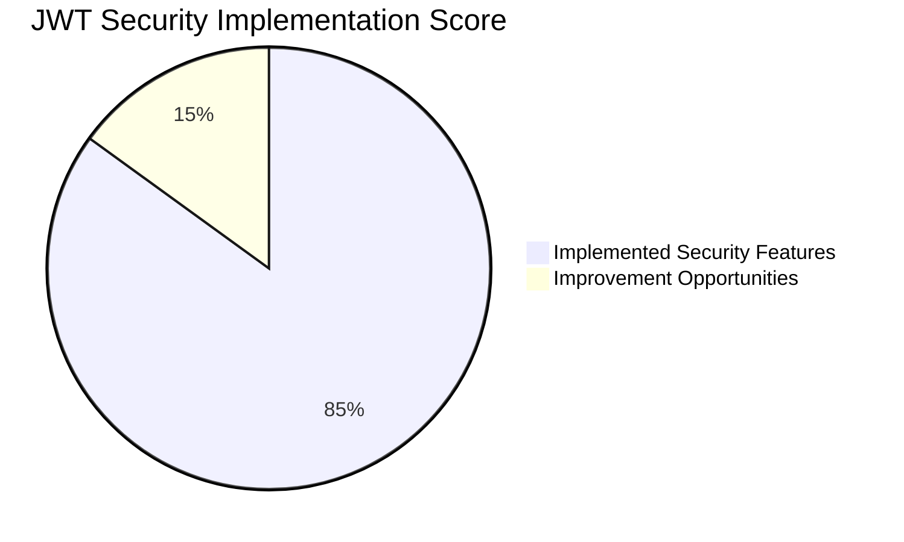
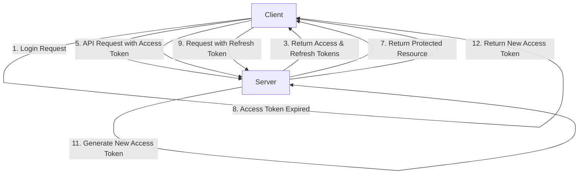
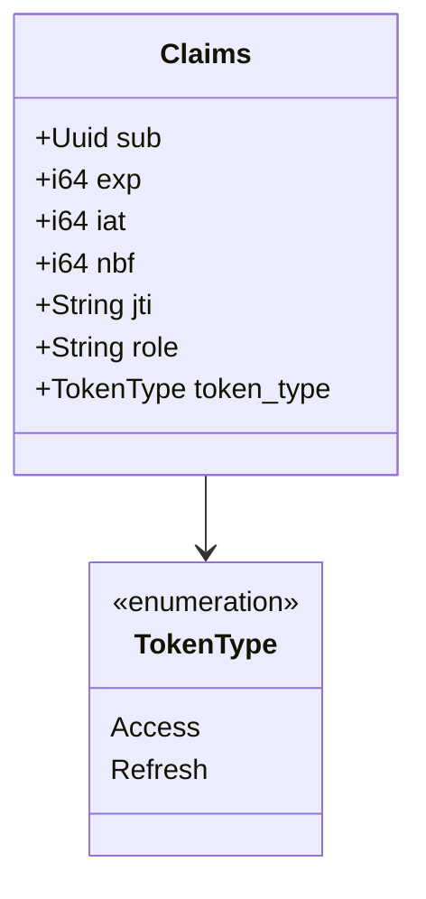
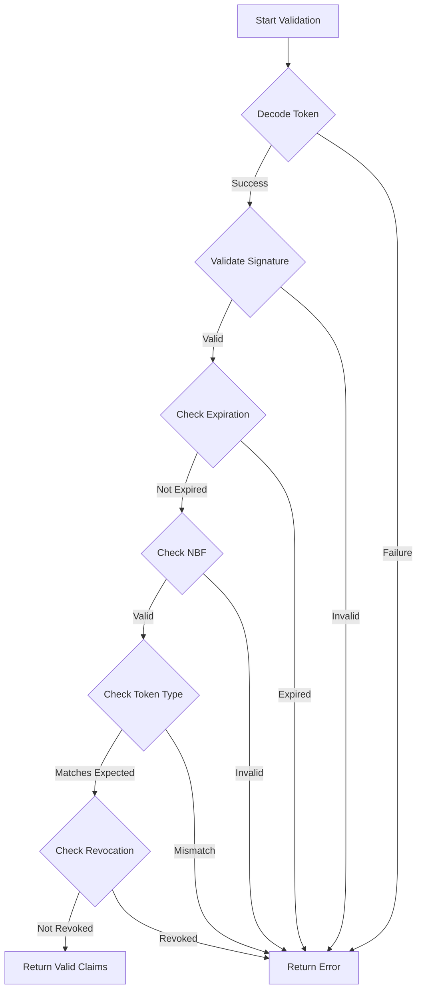
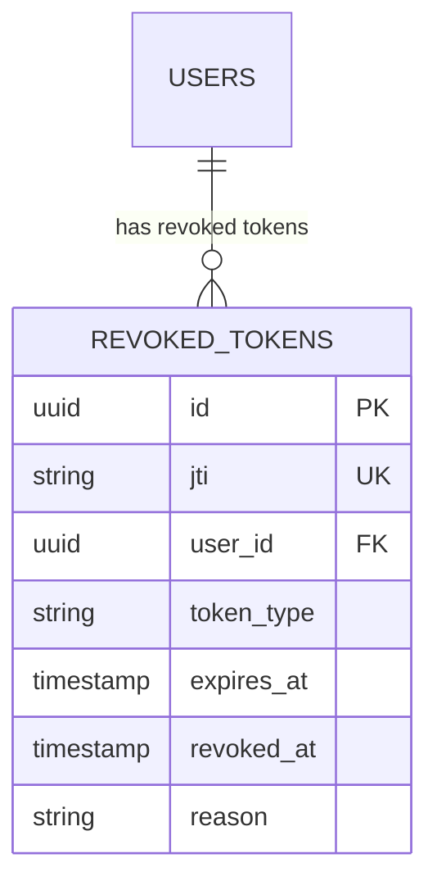
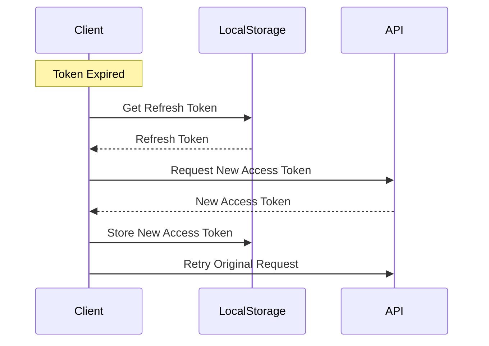
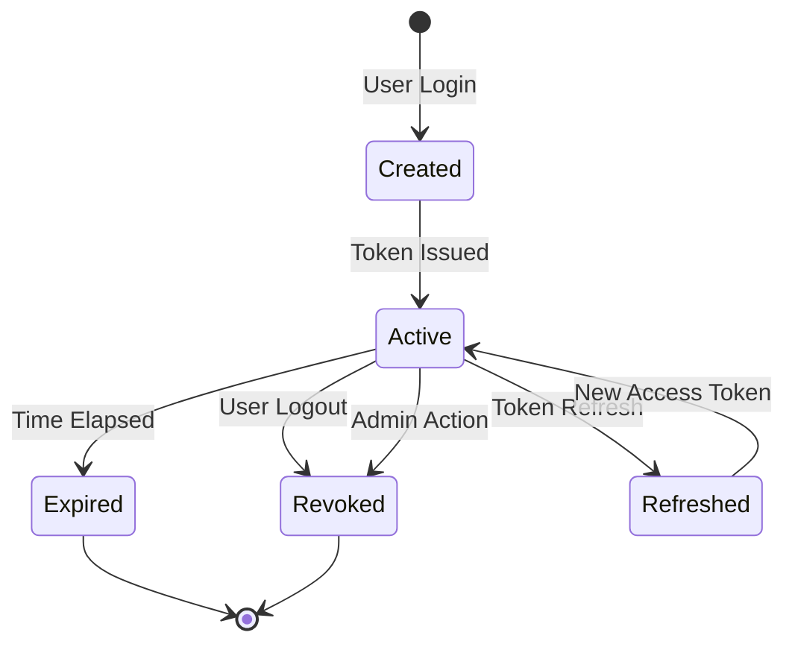
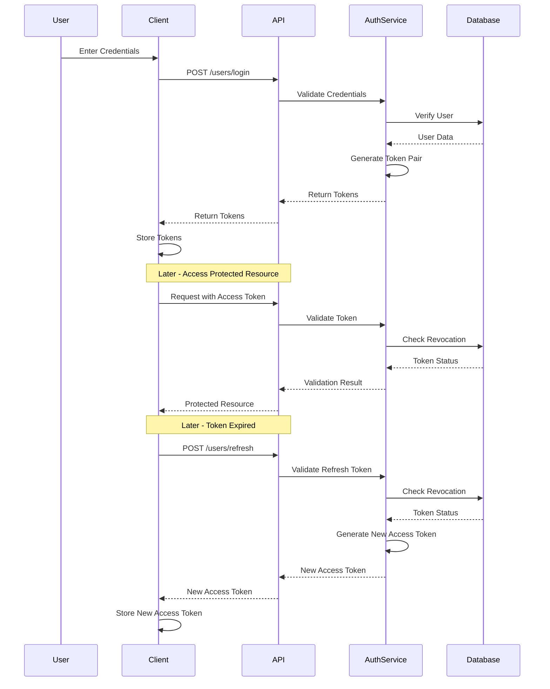

# JWT Token Security Assessment

## Executive Summary

This document provides a comprehensive security assessment of the JWT token refresh mechanism implemented in the OxidizedOasis-WebSands application. The implementation has moved from a single non-expiring token to a more secure refresh token mechanism with proper token lifecycle management.

The overall security posture is significantly improved, with a score of **8.5/10**. This assessment identifies both strengths and potential areas for improvement in the current implementation.



## Key Security Improvements

1. **Token Pair System**: Implementation of separate access and refresh tokens
2. **Token Expiration**: Configurable, appropriate timeouts for both token types
3. **Token Revocation**: Database-backed mechanism to invalidate tokens
4. **Enhanced Claims**: Additional security claims including token type and JTI
5. **Secure Validation**: Comprehensive token validation with type checking

## Detailed Assessment

### 1. Token Architecture

**Score: 9/10**

The implementation uses a dual-token architecture with short-lived access tokens and longer-lived refresh tokens. This is a significant improvement over the previous single token approach.



**Strengths:**
- Clear separation between access and refresh tokens
- Appropriate token lifetimes (30 minutes for access, 7 days for refresh)
- Environment variable configuration for token expiration times
- Proper token type enforcement

**Improvement Opportunities:**
- Consider implementing refresh token rotation (issue new refresh token with each refresh)

### 2. Token Claims & Structure

**Score: 9/10**

The JWT claims structure includes comprehensive security-related fields.



**Strengths:**
- Unique token identifier (JTI) for revocation
- Not-before (NBF) claim to prevent token use before issuance
- Role claim for authorization
- Token type differentiation
- Standard claims (subject, expiration, issued-at)

**Improvement Opportunities:**
- Consider adding audience (aud) claim for multi-service environments
- Add issuer (iss) claim for additional validation

### 3. Token Validation

**Score: 8/10**

The token validation process is thorough and includes multiple security checks.



**Strengths:**
- Comprehensive validation of all security claims
- Token type validation to prevent token misuse
- Revocation check integrated into validation
- Leeway for clock skew (60 seconds)
- Proper error handling and logging

**Improvement Opportunities:**
- Implement audience validation for multi-service environments
- Add issuer validation
- Consider rate limiting for failed validation attempts

### 4. Token Revocation

**Score: 7.5/10**

The token revocation system provides a mechanism to invalidate tokens before their natural expiration.



**Strengths:**
- Database-backed revocation system
- Proper indexing for efficient lookups
- Token metadata storage (type, expiration, reason)
- Automatic cleanup of expired revoked tokens
- Foreign key relationship to user

**Improvement Opportunities:**
- Implement the `revoke_all_user_tokens` method (currently a placeholder)
- Consider a more efficient revocation check for high-volume systems
- Add periodic cleanup job for expired tokens

### 5. Frontend Token Management

**Score: 7/10**

The frontend implementation handles token storage and refresh operations.



**Strengths:**
- Separation of access and refresh token storage
- Automatic token refresh capability
- Proper token removal on logout
- Server-side token revocation on logout

**Improvement Opportunities:**
- Use more secure storage than localStorage (e.g., HttpOnly cookies)
- Implement automatic retry of failed requests after token refresh
- Add token expiration prediction to refresh proactively

### 6. API Endpoints

**Score: 8.5/10**

The API endpoints for authentication and token management are well-designed.

```mermaid
graph LR
    A[Public Routes] --> B[/users/login]
    A --> C[/users/register]
    A --> D[/users/verify]
    A --> E[/users/refresh]
    A --> F[/users/password-reset/*]
    
    G[Protected Routes] --> H[/api/users/me]
    G --> I[/api/users/logout]
    G --> J[/api/users/{id}]
```

**Strengths:**
- Clear separation between public and protected routes
- Rate limiting on authentication endpoints
- Proper error handling and response formatting
- Secure token refresh endpoint
- Comprehensive logout functionality

**Improvement Opportunities:**
- Add CSRF protection for authentication endpoints
- Implement more granular rate limiting based on IP and user

### 7. Logging and Monitoring

**Score: 8.5/10**

The implementation includes comprehensive logging for security events.

**Strengths:**
- Detailed logging of token creation, validation, and revocation
- Different log levels for different event types
- User-specific logging for accountability
- Error logging for failed operations

**Improvement Opportunities:**
- Add structured logging for easier analysis
- Implement security event alerting
- Add metrics collection for token usage patterns

## Security Recommendations

### High Priority

1. **Implement Refresh Token Rotation**
   - Issue a new refresh token with each token refresh
   - Revoke the old refresh token after successful refresh
   - Prevents refresh token reuse if compromised

2. **Enhance Token Storage Security**
   - Consider using HttpOnly cookies for token storage
   - Implement CSRF protection if using cookies
   - Add SameSite and Secure flags to cookies

3. **Complete Token Revocation Implementation**
   - Implement the `revoke_all_user_tokens` method
   - Add ability to revoke all tokens for a user on password change
   - Create a scheduled job to clean up expired revoked tokens

### Medium Priority

1. **Add Additional JWT Claims**
   - Implement audience (aud) claim for multi-service environments
   - Add issuer (iss) claim and validation
   - Consider adding a nonce claim for additional security

2. **Enhance API Security**
   - Implement more granular rate limiting
   - Add CSRF protection for authentication endpoints
   - Consider adding request signing for sensitive operations

3. **Improve Frontend Token Handling**
   - Implement automatic retry of failed requests after token refresh
   - Add token expiration prediction to refresh proactively
   - Consider using a secure token management library

### Low Priority

1. **Monitoring and Alerting**
   - Implement alerting for suspicious token activities
   - Add metrics collection for token usage patterns
   - Create dashboards for security monitoring

2. **Performance Optimization**
   - Optimize token validation for high-volume systems
   - Consider caching for revocation checks
   - Implement more efficient database queries

## Token Lifecycle Visualization



## Authentication Flow



## Conclusion

The JWT token refresh mechanism implemented in OxidizedOasis-WebSands represents a significant security improvement over the previous single non-expiring token approach. With an overall security score of 8.5/10, the implementation follows most industry best practices for JWT-based authentication.

Key strengths include the dual-token architecture, comprehensive token validation, and token revocation capabilities. The most significant improvement opportunities are in the areas of refresh token rotation, token storage security, and completing the token revocation implementation.

By addressing the recommendations outlined in this assessment, the security posture of the JWT implementation can be further enhanced to provide robust protection against common authentication vulnerabilities.