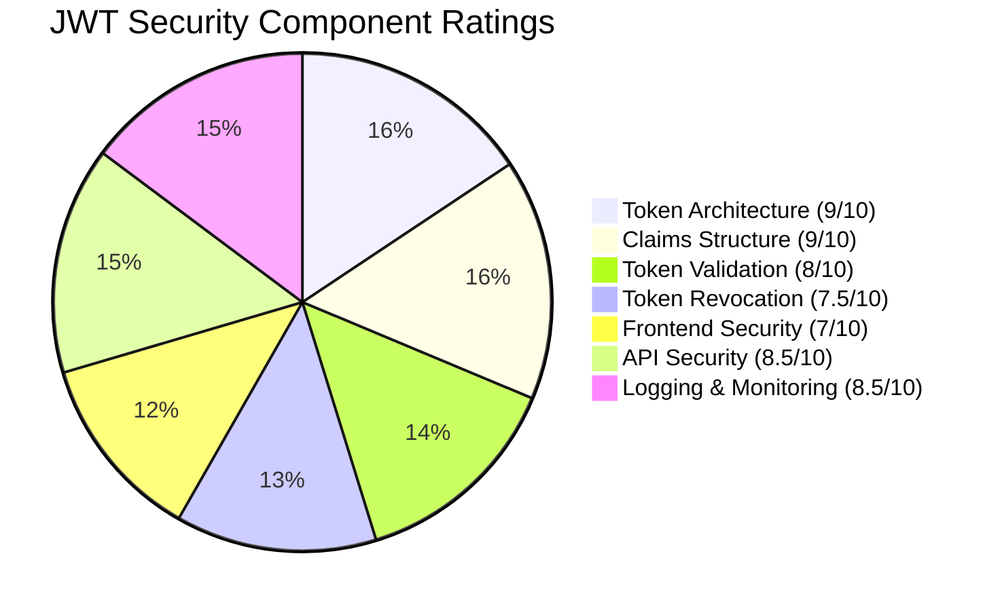
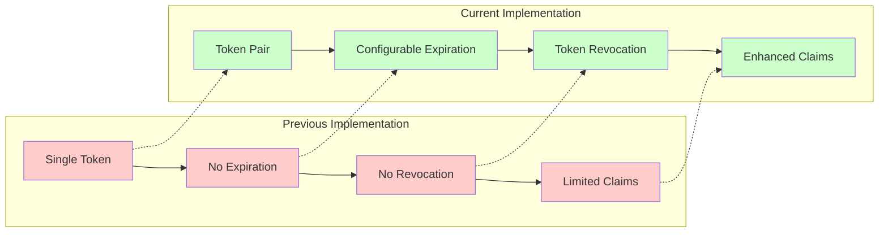
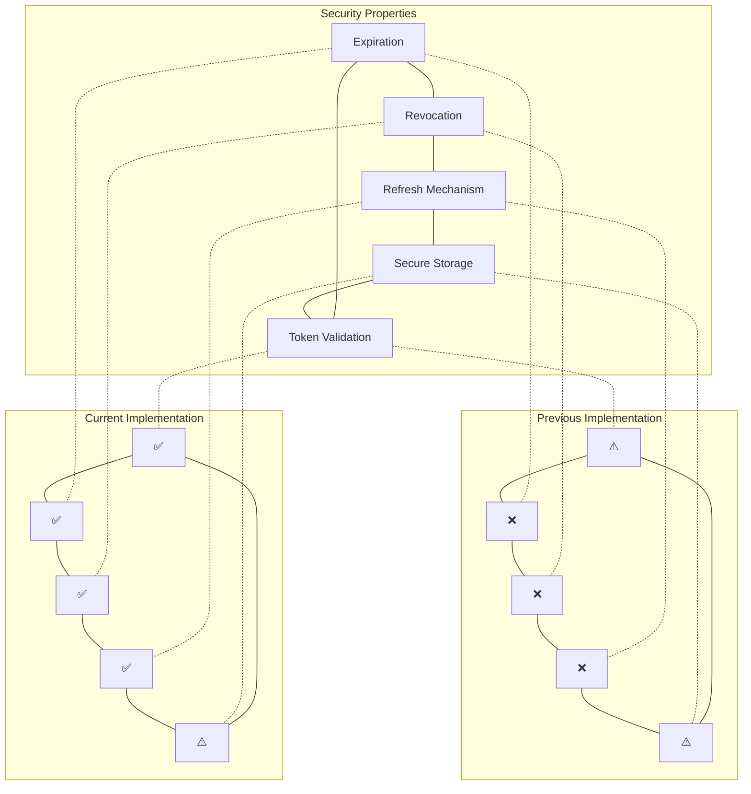
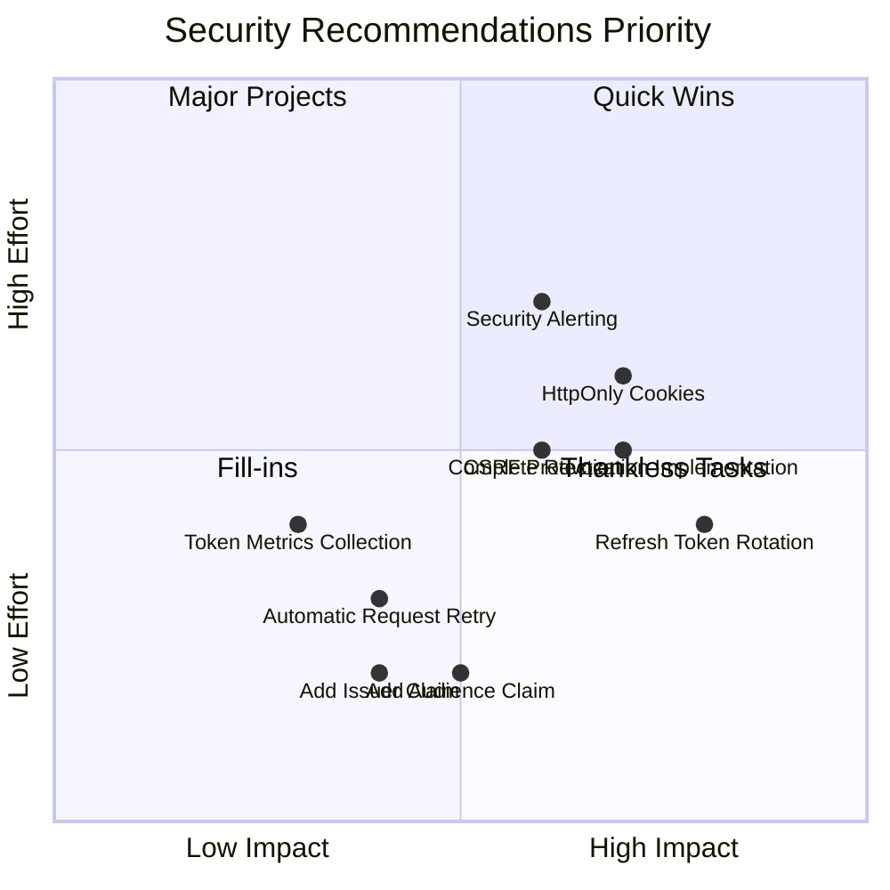

# JWT Security Rating

## Overall Security Rating: 8.5/10

## Component Ratings

| Component | Rating | Justification |
|-----------|--------|---------------|
| Token Architecture | 9/10 | Excellent dual-token system with appropriate lifetimes |
| Claims Structure | 9/10 | Comprehensive security claims including JTI, NBF, and role |
| Token Validation | 8/10 | Thorough validation with type checking and revocation verification |
| Token Revocation | 7.5/10 | Good database-backed system but incomplete implementation |
| Frontend Security | 7/10 | Functional but uses localStorage instead of more secure alternatives |
| API Security | 8.5/10 | Well-designed endpoints with rate limiting |
| Logging & Monitoring | 8.5/10 | Comprehensive logging of security events |

## Security Improvement from Previous Implementation

## OWASP Top 10 Compliance Assessment

| OWASP Category | Rating | Notes |
|----------------|--------|-------|
| A2:2021 - Cryptographic Failures | 9/10 | Strong JWT implementation with proper signature validation |
| A3:2021 - Injection | 9/10 | Proper input validation and parameterized queries |
| A5:2021 - Security Misconfiguration | 8/10 | Good configuration with environment variables |
| A7:2021 - Identification and Authentication Failures | 8.5/10 | Strong authentication with token refresh mechanism |
| A8:2021 - Software and Data Integrity Failures | 8/10 | Proper token validation and signature verification |

## Token Security Comparison

## Security Recommendations Priority Matrix

## Conclusion

The JWT token refresh mechanism represents a significant security improvement over the previous implementation. With an overall rating of 8.5/10, it follows most industry best practices for secure token-based authentication. The implementation of a dual-token system with proper expiration, validation, and revocation capabilities provides a solid foundation for secure authentication.

Key areas for improvement include:
1. Enhancing frontend token storage security
2. Implementing refresh token rotation
3. Completing the token revocation system
4. Adding additional security claims

By addressing these recommendations, the security posture can be further strengthened to provide robust protection against common authentication vulnerabilities.