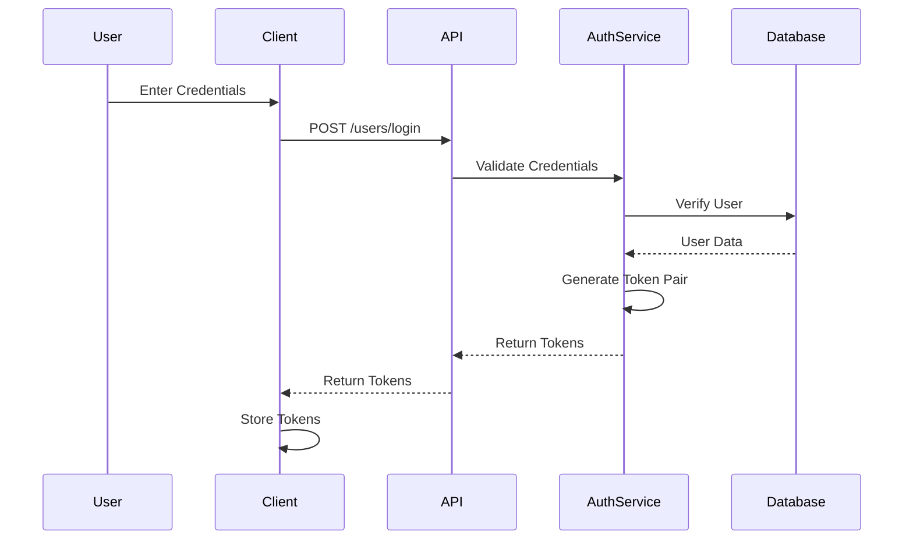
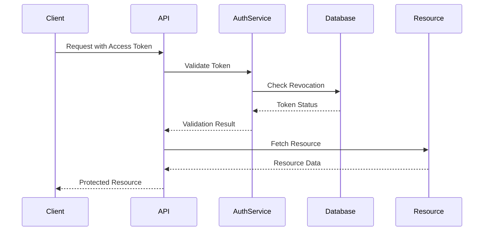
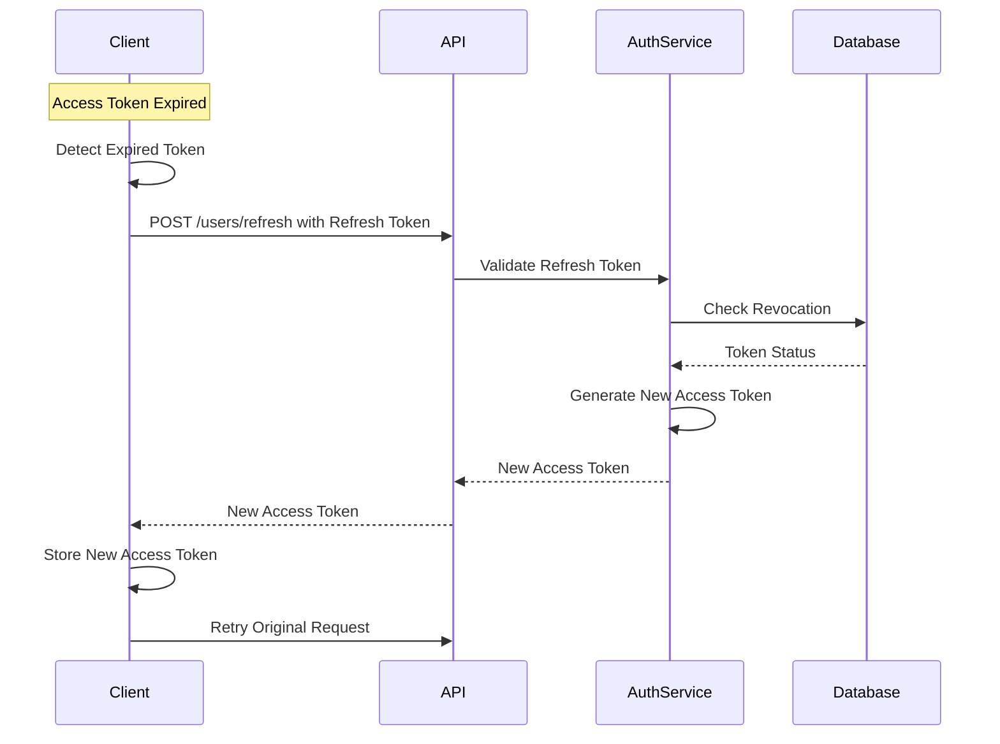
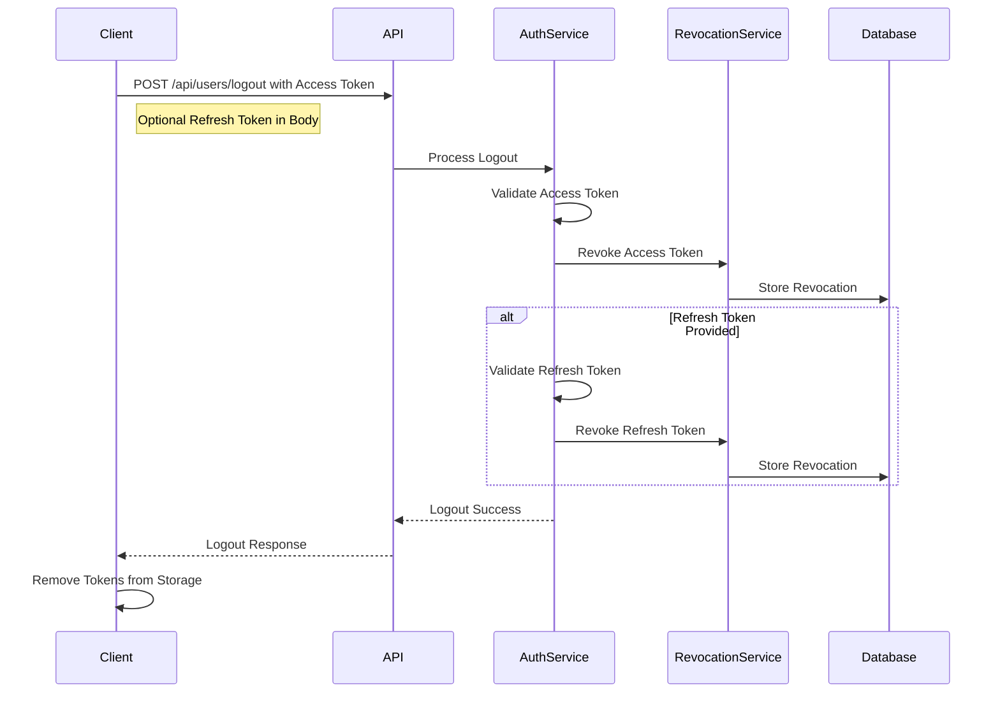
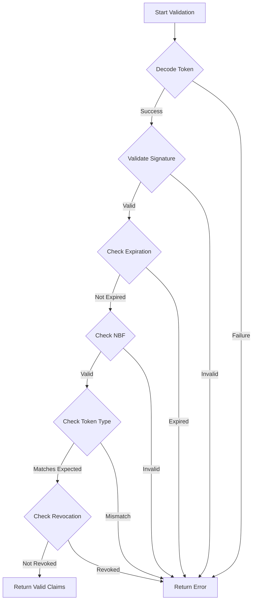
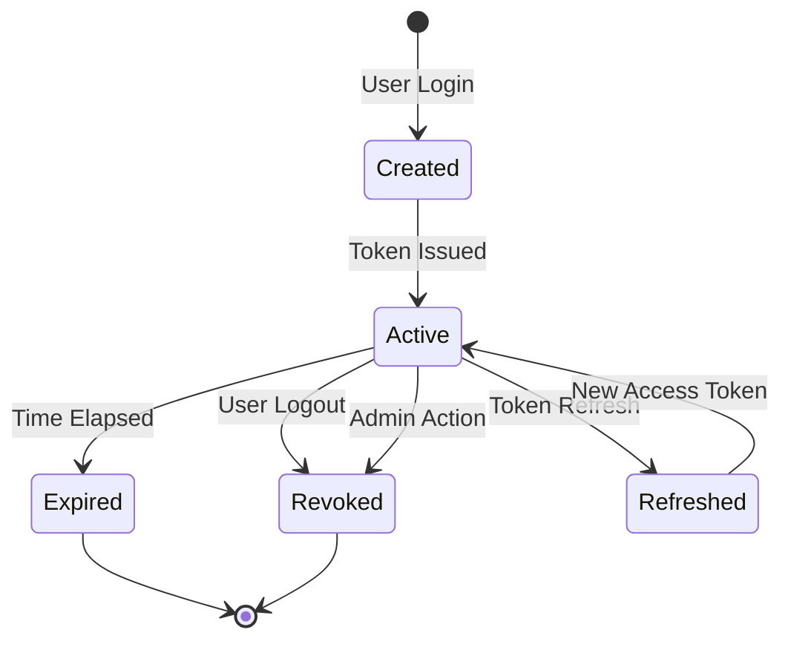
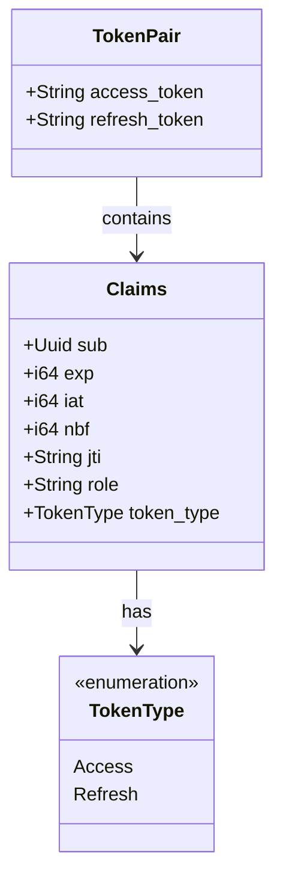
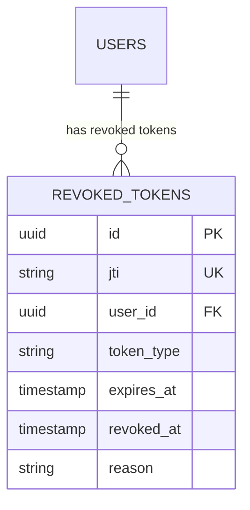
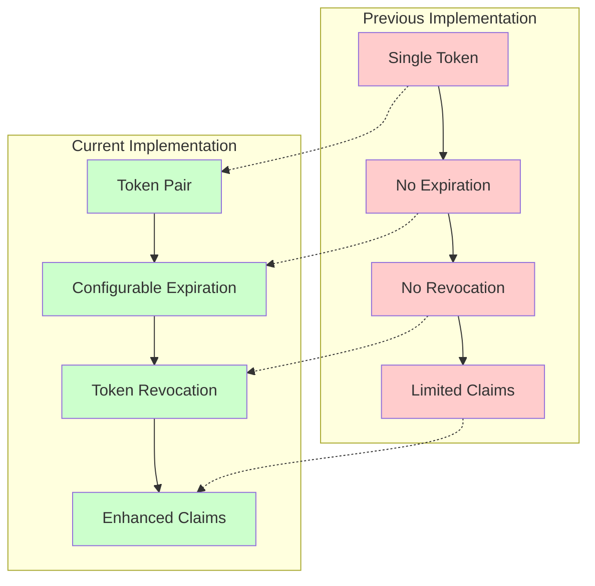

# JWT Token Flow Diagrams

This document provides visual representations of the JWT token flows in the OxidizedOasis-WebSands application.

## Authentication Flow



## Protected Resource Access



## Token Refresh Flow



## Logout Flow



## Token Validation Process



## Token Lifecycle



## Token Data Structure



## Token Revocation Database



## Security Improvement Comparison



## Recommended Security Enhancements

```mermaid
graph TD
    A[Current JWT Implementation] --> B[Refresh Token Rotation]
    A --> C[Secure Token Storage]
    A --> D[Complete Revocation System]
    A --> E[Additional JWT Claims]
    
    B --> F[Enhanced Security]
    C --> F
    D --> F
    E --> F
    
    style A fill:#aaddff
    style B fill:#ccffcc
    style C fill:#ccffcc
    style D fill:#ccffcc
    style E fill:#ccffcc
    style F fill:#aaffaa