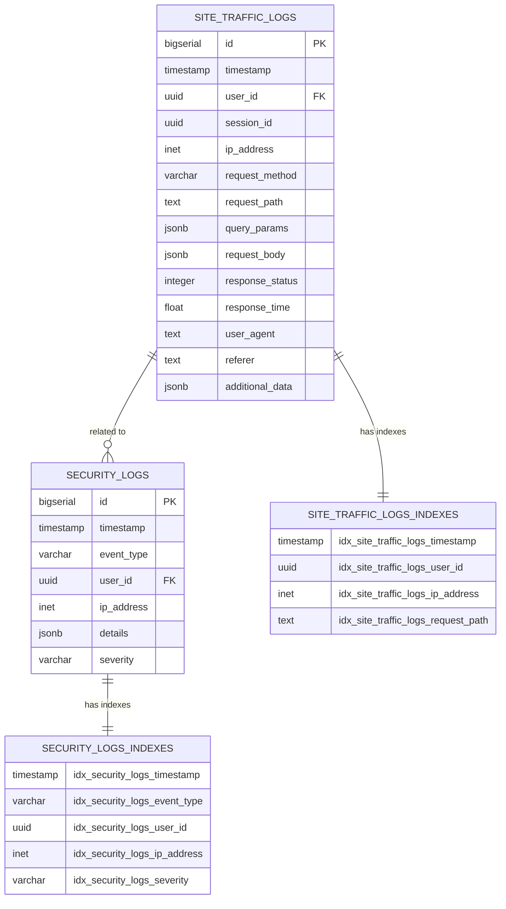
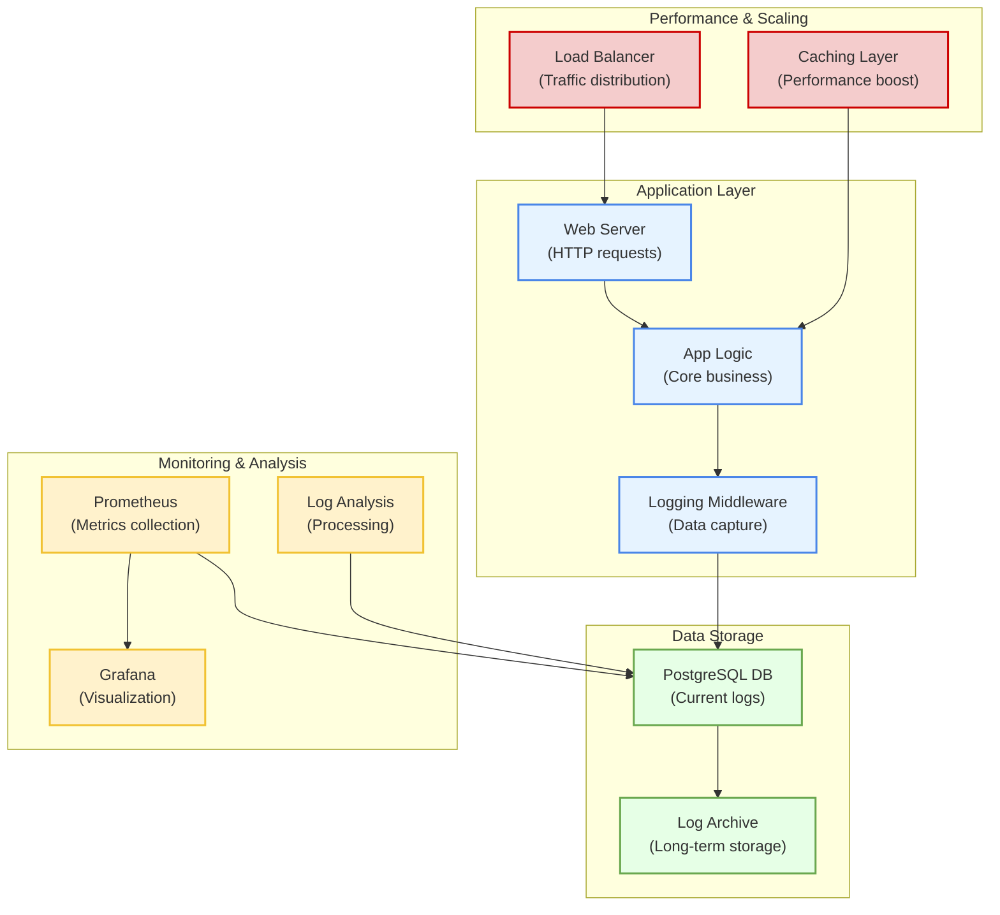
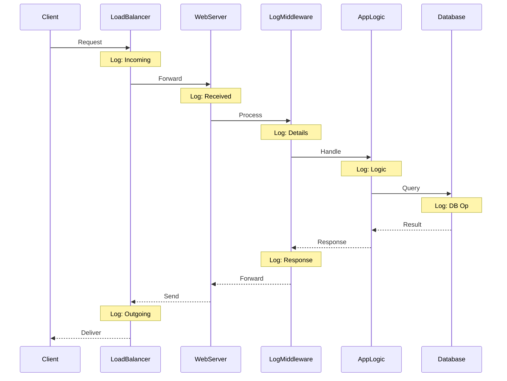

# OxidizedOasis-WebSands Logging Database Plan

## 1. Introduction

This document outlines the plan for implementing comprehensive logging in the OxidizedOasis-WebSands project. The logging system will focus on two main pillars: site traffic and security events. The plan is designed to be scalable, efficient, and follow industry best practices for logging and database management.

## 2. Logging Pillars

### 2.1 Site Traffic Logging
- Track user interactions across the entire website
- Record page views, API calls, and user actions
- Capture performance metrics and response times

### 2.2 Security Logging
- Log all authentication attempts (successful and failed)
- Record any potentially suspicious activities
- Track administrative actions and data modifications

## 3. Database Design

### 3.1 Database Choice
- Use PostgreSQL for log storage
- Leverage PostgreSQL's JSONB type for flexible log data storage

### 3.2 Table Structure

#### 3.2.1 Site Traffic Logs Table
```sql
CREATE TABLE site_traffic_logs (
    id BIGSERIAL PRIMARY KEY,
    timestamp TIMESTAMP WITH TIME ZONE NOT NULL DEFAULT CURRENT_TIMESTAMP,
    user_id UUID,
    session_id UUID,
    ip_address INET NOT NULL,
    request_method VARCHAR(10) NOT NULL,
    request_path TEXT NOT NULL,
    query_params JSONB,
    request_body JSONB,
    response_status INTEGER NOT NULL,
    response_time FLOAT NOT NULL,
    user_agent TEXT,
    referer TEXT,
    additional_data JSONB
);

CREATE INDEX idx_site_traffic_logs_timestamp ON site_traffic_logs (timestamp);
CREATE INDEX idx_site_traffic_logs_user_id ON site_traffic_logs (user_id);
CREATE INDEX idx_site_traffic_logs_ip_address ON site_traffic_logs (ip_address);
CREATE INDEX idx_site_traffic_logs_request_path ON site_traffic_logs (request_path);
```

#### 3.2.2 Security Logs Table
```sql
CREATE TABLE security_logs (
    id BIGSERIAL PRIMARY KEY,
    timestamp TIMESTAMP WITH TIME ZONE NOT NULL DEFAULT CURRENT_TIMESTAMP,
    event_type VARCHAR(50) NOT NULL,
    user_id UUID,
    ip_address INET NOT NULL,
    details JSONB NOT NULL,
    severity VARCHAR(20) NOT NULL
);

CREATE INDEX idx_security_logs_timestamp ON security_logs (timestamp);
CREATE INDEX idx_security_logs_event_type ON security_logs (event_type);
CREATE INDEX idx_security_logs_user_id ON security_logs (user_id);
CREATE INDEX idx_security_logs_ip_address ON security_logs (ip_address);
CREATE INDEX idx_security_logs_severity ON security_logs (severity);
```

## 4. Logging Implementation

### 4.1 Middleware Approach
- Implement logging as middleware in the Actix-web framework
- Ensure all requests pass through the logging middleware

### 4.2 Asynchronous Logging
- Use asynchronous I/O for log writing to minimize performance impact
- Implement a logging queue to handle high-volume periods

### 4.3 Log Levels
- Implement different log levels (DEBUG, INFO, WARN, ERROR, CRITICAL)
- Configure log levels based on environment (development, staging, production)

## 5. Security Considerations

### 5.1 Data Protection
- Implement field-level encryption for sensitive data in logs
- Ensure compliance with data protection regulations (e.g., GDPR)

### 5.2 Access Control
- Implement strict access controls for log data
- Create separate roles for log viewers and log administrators

### 5.3 Log Integrity
- Use cryptographic hashing to ensure log integrity
- Implement tamper-evident logging techniques

## 6. Performance Optimization

### 6.1 Indexing Strategy
- Create appropriate indexes on frequently queried fields
- Use partial indexes for specific query patterns

### 6.2 Partitioning
- Implement table partitioning by timestamp for improved query performance
- Set up automatic partition management

### 6.3 Log Rotation and Archiving
- Implement a log rotation strategy to manage database size
- Archive old logs to cold storage for long-term retention

## 7. Scalability Considerations

### 7.1 Sharding
- Design the system to support future sharding if needed
- Use UUID as the primary key to facilitate easy sharding

### 7.2 Replication
- Set up read replicas for log analysis to offload the primary database

## 8. Monitoring and Alerting

### 8.1 Real-time Monitoring
- Implement real-time monitoring of log entries for critical events
- Set up dashboards for visualizing log data and trends

### 8.2 Alerting System
- Configure alerts for suspicious activities or system anomalies
- Integrate with incident response systems

## 9. Compliance and Auditing

### 9.1 Retention Policies
- Implement log retention policies in compliance with legal requirements
- Ensure proper deletion of logs after the retention period

### 9.2 Audit Trail
- Maintain an audit trail of all accesses to the logging system
- Implement immutable audit logs for compliance purposes

## 10. Implementation Phases

### Phase 1: Basic Logging Infrastructure
- Set up database tables and indexes
- Implement basic logging middleware

### Phase 2: Enhanced Logging and Security Features
- Implement advanced security logging
- Add encryption and access controls

### Phase 3: Performance Optimization and Scaling
- Implement partitioning and archiving strategies
- Set up replication and monitoring systems

### Phase 4: Advanced Analytics and Compliance
- Develop advanced log analysis capabilities
- Ensure full compliance with relevant regulations

## 11. Conclusion

This logging database plan provides a comprehensive approach to implementing robust, scalable, and secure logging for the OxidizedOasis-WebSands project. By following this plan, we can ensure that our logging system will effectively capture all necessary information while maintaining high performance and adhering to best practices in database management and security.


# Logging Database Schema 







# Engineering Approach to Logging System Performance and Scalability Monitoring in OxidizedOasis-WebSands

## 1. Key Performance Indicators (KPIs)

Essential metrics for tracking:

- Log ingestion rate (logs/second)
- Query response time (ms)
- Database size and growth rate (GB/day)
- CPU and memory utilization (%)
- Disk I/O operations (IOPS)
- Network throughput for log transmission (Mbps)

Implementation: Grafana dashboards for KPI visualization, providing real-time system health status.

## 2. Real-time Monitoring System

Tools: Prometheus for data collection, Grafana for visualization.
Configuration: Alert thresholds set for each KPI, triggering notifications upon breach for rapid response to potential issues.

## 3. Performance Testing Protocol

Frequency: Monthly
Methodology: Load tests using Apache JMeter
Objective: Simulate high-volume logging scenarios to identify system bottlenecks and stress points
Analysis: Post-test performance reports generated for review and optimization planning

## 4. Query Optimization Process

Frequency: Bi-weekly
Methodology:
1. Identify resource-intensive queries through PostgreSQL logging
2. Utilize EXPLAIN ANALYZE for query execution plan analysis
3. Implement optimizations based on analysis results
4. Verify improvements through benchmarking

## 5. Scalability Architecture

Design Principle: Horizontal scalability
Components:
- Database sharding strategies
- Load balancers for traffic distribution
- Containerization for easy deployment and scaling

## 6. Log Retention and Archiving System

Strategy: Tiered storage implementation
Process: Automated migration of logs based on age and access frequency
Review: Quarterly analysis of retention policies for alignment with usage patterns and compliance requirements

## 7. Index Performance Monitoring

Methodology: Automated scripts for regular index usage and performance analysis
Frequency: Weekly
Actions:
- Creation of new indexes based on query patterns
- Removal or modification of underperforming indexes
- Performance impact assessment post-changes

## 8. Database Partitioning Schema

Implementation: Table partitioning in PostgreSQL
Partitioning Key: Timestamp
Benefits: Improved query performance on large datasets, efficient historical data management

## 9. System Audit Protocol

Frequency: Quarterly
Scope:
- Logging system performance and efficiency
- Logging strategy optimization
- Compliance with project requirements and regulations
  Deliverable: Comprehensive audit report with actionable optimization recommendations

## 10. High Availability and Disaster Recovery Plan

Components:
- Robust backup strategy with regular testing
- Replication setup for high availability
- Documented failover procedures
- Recovery time objective (RTO) and recovery point objective (RPO) definitions

## 11. Client-Side Performance Analysis

Methodology: Continuous monitoring of logging impact on application performance
Metrics:
- Latency introduced by logging operations
- Memory and CPU usage of logging components
  Optimization: Regular refactoring of client-side logging code based on performance analysis

## 12. Technology Stack Maintenance

Process:
1. Regular review of PostgreSQL release notes
2. Testing of new versions in staging environment
3. Planned upgrade cycles with rollback procedures

## 13. Feedback Integration System

Methodology: Structured feedback collection from stakeholders
Frequency: Monthly
Integration: Feedback analysis and prioritization for system improvements and feature development

## Continuous Improvement Cycle

Quarterly sprints dedicated to monitoring and optimization:
1. Comprehensive KPI and metric analysis
2. Execution of full system load tests
3. In-depth query and index optimization
4. Review and updating of scaling strategies
5. Stakeholder feedback integration

This engineering approach ensures proactive management of the logging system's performance and scalability. The methodologies outlined are designed to adapt to changing requirements and preemptively address potential issues as the OxidizedOasis-WebSands project scales.