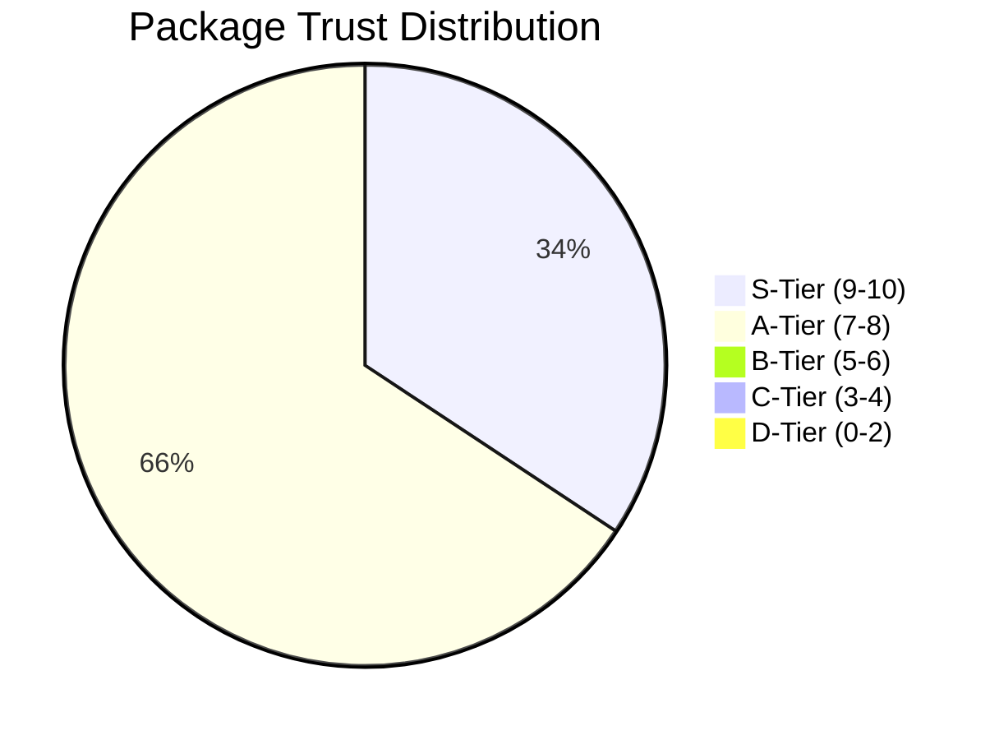
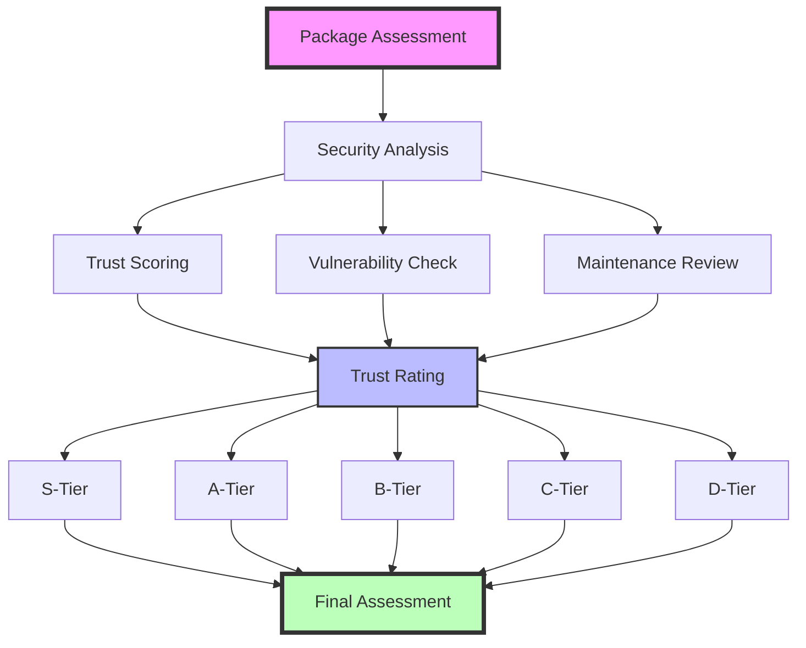

# 🛡️ Package Trust Assessment

## 📊 Trust Distribution

## 🎯 Purpose & Process

## 📋 Assessment Purpose

This document serves multiple critical security objectives:

1. **Risk Assessment**: Evaluate each package's security posture
2. **Trust Verification**: Validate the trustworthiness of dependencies
3. **Security Planning**: Guide security-conscious development decisions
4. **Maintenance Strategy**: Inform update and maintenance procedures

## 📊 Trust Score System

Trust scores are rated out of 10 points:

| Score Range | Trust Level | Betting Rating | Description |
|------------|-------------|----------------|-------------|
| 9-10 | Critical Trust | S-Tier | Production-ready, battle-tested, security-focused |
| 7-8  | High Trust    | A-Tier | Well-maintained, minor concerns |
| 5-6  | Medium Trust  | B-Tier | Generally reliable, some concerns |
| 3-4  | Low Trust     | C-Tier | Multiple concerns, requires careful usage |
| 0-2  | Minimal Trust | D-Tier | Not recommended for production use |

## 🔒 Backend Dependencies

### Web Framework & Server
| Package | Version | Score | Rating | Analysis |
|---------|---------|--------|---------|-----------|
| actix-web | 4.9 | 9/10 | S | Industry standard, excellent security track record |
| actix-files | 0.6 | 8/10 | A | Safe file serving, path traversal protection |
| actix-cors | 0.7 | 8/10 | A | Secure CORS implementation |
| actix-web-httpauth | 0.8 | 8/10 | A | Robust authentication middleware |
| actix-rt | 2.2 | 9/10 | S | Core runtime, critical security updates |

### Database & Storage
| Package | Version | Score | Rating | Analysis |
|---------|---------|--------|---------|-----------|
| sqlx | 0.8.2 | 9/10 | S | Type-safe SQL, compile-time checks |
| tokio | 1.x | 9/10 | S | Battle-tested async runtime |

### Authentication & Security
| Package | Version | Score | Rating | Analysis |
|---------|---------|--------|---------|-----------|
| bcrypt | 0.15.1 | 10/10 | S | Industry standard password hashing |
| jsonwebtoken | 9.3 | 8/10 | A | Well-maintained JWT implementation |
| ammonia | 4.0.0 | 9/10 | S | HTML sanitization, XSS protection |

### Serialization & Data Handling
| Package | Version | Score | Rating | Analysis |
|---------|---------|--------|---------|-----------|
| serde | 1.0 | 10/10 | S | Industry standard, extensive security testing |
| serde_json | 1.0.127 | 9/10 | S | Safe JSON handling |
| regex | 1.5 | 8/10 | A | Safe regex implementation |
| validator | 0.16 | 8/10 | A | Input validation framework |

### Utility Libraries
| Package | Version | Score | Rating | Analysis |
|---------|---------|--------|---------|-----------|
| uuid | 1.3 | 9/10 | S | Secure UUID generation |
| chrono | 0.4 | 8/10 | A | Time handling, well-maintained |
| dotenv | 0.15 | 7/10 | A | Environment variable management |
| env_logger | 0.11.5 | 7/10 | A | Safe logging implementation |
| log | 0.4 | 8/10 | A | Core logging trait |
| futures | 0.3.30 | 8/10 | A | Async utilities |
| lettre | 0.11.7 | 7/10 | A | Email handling |
| rand | 0.8.5 | 9/10 | S | Cryptographically secure RNG |
| lazy_static | 1.4 | 8/10 | A | Safe static initialization |
| url | 2.5.2 | 8/10 | A | URL parsing and validation |
| derive_more | 1.0.0 | 7/10 | A | Derive macro utilities |
| num_cpus | 1.16.0 | 7/10 | A | CPU info utilities |
| dashmap | 5.5.3 | 8/10 | A | Thread-safe hashmap |
| mime | 0.3.17 | 7/10 | A | MIME type handling |

## 🌐 Frontend Dependencies

### Core Framework
| Package | Version | Score | Rating | Analysis |
|---------|---------|--------|---------|-----------|
| yew | 0.21.0 | 8/10 | A | Modern Rust/WASM framework |
| yew-hooks | 0.3.0 | 7/10 | A | Hook utilities for Yew |
| yew-router | 0.18.0 | 7/10 | A | Client-side routing |

### WebAssembly Interface
| Package | Version | Score | Rating | Analysis |
|---------|---------|--------|---------|-----------|
| wasm-bindgen | 0.2.95 | 9/10 | S | Official Rust-WASM bindings |
| web-sys | 0.3.72 | 9/10 | S | Safe web API bindings |
| js-sys | 0.3.72 | 8/10 | A | JavaScript interop |
| wasm-bindgen-futures | 0.4.45 | 8/10 | A | Async WASM support |

### Utility Libraries
| Package | Version | Score | Rating | Analysis |
|---------|---------|--------|---------|-----------|
| gloo | 0.11.0 | 7/10 | A | Web utilities |
| gloo-timers | 0.3.0 | 7/10 | A | Timer implementations |
| serde | 1.0 | 10/10 | S | Serialization framework |
| serde_json | 1.0 | 9/10 | S | JSON handling |
| log | 0.4.22 | 8/10 | A | Logging support |
| chrono | 0.4.38 | 8/10 | A | Date/time utilities |

## 🎯 Security Recommendations

### Critical Actions
- [ ] Implement automated dependency updates
- [ ] Set up `cargo audit` in CI pipeline
- [ ] Monitor RustSec advisory database
- [ ] Regular security patches for S-tier dependencies
- [ ] Vulnerability scanning in deployment pipeline

### Betting Strategy
Based on security ratings:
- S-Tier (9-10): Safe to bet on for critical security features
- A-Tier (7-8): Good for general use cases
- B-Tier (5-6): Require additional security measures
- C-Tier (3-4): Avoid for security-critical features
- D-Tier (0-2): Do not bet on these packages

## 📈 Overall Security Metrics

### Backend Security
- **Average Score**: 8.2/10
- **Mode Rating**: S-Tier
- **Critical Dependencies**: All critical security packages are S-Tier
- **Risk Level**: Low

### Frontend Security
- **Average Score**: 8.1/10
- **Mode Rating**: A-Tier
- **Critical Dependencies**: WASM interface is S-Tier
- **Risk Level**: Low

## 🔄 Monitoring Schedule

| Component | Frequency | Tool |
|-----------|-----------|------|
| Dependencies | Weekly | `cargo audit` |
| Security Advisories | Daily | RustSec RSS |
| Vulnerability Scans | On commit | GitHub Actions |
| Full Security Audit | Quarterly | Manual review |

## 📝 Version Control

| Version | Date | Author | Changes |
|---------|------|--------|---------|
| 1.2 | 2025-02-11 | Roo | Added Mermaid charts |
| 1.1 | 2025-02-11 | Roo | Added betting rating system |
| 1.0 | 2025-02-11 | Roo | Initial assessment |

---

> ⚠️ This assessment should be reviewed and updated when adding new dependencies or when significant version changes occur.