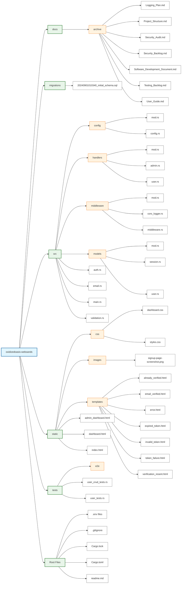

# OxidizedOasis-WebSands Project Structure



## Directory and File Descriptions

### `/docs`
Contains project documentation, including software development documents, security audits, and user guides.

### `/migrations`
Stores database migration scripts for managing database schema changes.

### `/src`
The main source code directory for the application.

- `/config`: Manages application configuration and environment variables.
- `/handlers`: Contains request handlers for different routes and functionalities.
- `/middleware`: Implements custom middleware for request/response processing.
- `/models`: Defines data models and structures used throughout the application.
- `auth.rs`: Implements authentication logic, including JWT token generation and validation.
- `email.rs`: Handles email-related functionality, such as sending verification emails.
- `main.rs`: The entry point of the application, setting up the server and routes.
- `validation.rs`: Implements input validation logic for user inputs and data.

### `/static`
Contains static files served by the application.

- `/css`: Stores CSS files for styling the frontend.
- `/images`: Contains image assets used in the application.
- HTML files: Templates for various pages (admin dashboard, user dashboard, etc.).

### `/tests`
Directory for integration tests.

### Root Files
- `.env` and `.env.test`: Environment variables for development and testing.
- `.gitignore`: Specifies intentionally untracked files to ignore.
- `Cargo.lock`: Ensures consistent builds by locking dependency versions.
- `Cargo.toml`: Cargo manifest file specifying project dependencies and metadata.
- `readme.md`: Provides an overview and instructions for the project.


# OxidizedOasis-WebSands Plain-Text Project Structure
```
# OxidizedOasis-WebSands Plain-Text Project Structure

oxidizedoasis-websands/
│
├── docs/                          # Project documentation
│   ├── archive/                   # Archived documents
│   │   ├── Logging_Plan.md        # Logging strategy and plan
│   │   ├── Project_Structure.md   # Documentation for project structure
│   │   ├── Security_Audit.md      # Security audit details
│   │   ├── Security_Backlog.md    # Security-related backlogs
│   │   ├── Software_Development_Document.md  # Development process documentation
│   │   ├── Testing_Backlog.md     # Testing backlog documentation
│   │   └── User_Guide.md          # User guide for the application
│
├── migrations/                    # Database migration scripts
│   └── 20240901010340_initial_schema.sql  # Initial database schema migration
│
├── src/                           # Source code directory
│   ├── config/                    # Configuration management
│   │   ├── mod.rs                 # Module declaration file
│   │   └── config.rs              # Application configuration handling
│   │
│   ├── handlers/                  # Request handlers
│   │   ├── mod.rs                 # Module declaration file
│   │   ├── admin.rs               # Admin-specific handlers
│   │   └── user.rs                # User-related handlers
│   │
│   ├── middleware/                # Custom middleware
│   │   ├── mod.rs                 # Module declaration file
│   │   ├── cors_logger.rs         # CORS logging middleware
│   │   └── middleware.rs          # General middleware implementations
│   │
│   ├── models/                    # Data models
│   │   ├── mod.rs                 # Module declaration file
│   │   ├── session.rs             # Session model
│   │   └── user.rs                # User model
│   │
│   ├── auth.rs                    # Authentication logic
│   ├── email.rs                   # Email service implementation
│   ├── main.rs                    # Application entry point
│   └── validation.rs              # Input validation logic
│
├── static/                        # Static files
│   ├── css/                       # CSS stylesheets
│   │   ├── dashboard.css          # Dashboard-specific styles
│   │   └── styles.css             # Global styles
│   │
│   ├── images/                    # Image assets
│   │   └── signup-page-screenshot.png  # Signup page screenshot for documentation or UI reference
│   │
│   ├── templates/                 # HTML templates for various pages
│   │   ├── already_verified.html  # Template for already verified users
│   │   ├── email_verified.html    # Template for email verification success
│   │   ├── error.html             # Error page template
│   │   ├── expired_token.html     # Token expired template
│   │   ├── invalid_token.html     # Invalid token template
│   │   ├── token_failure.html     # Token failure template
│   │   └── verification_resent.html  # Template for resent verification
│   │
│   ├── admin_dashboard.html       # Admin dashboard template
│   ├── dashboard.html             # User dashboard template
│   ├── index.html                 # Main landing page
│
├── tests/                         # Test directory (integration tests)
│   ├── e2e/                       # End-to-end test scripts
│   ├── user_crud_tests.rs         # CRUD operation tests for users
│   └── user_tests.rs              # General user tests
│
├── .env                           # Environment variables for development
├── .env.test                      # Environment variables for testing
├── .gitignore                     # Git ignore file
├── Cargo.lock                     # Cargo lock file (dependency versions)
├── Cargo.toml                     # Cargo manifest file (project dependencies)
└── readme.md                      # Project readme file
```
