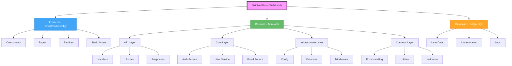
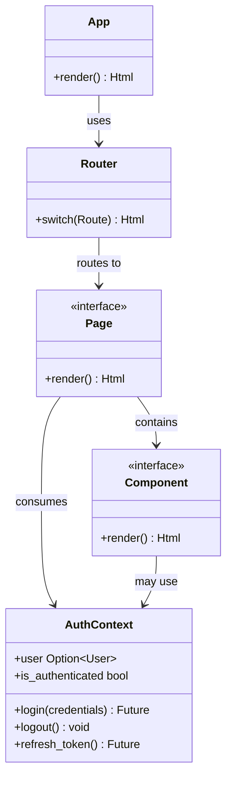
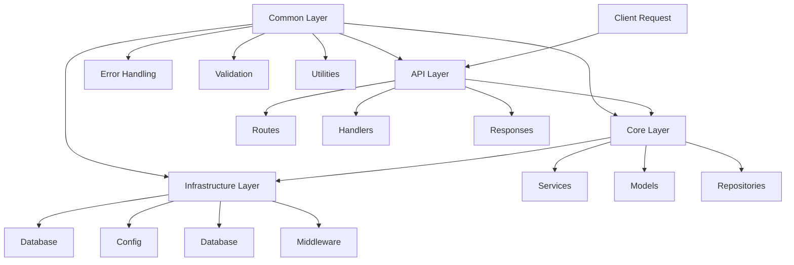
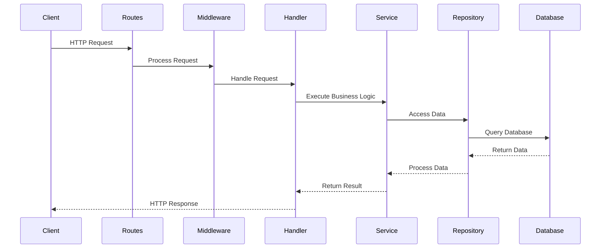
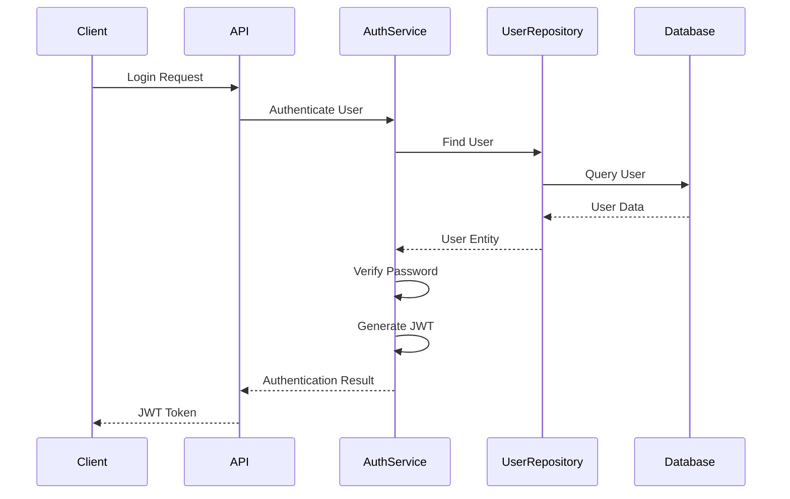
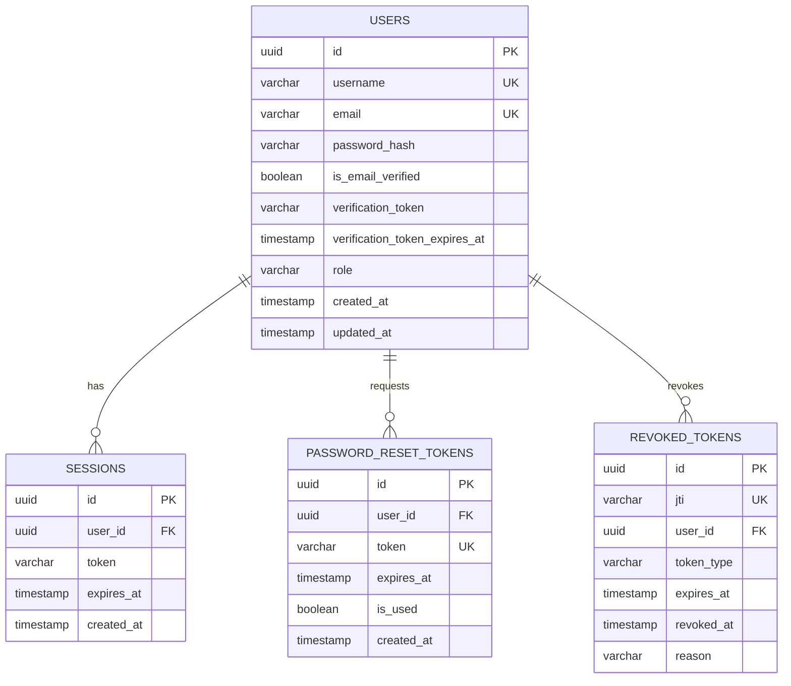
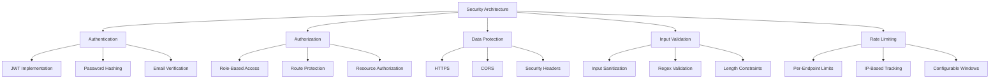
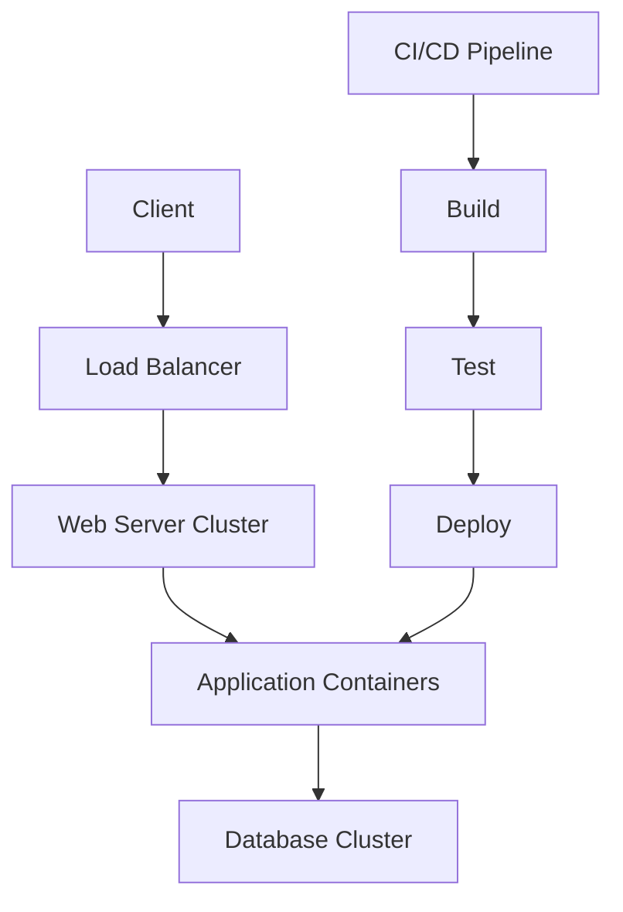

# OxidizedOasis-WebSands Project Structure

This document provides a comprehensive overview of the OxidizedOasis-WebSands project architecture, detailing both frontend and backend components, their relationships, and the technical decisions behind the design.

## System Architecture Overview



## Frontend Architecture

The frontend is built with Rust using the Yew framework, compiled to WebAssembly for high-performance browser execution.

### Directory Structure

```
frontend/
├── dist/                    # Build output directory
├── src/                     # Source code directory
│   ├── components/          # Reusable UI components
│   │   ├── mod.rs          # Components module declarations
│   │   ├── nav.rs          # Navigation bar component
│   │   ├── footer.rs       # Footer component
│   │   ├── icons.rs        # Icon components
│   │   └── not_found.rs    # 404 page component
│   │
│   ├── pages/              # Page-level components
│   │   ├── mod.rs          # Pages module declarations
│   │   ├── home.rs         # Home page
│   │   ├── about.rs        # About page
│   │   ├── dashboard.rs    # Dashboard page
│   │   ├── login.rs        # Login page
│   │   ├── register.rs     # Registration page
│   │   ├── email_verified.rs  # Email verification confirmation
│   │   ├── registration_complete.rs  # Registration success
│   │   ├── password_reset_request.rs # Password reset request page
│   │   ├── password_reset_verify.rs  # Password reset verification
│   │   ├── password_reset_new.rs     # New password entry page
│   │   └── not_found.rs    # 404 page
│   │
│   ├── services/           # Business logic and state management
│   │   ├── mod.rs          # Services module declarations
│   │   ├── auth.rs         # Authentication service
│   │   ├── auth_context.rs # Authentication context provider
│   │   ├── confetti.rs     # Confetti animation service
│   │   ├── confetti_context.rs # Confetti context provider
│   │   └── reset_token_context.rs # Password reset token context
│   │
│   ├── routes.rs           # Route definitions
│   └── lib.rs              # Main application entry
│
├── static/                 # Static assets
│   ├── favicon.svg        # Site favicon
│   └── css/               # CSS structure
│       ├── main.css       # Main CSS entry point
│       ├── core/          # Core styles
│       │   ├── base.css   # Base styles
│       │   ├── reset.css  # CSS reset
│       │   └── variables.css # CSS variables
│       ├── components/    # Component styles
│       │   ├── buttons.css
│       │   ├── cards.css
│       │   ├── footer.css
│       │   ├── loaders.css
│       │   ├── forms/
│       │   │   ├── inputs.css
│       │   │   └── validation.css
│       │   └── nav/
│       │       ├── navbar.css
│       │       └── sidebar.css
│       ├── layouts/       # Layout styles
│       │   ├── containers.css
│       │   └── grid.css
│       ├── pages/         # Page-specific styles
│       │   ├── about/
│       │   ├── auth/
│       │   ├── dashboard/
│       │   └── home/
│       └── utils/         # Utility styles
│           ├── animations.css
│           ├── breakpoints.css
│           └── helpers.css
│
├── Cargo.toml             # Dependencies and build configuration
├── index.html            # HTML template
└── Trunk.toml           # Trunk bundler configuration
```

### Component Architecture



### Key Frontend Components

1. **Navigation Component**
   - Provides site-wide navigation
   - Adapts based on authentication state
   - Responsive design for mobile and desktop

2. **Authentication Components**
   - Login form with validation
   - Registration form with validation
   - Password reset workflow
   - Email verification handling

3. **Dashboard Components**
   - User profile management
   - Settings configuration
   - Content display

### State Management

The frontend uses Yew's context providers for global state management:

```rust
// Authentication context example
#[derive(Clone, PartialEq, Properties)]
pub struct AuthContextProps {
    pub children: Children,
}

#[function_component(AuthContextProvider)]
pub fn auth_context_provider(props: &AuthContextProps) -> Html {
    let user_state = use_state(|| None::<User>);
    let token_state = use_state(|| None::<String>);
    
    // Context value
    let context = AuthContext {
        user: (*user_state).clone(),
        token: (*token_state).clone(),
        login: Callback::from(move |credentials: LoginCredentials| {
            // Login implementation
        }),
        logout: Callback::from(move |_| {
            // Logout implementation
        }),
    };
    
    html! {
        <ContextProvider<AuthContext> context={context}>
            { props.children.clone() }
        </ContextProvider<AuthContext>>
    }
}
```

### Routing System

The frontend uses Yew Router for client-side routing:

```rust
#[derive(Clone, Routable, PartialEq)]
pub enum Route {
    #[at("/")]
    Home,
    #[at("/about")]
    About,
    #[at("/login")]
    Login,
    #[at("/register")]
    Register,
    #[at("/dashboard")]
    Dashboard,
    #[at("/verify")]
    EmailVerify,
    #[at("/password-reset")]
    PasswordReset,
    #[at("/password-reset/verify")]
    PasswordResetVerify,
    #[at("/password-reset/new")]
    PasswordResetNew,
    #[not_found]
    #[at("/404")]
    NotFound,
}

fn switch(routes: Route) -> Html {
    match routes {
        Route::Home => html! { <HomePage /> },
        Route::About => html! { <AboutPage /> },
        Route::Login => html! { <LoginPage /> },
        Route::Register => html! { <RegisterPage /> },
        Route::Dashboard => html! {
            <ProtectedRoute>
                <DashboardPage />
            </ProtectedRoute>
        },
        // Additional routes...
        Route::NotFound => html! { <NotFoundPage /> },
    }
}
```

## Backend Architecture

The backend is built with Rust using the Actix-web framework, following clean architecture principles for maintainability and testability.

### Directory Structure

```
src/
├── api/                  # API Layer
│   ├── handlers/         # Request handlers
│   │   ├── mod.rs
│   │   └── user_handler.rs
│   ├── responses/        # Response structures
│   │   ├── mod.rs
│   │   └── user_response.rs
│   ├── routes/          # Route definitions
│   │   ├── mod.rs
│   │   ├── user_routes.rs
│   │   └── admin/       # Admin-specific routes
│   │       ├── mod.rs
│   │       ├── logs.rs
│   │       ├── security.rs
│   │       └── user_management.rs
│   └── mod.rs
│
├── common/              # Shared utilities and error handling
│   ├── error/          # Error definitions
│   │   ├── mod.rs
│   │   ├── api_error.rs
│   │   ├── auth_error.rs
│   │   └── db_error.rs
│   ├── utils/          # Utility functions
│   │   ├── mod.rs
│   │   ├── string.rs
│   │   ├── time.rs
│   │   └── validation.rs
│   ├── validation/     # Input validation
│   │   ├── mod.rs
│   │   ├── password.rs # Password validation rules
│   │   └── user.rs     # User input validation
│   └── mod.rs
│
├── core/               # Core business logic
│   ├── auth/          # Authentication
│   │   ├── mod.rs
│   │   ├── jwt.rs     # JWT implementation
│   │   └── service.rs # Authentication service
│   ├── email/         # Email functionality
│   │   ├── mod.rs
│   │   ├── service.rs # Email service implementation
│   │   └── templates.rs # Email templates
│   ├── user/          # User management
│   │   ├── mod.rs
│   │   ├── model.rs   # User domain model
│   │   ├── repository.rs # User data access
│   │   └── service.rs # User business logic
│   └── mod.rs
│
├── infrastructure/     # Infrastructure layer
│   ├── config/        # Configuration
│   │   ├── mod.rs
│   │   └── app_config.rs # Application configuration
│   ├── database/      # Database management
│   │   ├── mod.rs
│   │   ├── connection.rs # Database connection setup
│   │   └── migrations.rs # Database migrations
│   ├── middleware/    # HTTP middleware
│   │   ├── mod.rs
│   │   ├── admin.rs   # Admin authentication
│   │   ├── auth.rs    # User authentication
│   │   ├── cors.rs    # CORS configuration
│   │   ├── logger.rs  # Request logging
│   │   └── rate_limit.rs # Rate limiting
│   └── mod.rs
│
├── lib.rs             # Library exports
└── main.rs            # Application entry point
```

### Layer Architecture



### Key Backend Components

1. **API Layer**
   - **Routes**: Define API endpoints and HTTP methods
   - **Handlers**: Process HTTP requests and return responses
   - **Responses**: Format data for client consumption

2. **Core Layer**
   - **Services**: Implement business logic
   - **Models**: Define domain entities
   - **Repositories**: Abstract data access

3. **Infrastructure Layer**
   - **Config**: Manage application configuration
   - **Database**: Handle database connections and migrations
   - **Middleware**: Process requests before they reach handlers

4. **Common Layer**
   - **Error Handling**: Define and process errors
   - **Validation**: Validate input data
   - **Utilities**: Provide common functionality

### Request Flow



### Authentication Flow



## Database Schema

The database uses PostgreSQL with the following schema:



### Database Migrations

The project uses SQL-based migrations for database schema management:

```
migrations/
├── 20240901010340_initial_schema.sql
├── 20240902010341_add_password_reset.sql
├── 20240903010342_add_revoked_tokens.sql
└── 20250302010343_add_active_tokens.sql
```

## Security Architecture

The security architecture is built around several key components:



### JWT Authentication

```rust
// JWT claims structure
#[derive(Debug, Serialize, Deserialize)]
pub struct Claims {
    pub sub: Uuid,            // Subject (user ID)
    pub exp: i64,             // Expiration time
    pub iat: i64,             // Issued at time
    pub nbf: i64,             // Not before time
    pub jti: String,          // JWT ID (unique identifier)
    pub role: String,         // User role
    pub token_type: TokenType, // Token type (access or refresh)
}

// Token validation
pub fn validate_token(token: &str, expected_type: TokenType, secret: &str) -> Result<Claims, JwtError> {
    // Decode and verify signature
    let token_data = decode::<Claims>(
        token,
        &DecodingKey::from_secret(secret.as_ref()),
        &Validation::default()
    )?;
    
    // Verify token type
    if token_data.claims.token_type != expected_type {
        return Err(JwtError::InvalidTokenType);
    }
    
    // Check if token is revoked
    if is_token_revoked(&token_data.claims.jti)? {
        return Err(JwtError::TokenRevoked);
    }
    
    // Return claims if all checks pass
    Ok(token_data.claims)
}
```

### Rate Limiting

```rust
// Rate limiting configuration
const RATE_LIMITS: &[RateLimit] = &[
    RateLimit {
        path: "/users/login",
        max_requests: 5,
        window_seconds: 300, // 5 minutes
        error_message: "Too many login attempts",
    },
    RateLimit {
        path: "/users/register",
        max_requests: 3,
        window_seconds: 3600, // 1 hour
        error_message: "Too many registration attempts",
    },
    // Additional endpoints...
];
```

## Testing Architecture

The project uses a comprehensive testing approach:

```
tests/
├── user_crud_tests.rs  # User CRUD operation tests
└── user_tests.rs       # General user functionality tests
```

### Test Categories

1. **Unit Tests**
   - Test individual components in isolation
   - Mock dependencies
   - Focus on business logic

2. **Integration Tests**
   - Test component interactions
   - Use real database with test data
   - Verify end-to-end flows

3. **Security Tests**
   - Test authentication flows
   - Verify authorization rules
   - Validate input handling

## Deployment Architecture

The application is designed for containerized deployment:



### Deployment Components

1. **Docker Containers**
   - Frontend container
   - Backend container
   - Database container

2. **Kubernetes Orchestration**
   - Service definitions
   - Deployment configurations
   - Scaling policies

3. **CI/CD Pipeline**
   - Automated testing
   - Security scanning
   - Deployment automation

## Conclusion

The OxidizedOasis-WebSands project follows a clean, modular architecture that separates concerns and promotes maintainability. The frontend uses Yew/WebAssembly for high-performance client-side rendering, while the backend uses Actix-web for efficient request handling. The security architecture is comprehensive, covering authentication, authorization, data protection, and rate limiting.

Key architectural benefits include:

1. **Maintainability**
   - Clear separation of concerns
   - Modular design
   - Consistent patterns

2. **Scalability**
   - Independent layer scaling
   - Containerized deployment
   - Stateless design

3. **Security**
   - Comprehensive authentication
   - Thorough input validation
   - Robust rate limiting

4. **Performance**
   - WebAssembly frontend
   - Efficient Rust backend
   - Optimized database queries