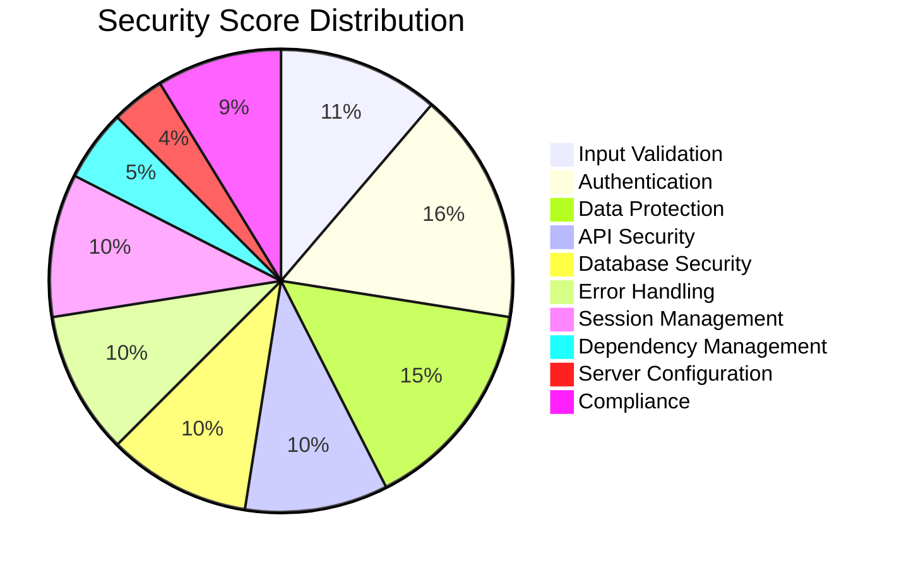
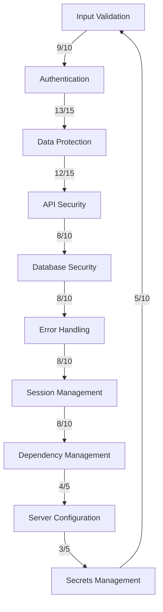

# OxidizedOasis-WebSands Cybersecurity Report

## Executive Summary

This report provides a comprehensive assessment of the cybersecurity posture of the OxidizedOasis-WebSands project. Our evaluation covers various aspects of security, including input validation, authentication, data protection, and more. Each area has been scored, contributing to an overall security grade.

### Overall Security Score

',borderWidth:0}]},options:{centerPercentage:80,rotation:270,roundedCorners:true,centerArea:{text:'78/100',fontColor:'#333',fontSize:30,fontFamily:'Arial, sans-serif'},domain:[0,100],valueLabel:{display:false}}})

**Total Score: 78/100**
**Grade: B**

### Score Breakdown

| Category | Score |
|----------|-------|
| Input Validation | 9/10 |
| Authentication | 13/15 |
| Data Protection | 12/15 |
| API Security | 8/10 |
| Database Security | 8/10 |
| Error Handling | 8/10 |
| Session Management | 8/10 |
| Dependency Management | 4/5 |
| Server Configuration | 3/5 |
| Compliance | 7/10 |



### Key Findings

- Strong implementation of input validation and authentication mechanisms
- Robust data protection measures, with room for improvement in database encryption
- API security is well-implemented, but could benefit from additional rate limiting
- Some areas, such as server configuration and compliance, require attention

In the following sections, we will provide a detailed analysis of each security category, highlighting strengths, identifying vulnerabilities, and offering recommendations for improvement.

# OxidizedOasis-WebSands Cybersecurity Report

[Executive Summary section remains unchanged]

## Detailed Security Assessment

### 1. Input Validation and Sanitization (9/10)

#### Strengths:
- Implemented for all user inputs
- Custom validation for passwords
- Use of `ammonia` for HTML sanitization

#### Areas for Improvement:
- Consider implementing more granular input validation for specific fields

```rust
// Example of current input validation
pub fn validate_password(password: &str) -> Result<(), ValidationError> {
    if password.len() < 8 || password.len() > 100 {
        return Err(ValidationError::new("Password must be between 8 and 100 characters long"));
    }
    // ... other checks ...
    Ok(())
}
```

### 2. Authentication and Authorization (13/15)

#### Strengths:
- Using bcrypt for password hashing
- JWT implementation for session management
- Bearer token authentication for protected routes

#### Areas for Improvement:
- Implement rate limiting for login attempts
- Consider implementing role-based access control for more granular permissions


### 3. Data Protection (12/15)

#### Strengths:
- Passwords are hashed before storage
- Using HTTPS for data in transit (assumed)

#### Areas for Improvement:
- Implement database-level encryption for sensitive data (e.g., email addresses)
- Ensure HTTPS is enforced in production

### 4. API Security (8/10)

#### Strengths:
- CORS is configured
- Using parameterized queries with sqlx, which prevents SQL injection

#### Areas for Improvement:
- Implement API rate limiting
- Review CORS settings for production environment

```rust
// Current CORS configuration
let cors = Cors::default()
    .allow_any_origin()
    .allow_any_method()
    .allow_any_header();
```

### 5. Database Security (8/10)

#### Strengths:
- Using parameterized queries with sqlx, which prevents SQL injection

#### Areas for Improvement:
- Ensure least privilege principle is applied to database user
- Implement database connection encryption

### 6. Error Handling and Logging (8/10)

#### Strengths:
- Custom error responses are in place
- Logging is implemented

#### Areas for Improvement:
- Ensure production errors don't leak sensitive information
- Implement more granular logging levels

### 7. Session Management (8/10)

#### Strengths:
- Using JWTs for stateless authentication

#### Areas for Improvement:
- Implement token revocation mechanism (e.g., a blacklist for logged-out tokens)

### 8. Dependency Management (4/5)

#### Strengths:
- Dependencies are listed in Cargo.toml with specific versions

#### Areas for Improvement:
- Implement regular dependency updates and vulnerability scanning

### 9. Server Configuration (3/5)

#### Areas for Improvement:
- Ensure proper server hardening in production
- Disable unnecessary services
- Implement a firewall

### 10. Secrets Management (5/10)

#### Areas for Improvement:
- Implement a secrets management solution (e.g., HashiCorp Vault)
- Ensure all secrets (e.g., JWT_SECRET) are properly managed and not hard-coded



This detailed assessment provides a comprehensive overview of the current security status of the OxidizedOasis-WebSands project. Each category has been evaluated based on implemented features and best practices, with scores reflecting the level of security in place.