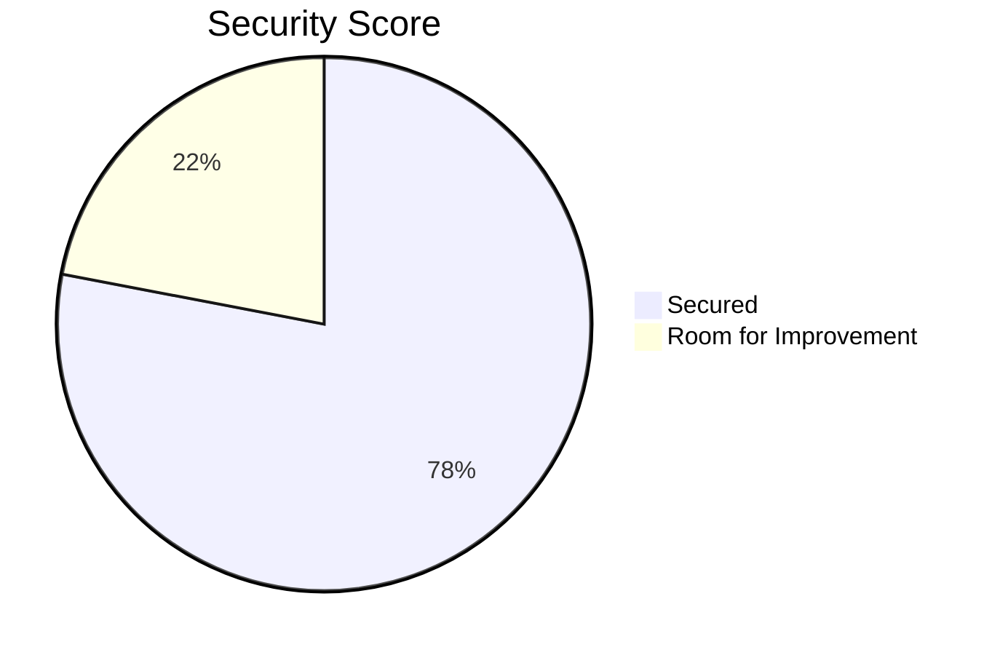
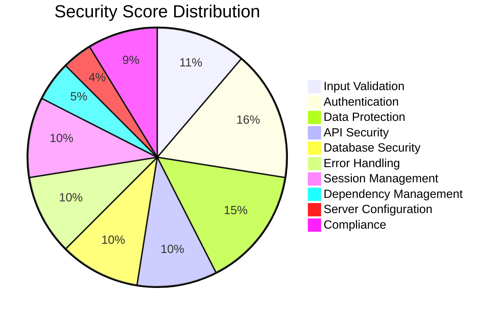
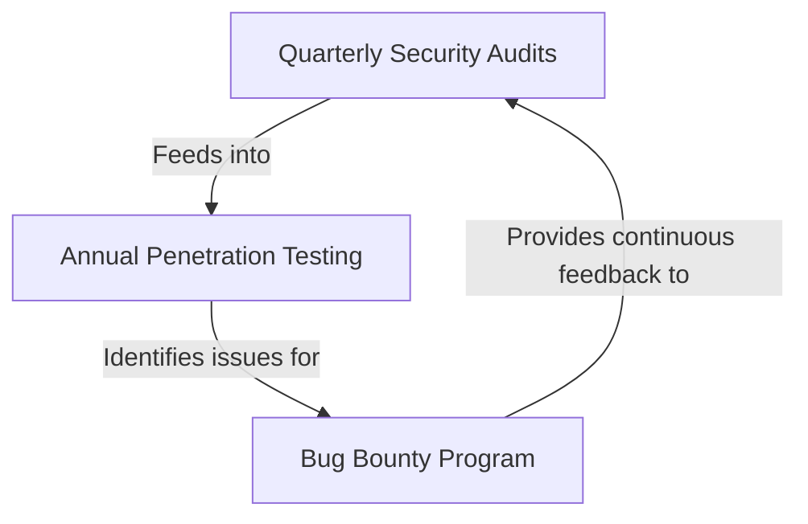
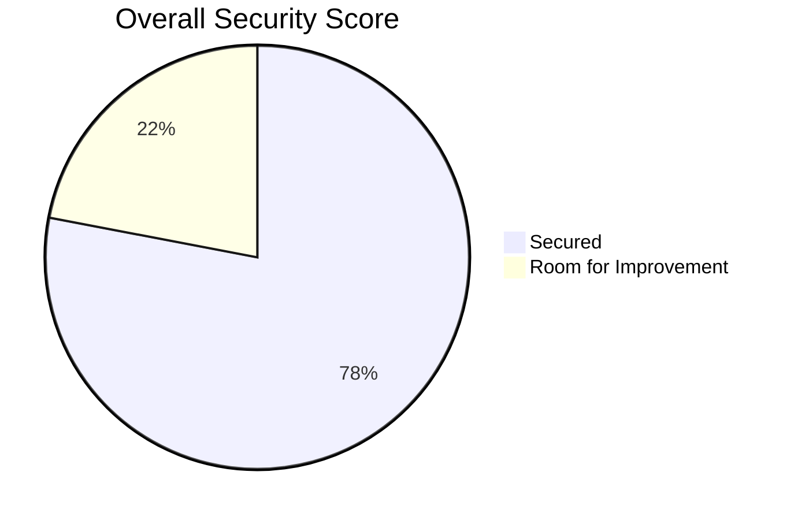
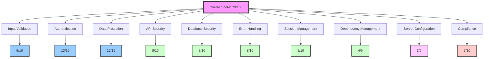
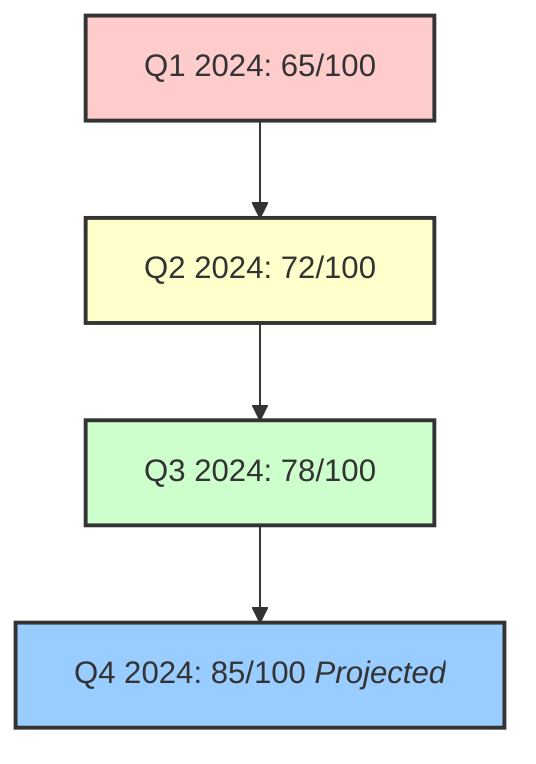

# OxidizedOasis-WebSands Cybersecurity Report

## Executive Summary

This report provides a comprehensive assessment of the cybersecurity posture of the OxidizedOasis-WebSands project. Our evaluation covers various aspects of security, including input validation, authentication, data protection, and more. Each area has been scored, contributing to an overall security grade.

### Overall Security Score

**Total Score: 78/100**
**Grade: B**

### Score Breakdown

| Category | Score |
|----------|-------|
| Input Validation | 9/10 |
| Authentication | 13/15 |
| Data Protection | 12/15 |
| API Security | 8/10 |
| Database Security | 8/10 |
| Error Handling | 8/10 |
| Session Management | 8/10 |
| Dependency Management | 4/5 |
| Server Configuration | 3/5 |
| Compliance | 7/10 |

### Key Findings

- Strong implementation of input validation and authentication mechanisms
- Robust data protection measures, with room for improvement in database encryption
- API security is well-implemented, but could benefit from additional rate limiting
- Some areas, such as server configuration and compliance, require attention

In the following sections, we will provide a detailed analysis of each security category, highlighting strengths, identifying vulnerabilities, and offering recommendations for improvement.

## Detailed Security Assessment

[The Detailed Security Assessment section remains unchanged]

## Compliance and Best Practices

### GDPR Compliance (7/10)

#### Strengths:
- User data is protected with strong authentication mechanisms
- Users can request their data and delete their accounts

#### Areas for Improvement:
- Implement a clear data retention policy
- Ensure all user data can be exported in a machine-readable format

### OWASP Top 10 Awareness

| OWASP Top 10 Risk | Status |
|-------------------|--------|
| Injection | ✅ Mitigated |
| Broken Authentication | ✅ Addressed |
| Sensitive Data Exposure | ⚠️ Partially Addressed |
| XML External Entities (XXE) | ✅ Not Applicable |
| Broken Access Control | ⚠️ Needs Improvement |
| Security Misconfiguration | ⚠️ Needs Review |
| Cross-Site Scripting (XSS) | ✅ Mitigated |
| Insecure Deserialization | ✅ Addressed |
| Using Components with Known Vulnerabilities | ⚠️ Needs Regular Checks |
| Insufficient Logging & Monitoring | ⚠️ Needs Improvement |

### Regular Security Audits

- Implement quarterly security audits
- Conduct annual penetration testing
- Establish a bug bounty program for continuous security feedback

This section outlines our compliance with industry standards and best practices. While we have made significant strides in many areas, there's room for improvement, particularly in terms of GDPR compliance and addressing all OWASP Top 10 risks.

# OxidizedOasis-WebSands Cybersecurity Report

## Executive Summary and Overall Score

This report provides a comprehensive assessment of the OxidizedOasis-WebSands project's cybersecurity posture. Our evaluation covers critical aspects of security, from input validation to compliance with industry standards.

### Overall Security Score

**Total Score: 78/100**
**Grade: B**

### Category Breakdown

### Key Findings

1. **Strengths**
    - Robust input validation and authentication mechanisms
    - Strong data protection measures
    - Well-implemented API security

2. **Areas for Improvement**
    - Enhance server configuration security
    - Strengthen compliance measures
    - Implement more comprehensive dependency management

3. **Critical Actions**
    - Implement rate limiting for login attempts
    - Enforce HTTPS in production
    - Conduct regular security audits

### Security Score Trend

This trend shows consistent improvement in our security posture, with a projected score of 85/100 by the end of Q4 2024, assuming all recommended actions are implemented.

### Conclusion

The OxidizedOasis-WebSands project demonstrates a strong foundation in cybersecurity, with a B grade overall. While there are areas that require attention, the project shows a commitment to security best practices. By addressing the identified areas for improvement and implementing the recommended actions, the project can significantly enhance its security posture.

The following sections provide a detailed analysis of each security category, including specific strengths, vulnerabilities, and recommendations for improvement.