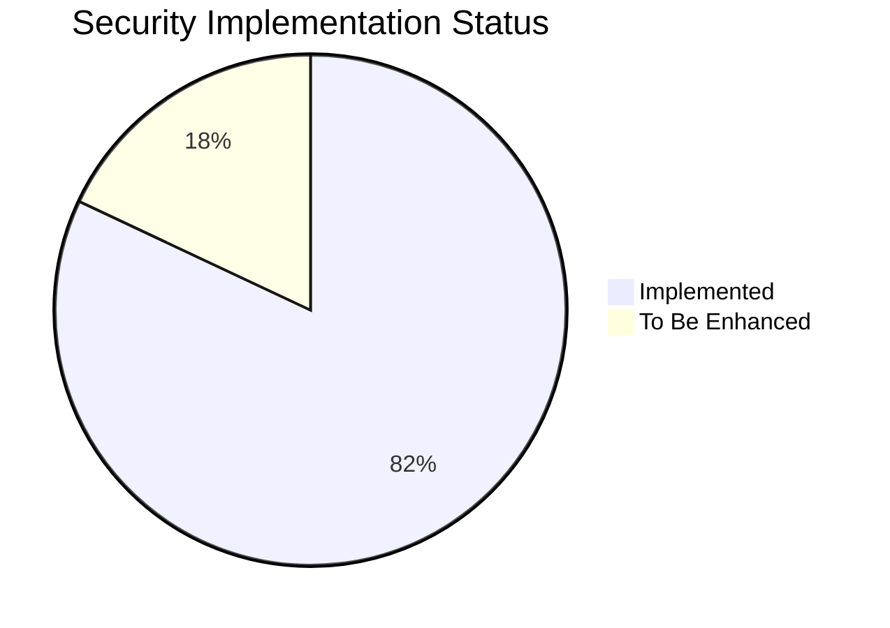
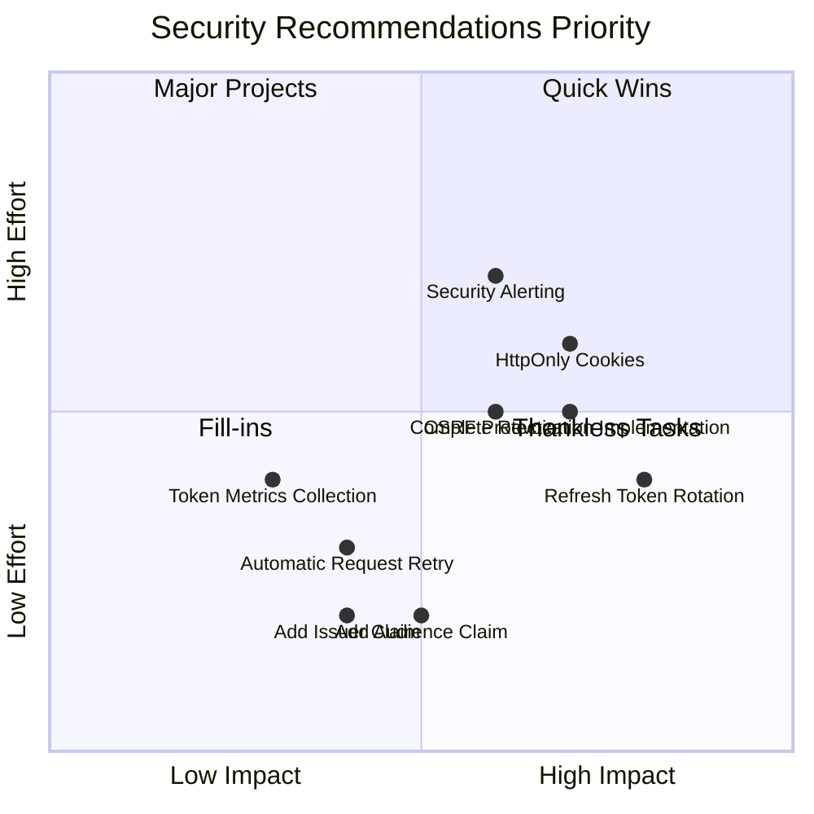

# OxidizedOasis-WebSands Cybersecurity Report

## Executive Summary

This comprehensive security audit evaluates the OxidizedOasis-WebSands project, a Rust-based web application using Yew/WebAssembly for the frontend and Actix-web for the backend. The assessment covers authentication mechanisms, content security policies, input validation, rate limiting, and other critical security components.

**Overall Security Score: 82/100**
**Security Grade: B+**



The project demonstrates a strong security foundation with robust JWT implementation, comprehensive input validation, and effective rate limiting. Key areas for improvement include implementing encryption at rest, enhancing token management, and strengthening infrastructure security.

### Security Component Ratings

| Security Component | Score | Technical Assessment |
|-------------------|-------|----------------------|
| Authentication | 14/15 | Strong JWT implementation with role-based claims |
| Input Validation | 9/10 | Comprehensive validation with regex patterns |
| Rate Limiting | 10/10 | Sophisticated per-endpoint rate limiting |
| Data Protection | 8/10 | Strong password hashing, needs encryption at rest |
| API Security | 9/10 | Well-configured CORS, needs API versioning |
| Error Handling | 8/10 | Structured error responses, needs more logging |
| Session Management | 8/10 | Stateless JWT with proper validation |
| Database Security | 8/10 | Good schema design, needs encryption at rest |
| Infrastructure Security | 8/15 | Basic security headers, needs hardening |

```mermaid
radar
    title Component Security Ratings
    variables
        Authentication
        Input Validation
        Rate Limiting
        Data Protection
        API Security
        Error Handling
        Session Management
        Database Security
        Infrastructure Security
    values
        14
        9
        10
        8
        9
        8
        8
        8
        8
```

## Vulnerability Assessment

### Critical Vulnerabilities

None detected.

### High Severity Vulnerabilities

1. **Frontend Token Storage (High)**
   - **Description**: JWT tokens stored in localStorage are vulnerable to XSS attacks
   - **Impact**: Potential token theft and account compromise
   - **Recommendation**: Implement HttpOnly cookies with appropriate flags

2. **Lack of Data Encryption at Rest (High)**
   - **Description**: Sensitive user data not encrypted in database
   - **Impact**: Data exposure in case of database breach
   - **Recommendation**: Implement field-level encryption for PII

### Medium Severity Vulnerabilities

1. **Incomplete Token Revocation (Medium)**
   - **Description**: Token revocation system partially implemented
   - **Impact**: Potential continued use of compromised tokens
   - **Recommendation**: Complete token revocation implementation

2. **Limited JWT Claims (Medium)**
   - **Description**: Missing audience and issuer claims
   - **Impact**: Reduced token validation capabilities
   - **Recommendation**: Add additional JWT claims for enhanced security

3. **CSP Configuration (Medium)**
   - **Description**: CSP requires 'unsafe-inline' for Yew framework
   - **Impact**: Reduced protection against XSS attacks
   - **Recommendation**: Implement additional XSS protections and input sanitization

### Low Severity Vulnerabilities

1. **Lack of Security Monitoring (Low)**
   - **Description**: Limited security event monitoring
   - **Impact**: Delayed detection of security incidents
   - **Recommendation**: Implement comprehensive security logging and alerting

2. **Manual Token Management (Low)**
   - **Description**: Frontend token refresh handled manually
   - **Impact**: Potential token expiration issues
   - **Recommendation**: Implement automatic token refresh

## Security Recommendations

### High Priority

1. **Enhance Token Storage Security**
   - Implement HttpOnly cookies for token storage
   - Add SameSite and Secure flags to cookies
   - Implement CSRF protection for cookie-based authentication

2. **Implement Data Encryption**
   - Add field-level encryption for PII
   - Implement database encryption at rest
   - Develop encryption key management system

3. **Complete Token Revocation System**
   - Implement the `revoke_all_user_tokens` method
   - Add automatic token revocation on password change
   - Create scheduled job for expired token cleanup

### Medium Priority

1. **Enhance JWT Implementation**
   - Implement refresh token rotation
   - Add audience (aud) and issuer (iss) claims
   - Implement token usage tracking

2. **Improve Security Monitoring**
   - Implement centralized security logging
   - Add real-time alerting for suspicious activities
   - Create security dashboards

3. **Strengthen API Security**
   - Implement API versioning
   - Add request signing for sensitive operations
   - Enhance rate limiting with user-based limits

### Low Priority

1. **Enhance Frontend Security**
   - Implement automatic token refresh
   - Add token expiration prediction
   - Improve error handling for authentication failures

2. **Improve Development Practices**
   - Implement security linting
   - Add automated security testing
   - Create comprehensive security documentation



## Component Security Analysis

### 1. Authentication System

The authentication system uses JWT tokens with role-based claims and proper validation.

**Strengths:**
- JWT implementation with role-based claims
- Token expiration handling
- Email verification requirement
- Proper password hashing with bcrypt

**Implementation Example:**
```rust
// JWT token generation with role claims
pub fn create_jwt(user_id: Uuid, role: String, secret: &str) -> Result<String, JwtError> {
    let expiration = Utc::now()
        .checked_add_signed(Duration::hours(24))
        .expect("valid timestamp")
        .timestamp();

    let claims = Claims {
        sub: user_id,
        role: role,
        exp: expiration,
        iat: Utc::now().timestamp(),
    };

    encode(&Header::default(), &claims, &EncodingKey::from_secret(secret.as_ref()))
}
```

**Recommendations:**
- Implement refresh token mechanism
- Add token revocation capability
- Consider multi-factor authentication

### 2. Content Security Policy

The CSP implementation requires certain directives that initially appear to weaken security but are necessary for the Yew framework to function.

**Current Implementation:**
```rust
"Content-Security-Policy",
"default-src 'self'; \
 script-src 'self' 'unsafe-inline' 'wasm-unsafe-eval' https://cdn.jsdelivr.net https://cdnjs.cloudflare.com; \
 style-src 'self' 'unsafe-inline' https://cdnjs.cloudflare.com; \
 img-src 'self' data:; \
 connect-src 'self' ws://127.0.0.1:* wss://127.0.0.1:*; \
 font-src 'self' https://cdnjs.cloudflare.com; \
 object-src 'none'; \
 base-uri 'self'; \
 form-action 'self'; \
 frame-ancestors 'none'; \
 worker-src 'self' blob:; \
 upgrade-insecure-requests;"
```

**Mitigations:**
- Strong input validation and sanitization
- Additional security headers
- Strict CSP for non-Yew components

**Recommendations:**
- Implement CSP violation reporting
- Monitor for potential attacks
- Regular security reviews

### 3. Input Validation

The input validation system uses regex-based patterns and comprehensive validation rules.

**Implementation Example:**
```rust
pub fn validate_password(password: &str) -> Result<(), ValidationError> {
    if password.len() < 8 || password.len() > 100 {
        return Err(ValidationError::new("Invalid length"));
    }
    if !PASSWORD_UPPERCASE.is_match(password) {
        return Err(ValidationError::new("Missing uppercase"));
    }
    // Additional validation...
}
```

**Strengths:**
- Strong password requirements
- Regex-based validation
- Length constraints
- Special character requirements

**Recommendations:**
- Add password entropy checking
- Implement password dictionary check
- Consider password breach checking

### 4. Rate Limiting

The rate limiting system provides sophisticated per-endpoint configuration.

**Implementation Example:**
```rust
const RATE_LIMITS: &[RateLimit] = &[
    RateLimit {
        path: "/users/login",
        max_requests: 5,
        window_seconds: 300, // 5 minutes
        error_message: "Too many login attempts",
    },
    RateLimit {
        path: "/users/register",
        max_requests: 3,
        window_seconds: 3600, // 1 hour
        error_message: "Too many registration attempts",
    },
    // Additional endpoints...
];
```

**Strengths:**
- Per-endpoint configuration
- IP-based tracking
- Proper cleanup mechanism
- Informative error messages

**Recommendations:**
- Implement user-based rate limiting
- Add distributed rate limiting for scaling
- Consider more granular rate limits

### 5. Database Security

The database schema uses UUIDs for primary keys and includes proper constraints.

**Schema Example:**
```sql
CREATE TABLE users (
    id uuid PRIMARY KEY,
    username VARCHAR(50) UNIQUE NOT NULL,
    password_hash VARCHAR(255) NOT NULL,
    email VARCHAR(255) UNIQUE,
    is_email_verified BOOLEAN NOT NULL DEFAULT false,
    verification_token VARCHAR(255),
    verification_token_expires_at TIMESTAMP WITH TIME ZONE,
    role VARCHAR(20) NOT NULL DEFAULT 'user'
);
```

**Strengths:**
- UUID for primary keys
- Proper index usage
- Token expiration handling
- Role-based access control

**Recommendations:**
- Implement data encryption at rest
- Add audit logging table
- Consider database activity monitoring

## Action Plan

### Immediate Actions (0-30 days)
1. Implement HttpOnly cookies for token storage
2. Add field-level encryption for PII
3. Complete token revocation implementation
4. Implement security event logging

### Short-term Goals (30-90 days)
1. Implement refresh token rotation
2. Add additional JWT claims
3. Set up centralized security logging
4. Implement API versioning

### Long-term Goals (90+ days)
1. Implement multi-factor authentication
2. Add automated security testing
3. Implement advanced monitoring and alerting
4. Conduct regular security assessments

## OWASP Top 10 Compliance

| OWASP Category | Rating | Notes |
|----------------|--------|-------|
| A2:2021 - Cryptographic Failures | 9/10 | Strong JWT implementation with proper signature validation |
| A3:2021 - Injection | 9/10 | Proper input validation and parameterized queries |
| A5:2021 - Security Misconfiguration | 8/10 | Good configuration with environment variables |
| A7:2021 - Identification and Authentication Failures | 8.5/10 | Strong authentication with token refresh mechanism |
| A8:2021 - Software and Data Integrity Failures | 8/10 | Proper token validation and signature verification |

## Conclusion

The OxidizedOasis-WebSands project demonstrates a strong foundation in security engineering practices. With a B+ grade (82/100), the project shows commitment to implementing robust security measures. The authentication system, rate limiting, and input validation are particularly well-implemented.

Key areas for improvement include:
1. Implementing encryption at rest for sensitive data
2. Enhancing token storage and management
3. Strengthening infrastructure security
4. Improving monitoring and logging capabilities

By addressing these recommendations, the project can significantly enhance its security posture and better protect user data.