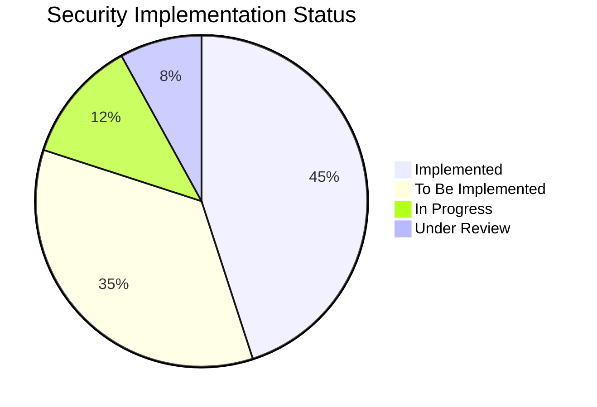
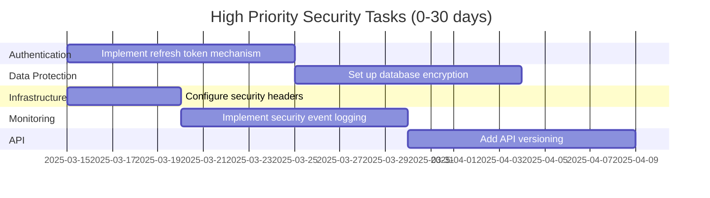
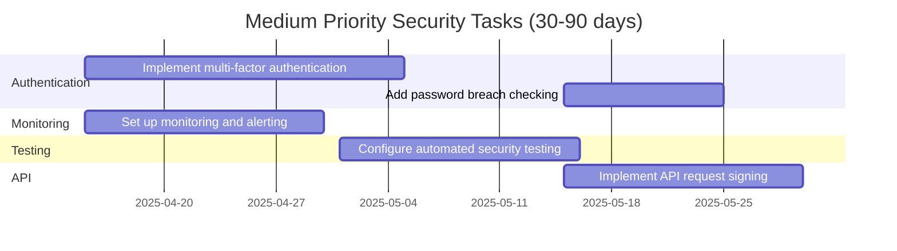
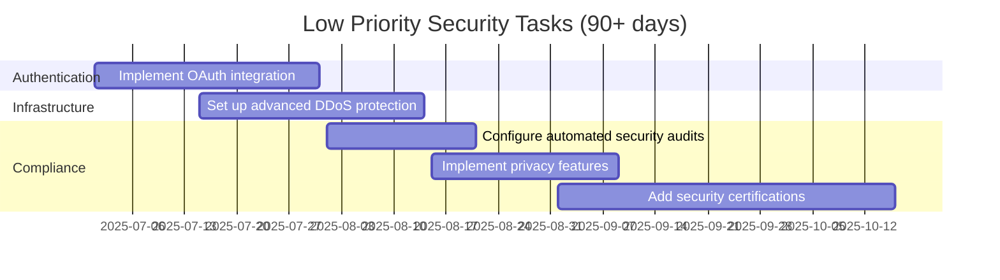
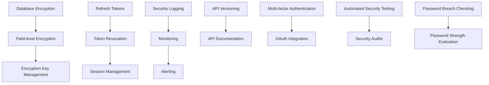
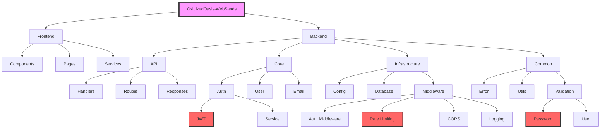
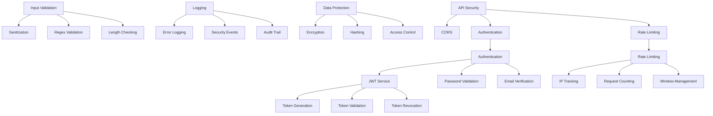

# OxidizedOasis-WebSands Security Backlog

This document provides a comprehensive list of security tasks for the OxidizedOasis-WebSands project, categorized by implementation status, priority, and technical area. It serves as a roadmap for enhancing the security posture of the application.



## Legend
✅ Implemented  
🔷 To be implemented  
🚧 In progress  
🔍 Under review  

## 1. Authentication and Authorization

### 1.1 Core Authentication
- ✅ JWT-based authentication
- ✅ Password hashing with bcrypt
- ✅ Role-based authorization
- ✅ Email verification system
- 🔷 Refresh token mechanism
- 🔷 Token revocation system
- 🔷 Multi-factor authentication
- 🚧 Session management improvements

### 1.2 Password Security
- ✅ Password complexity requirements
- ✅ Password validation
- ✅ Secure password reset flow
- 🔷 Password entropy checking
- 🔷 Password dictionary attack prevention
- 🔷 Password breach checking
- 🚧 Password expiration policy

### 1.3 Access Control
- ✅ Role-based access control
- ✅ Route protection middleware
- ✅ Admin authorization checks
- 🔷 Resource-level permissions
- 🔷 API key management
- 🔷 OAuth integration support

## 2. Data Protection

### 2.1 Data at Rest
- ✅ Password hashing
- ✅ Secure token storage
- 🔷 Database encryption
- 🔷 Field-level encryption for PII
- 🔷 Encryption key management
- 🚧 Secure backup system

### 2.2 Data in Transit
- ✅ CORS configuration
- ✅ Secure headers
- 🔷 HTTPS enforcement
- 🔷 Certificate management
- 🔷 Perfect forward secrecy
- 🚧 API request signing

### 2.3 Data Validation
- ✅ Input sanitization
- ✅ XSS prevention
- ✅ SQL injection prevention
- ✅ Input length validation
- 🔷 Content security policy
- 🔷 File upload validation

## 3. Rate Limiting and DDoS Protection

### 3.1 Rate Limiting
- ✅ Per-endpoint rate limiting
- ✅ IP-based tracking
- ✅ Configurable windows
- ✅ Retry-after headers
- 🔷 Rate limit by user
- 🔷 Distributed rate limiting

### 3.2 DDoS Protection
- ✅ Basic request throttling
- 🔷 Advanced DDoS mitigation
- 🔷 Load balancing configuration
- 🔷 Traffic analysis
- 🚧 Automatic blocking rules

## 4. Monitoring and Logging

### 4.1 Security Logging
- ✅ Error logging
- ✅ Authentication logging
- 🔷 Security event logging
- 🔷 Audit logging
- 🔷 Log aggregation
- 🚧 Log rotation policy

### 4.2 Monitoring
- ✅ Basic health checks
- 🔷 Security metrics collection
- 🔷 Real-time alerting
- 🔷 Anomaly detection
- 🔷 Performance monitoring
- 🚧 Dashboard implementation

### 4.3 Incident Response
- 🔷 Incident response plan
- 🔷 Automated notifications
- 🔷 Forensics capabilities
- 🔷 Recovery procedures
- 🚧 Incident playbooks

## 5. Infrastructure Security

### 5.1 Server Security
- ✅ Environment configuration
- 🔷 Server hardening
- 🔷 Container security
- 🔷 Network segmentation
- 🚧 Vulnerability scanning

### 5.2 Database Security
- ✅ Connection pooling
- ✅ Prepared statements
- ✅ Access control
- 🔷 Database encryption
- 🔷 Audit logging
- 🚧 Backup encryption

### 5.3 API Security
- ✅ Input validation
- ✅ Authentication checks
- ✅ Error handling
- 🔷 API versioning
- 🔷 Request signing
- 🚧 API documentation

## 6. Compliance and Privacy

### 6.1 Data Privacy
- ✅ PII handling
- 🔷 Data anonymization
- 🔷 Privacy policy implementation
- 🔷 Data retention policy
- 🚧 GDPR compliance

### 6.2 Compliance
- ✅ Security headers
- 🔷 Compliance documentation
- 🔷 Security certifications
- 🔷 Regular audits
- 🚧 Policy enforcement

## 7. Security Testing

### 7.1 Automated Testing
- ✅ Unit tests
- ✅ Integration tests
- 🔷 Security testing
- 🔷 Penetration testing
- 🔷 Fuzz testing
- 🚧 CI/CD security checks

### 7.2 Code Security
- ✅ Code reviews
- ✅ Dependency scanning
- 🔷 Static analysis
- 🔷 Dynamic analysis
- 🔷 Security linting
- 🚧 Secure coding guidelines

## Implementation Priorities

### High Priority (0-30 days)

| Task | Description | Dependencies | Effort | Impact |
|------|-------------|--------------|--------|--------|
| Implement refresh token mechanism | Add support for refresh tokens with rotation | None | Medium | High |
| Set up database encryption | Implement encryption at rest for sensitive data | None | Medium | High |
| Configure security headers | Add comprehensive security headers | None | Low | Medium |
| Implement security event logging | Add detailed logging for security events | None | Medium | High |
| Add API versioning | Implement versioned API endpoints | None | Medium | Medium |



### Medium Priority (30-90 days)

| Task | Description | Dependencies | Effort | Impact |
|------|-------------|--------------|--------|--------|
| Implement multi-factor authentication | Add support for 2FA/MFA | Refresh token mechanism | High | High |
| Set up monitoring and alerting | Implement real-time security monitoring | Security event logging | Medium | High |
| Configure automated security testing | Add security tests to CI/CD pipeline | None | Medium | Medium |
| Implement API request signing | Add request signatures for sensitive operations | API versioning | Medium | Medium |
| Add password breach checking | Check passwords against known breaches | None | Low | Medium |



### Low Priority (90+ days)

| Task | Description | Dependencies | Effort | Impact |
|------|-------------|--------------|--------|--------|
| Implement OAuth integration | Add support for third-party authentication | Multi-factor authentication | High | Medium |
| Set up advanced DDoS protection | Implement sophisticated DDoS mitigation | None | High | Medium |
| Configure automated security audits | Schedule regular security assessments | Automated security testing | Medium | Medium |
| Implement privacy features | Add privacy controls and anonymization | None | Medium | Medium |
| Add security certifications | Pursue relevant security certifications | All high and medium tasks | High | Medium |



## Task Dependencies



## Technical Implementation Details

### Refresh Token Mechanism

```rust
// Token pair structure
pub struct TokenPair {
    pub access_token: String,
    pub refresh_token: String,
}

// Token generation
pub fn create_token_pair(user_id: Uuid, role: &str) -> Result<TokenPair, JwtError> {
    let access_token = create_access_token(user_id, role)?;
    let refresh_token = create_refresh_token(user_id, role)?;
    
    Ok(TokenPair {
        access_token,
        refresh_token,
    })
}

// Token refresh with rotation
pub async fn refresh_token(&self, refresh_token: &str) -> Result<TokenPair, AuthError> {
    // Validate refresh token
    let claims = validate_token(refresh_token, TokenType::Refresh, &self.jwt_secret)?;
    
    // Revoke the old refresh token
    self.revocation_service.revoke_token(&claims.jti, claims.sub).await?;
    
    // Generate new token pair
    let token_pair = create_token_pair(claims.sub, &claims.role)?;
    
    Ok(token_pair)
}
```

### Database Encryption

```rust
// Field-level encryption
pub struct EncryptionService {
    key: [u8; 32],
}

impl EncryptionService {
    pub fn encrypt_pii(&self, plaintext: &str) -> Result<String, EncryptionError> {
        let nonce = generate_random_nonce();
        let cipher = ChaCha20Poly1305::new(&self.key.into());
        let ciphertext = cipher.encrypt(&nonce, plaintext.as_bytes())?;
        
        // Encode as base64 for storage
        let encoded = base64::encode([nonce.as_slice(), &ciphertext].concat());
        
        Ok(encoded)
    }
    
    pub fn decrypt_pii(&self, ciphertext: &str) -> Result<String, EncryptionError> {
        let decoded = base64::decode(ciphertext)?;
        
        // Extract nonce and ciphertext
        let nonce = GenericArray::from_slice(&decoded[0..12]);
        let actual_ciphertext = &decoded[12..];
        
        let cipher = ChaCha20Poly1305::new(&self.key.into());
        let plaintext = cipher.decrypt(nonce, actual_ciphertext)?;
        
        Ok(String::from_utf8(plaintext)?)
    }
}
```

### Security Event Logging

```rust
pub enum SecurityEventType {
    Authentication,
    Authorization,
    DataAccess,
    SystemChange,
    Anomaly,
}

pub enum SecurityEventSeverity {
    Info,
    Warning,
    Error,
    Critical,
}

pub struct SecurityEvent {
    pub event_type: SecurityEventType,
    pub severity: SecurityEventSeverity,
    pub user_id: Option<Uuid>,
    pub ip_address: String,
    pub description: String,
    pub metadata: HashMap<String, String>,
    pub timestamp: DateTime<Utc>,
}

pub async fn log_security_event(
    pool: &PgPool,
    event: SecurityEvent,
) -> Result<(), DbError> {
    sqlx::query!(
        r#"
        INSERT INTO security_events (
            event_type, severity, user_id, ip_address, 
            description, metadata, timestamp
        )
        VALUES ($1, $2, $3, $4, $5, $6, $7)
        "#,
        event.event_type as _,
        event.severity as _,
        event.user_id,
        event.ip_address,
        event.description,
        serde_json::to_value(event.metadata)?,
        event.timestamp,
    )
    .execute(pool)
    .await?;
    
    Ok(())
}
```

## Success Criteria

### Authentication
- Zero successful unauthorized access attempts
- 100% password compliance
- < 0.1% authentication failure rate

### Data Protection
- All sensitive data encrypted
- Zero data breaches
- 100% input validation coverage

### Monitoring
- 100% security event logging
- < 5 minute alert response time
- Zero undetected security incidents

### Testing
- 95% test coverage
- Zero high-risk vulnerabilities
- Weekly security scans

## Project Structure



## Security Component Relationships



## Conclusion

This security backlog provides a comprehensive roadmap for enhancing the security posture of the OxidizedOasis-WebSands project. By implementing these tasks according to their priority and dependencies, the project will achieve a robust security foundation that protects user data, prevents unauthorized access, and maintains system integrity.

The backlog will be regularly reviewed and updated as new security requirements emerge or as the threat landscape evolves. Regular security assessments will be conducted to evaluate the effectiveness of implemented security measures and identify new areas for improvement.