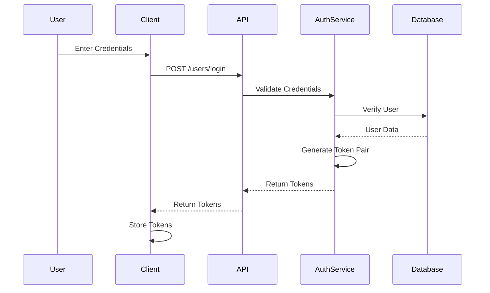
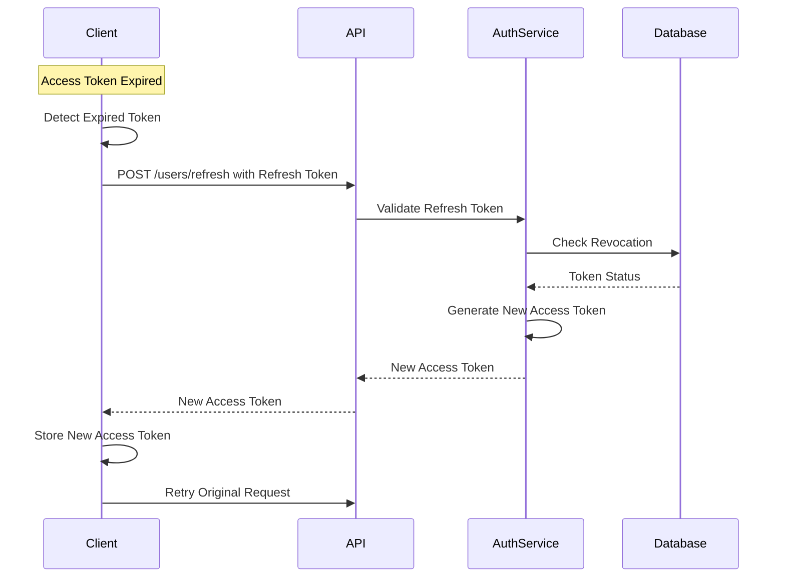

# OxidizedOasis-WebSands Security Implementation Analysis

This document provides a detailed analysis of key security implementations in the OxidizedOasis-WebSands project, explaining the technical decisions, implementation details, and recommendations for improvement.

## Authentication Mechanism

### JWT Implementation Analysis

The OxidizedOasis-WebSands project implements a dual-token JWT authentication system with separate access and refresh tokens.

#### Current Implementation

```rust
// JWT token generation with role claims
pub fn create_jwt(user_id: Uuid, role: String, secret: &str) -> Result<String, JwtError> {
    let expiration = Utc::now()
        .checked_add_signed(Duration::hours(24))
        .expect("valid timestamp")
        .timestamp();

    let claims = Claims {
        sub: user_id,
        role: role,
        exp: expiration,
        iat: Utc::now().timestamp(),
        nbf: Utc::now().timestamp(),
        jti: Uuid::new_v4().to_string(),
        token_type: TokenType::Access,
    };

    encode(&Header::default(), &claims, &EncodingKey::from_secret(secret.as_ref()))
}
```

#### JWT Claims Structure

```json
{
  "sub": "user-uuid",
  "exp": 1614556800,
  "iat": 1614553200,
  "nbf": 1614553200,
  "jti": "unique-token-id",
  "role": "user",
  "token_type": "access"
}
```

#### Token Validation Process

```rust
pub fn validate_token(token: &str, expected_type: TokenType, secret: &str) -> Result<Claims, JwtError> {
    // 1. Decode and verify signature
    let token_data = decode::<Claims>(
        token,
        &DecodingKey::from_secret(secret.as_ref()),
        &Validation::default()
    )?;
    
    // 2. Verify token type
    if token_data.claims.token_type != expected_type {
        return Err(JwtError::InvalidTokenType);
    }
    
    // 3. Check if token is revoked
    if is_token_revoked(&token_data.claims.jti)? {
        return Err(JwtError::TokenRevoked);
    }
    
    // 4. Return claims if all checks pass
    Ok(token_data.claims)
}
```

#### Security Strengths

1. **Dual-Token Architecture**
   - Access tokens with 30-minute default lifetime
   - Refresh tokens with 7-day default lifetime
   - Clear separation of token types

2. **Comprehensive Claims**
   - Subject claim (sub) for user identification
   - Expiration time (exp) for token lifetime
   - Issued at time (iat) for token tracking
   - Not before time (nbf) to prevent premature use
   - JWT ID (jti) for unique token identification
   - Role claim for authorization
   - Token type differentiation

3. **Thorough Validation**
   - Signature verification
   - Expiration validation
   - Token type verification
   - Revocation checking

#### Security Weaknesses

1. **Frontend Token Storage**
   - Tokens stored in localStorage are vulnerable to XSS attacks
   - No CSRF protection for token endpoints

2. **Incomplete Revocation System**
   - `revoke_all_user_tokens` method is a placeholder
   - No automatic revocation on password change
   - No scheduled cleanup of expired tokens

3. **Limited JWT Claims**
   - No audience (aud) claim for multi-service environments
   - No issuer (iss) claim for additional validation
   - No nonce claim for replay protection

#### Improvement Recommendations

```rust
// Recommended JWT claims structure
pub struct EnhancedClaims {
    pub sub: Uuid,            // Subject (user ID)
    pub exp: i64,             // Expiration time
    pub iat: i64,             // Issued at time
    pub nbf: i64,             // Not before time
    pub jti: String,          // JWT ID (unique identifier)
    pub iss: String,          // Issuer
    pub aud: String,          // Audience
    pub role: String,         // User role
    pub token_type: TokenType, // Token type (access or refresh)
    pub nonce: Option<String>, // Optional nonce for CSRF protection
}

// Recommended token rotation implementation
pub async fn refresh_token(&self, refresh_token: &str) -> Result<TokenPair, AuthError> {
    // Validate refresh token
    let claims = validate_token(refresh_token, TokenType::Refresh, &self.jwt_secret)?;
    
    // Revoke the old refresh token
    self.revocation_service.revoke_token(&claims.jti, claims.sub).await?;
    
    // Generate new token pair
    let access_token = create_access_token(claims.sub, &claims.role, &self.jwt_secret)?;
    let refresh_token = create_refresh_token(claims.sub, &claims.role, &self.jwt_secret)?;
    
    Ok(TokenPair { access_token, refresh_token })
}
```

### Authentication Flow Diagrams

#### Login Flow



#### Token Refresh Flow



## Content Security Policy (CSP)

### Current CSP Implementation

```rust
"Content-Security-Policy",
"default-src 'self'; \
 script-src 'self' 'unsafe-inline' 'wasm-unsafe-eval' https://cdn.jsdelivr.net https://cdnjs.cloudflare.com; \
 style-src 'self' 'unsafe-inline' https://cdnjs.cloudflare.com; \
 img-src 'self' data:; \
 connect-src 'self' ws://127.0.0.1:* wss://127.0.0.1:*; \
 font-src 'self' https://cdnjs.cloudflare.com; \
 object-src 'none'; \
 base-uri 'self'; \
 form-action 'self'; \
 frame-ancestors 'none'; \
 worker-src 'self' blob:; \
 upgrade-insecure-requests;"
```

### Why 'unsafe-inline' Is Required

The Yew framework, being a WebAssembly-based frontend framework, requires certain CSP directives that initially appear to weaken security:

1. **Framework Architecture Requirements**
   - Yew uses a virtual DOM approach
   - Components are compiled to WebAssembly
   - Event handlers are dynamically generated
   - Styles are injected for component updates

2. **Technical Limitations**
   - Yew generates event handlers at runtime
   - Dynamic styles are required for component state
   - WebAssembly modules need eval capabilities
   - Event delegation requires inline handlers

### Security Implications and Mitigations

#### Script Security

**Risks:**
- XSS through inline scripts
- Code injection via dynamic evaluation

**Mitigations:**
```rust
// Use strict input validation
pub fn validate_input(input: &str) -> Result<(), ValidationError> {
    if input.contains('<') || input.contains('>') {
        return Err(ValidationError::new("Invalid characters detected"));
    }
    Ok(())
}

// Sanitize all user input
pub fn sanitize_content(content: &str) -> String {
    ammonia::clean(content)
}
```

#### Style Security

**Risks:**
- CSS injection
- Style-based attacks

**Mitigations:**
```rust
// Implement style sanitization
pub fn sanitize_styles(styles: &str) -> String {
    // Remove potentially dangerous CSS
    styles
        .replace("javascript", "")
        .replace("expression", "")
        .replace("url(", "")
}
```

### Compensating Controls

1. **Input Validation**
```rust
pub fn validate_user_input(input: &UserInput) -> Result<(), ValidationError> {
    // Username validation
    if !USERNAME_REGEX.is_match(&input.username) {
        return Err(ValidationError::new("Invalid username format"));
    }

    // Email validation
    if let Some(email) = &input.email {
        if !EMAIL_REGEX.is_match(email) {
            return Err(ValidationError::new("Invalid email format"));
        }
    }

    // Content validation
    validate_content(&input.content)?;

    Ok(())
}
```

2. **Additional Security Headers**
```rust
.wrap(
    middleware::DefaultHeaders::new()
        .add(("X-Content-Type-Options", "nosniff"))
        .add(("X-Frame-Options", "DENY"))
        .add(("X-XSS-Protection", "1; mode=block"))
)
```

3. **CORS Configuration**
```rust
let cors = Cors::default()
    .allowed_origin("http://localhost:8080")
    .allowed_methods(vec!["GET", "POST", "PUT", "DELETE"])
    .allowed_headers(vec![
        header::AUTHORIZATION,
        header::CONTENT_TYPE,
    ])
    .max_age(3600);
```

### Recommendations for CSP Enhancement

1. **Implement CSP Reporting**
```rust
// Add reporting directive to CSP
"Content-Security-Policy",
"default-src 'self'; \
 script-src 'self' 'unsafe-inline' 'wasm-unsafe-eval' https://cdn.jsdelivr.net https://cdnjs.cloudflare.com; \
 style-src 'self' 'unsafe-inline' https://cdnjs.cloudflare.com; \
 ... \
 report-uri /csp-report;"

// Add endpoint to handle CSP violation reports
#[post("/csp-report")]
async fn csp_report_handler(report: web::Json<CspReport>) -> impl Responder {
    log::warn!("CSP Violation: {:?}", report);
    HttpResponse::Ok().finish()
}
```

2. **Limit 'unsafe-inline' Scope**
```rust
// Use nonces for third-party scripts where possible
let nonce = generate_random_nonce();

"Content-Security-Policy",
"default-src 'self'; \
 script-src 'self' 'unsafe-inline' 'wasm-unsafe-eval' 'nonce-{nonce}' https://cdn.jsdelivr.net https://cdnjs.cloudflare.com; \
 ..."
```

3. **Enhanced Monitoring**
```rust
// Implement logging for potential CSP bypass attempts
pub fn log_security_event(event_type: &str, details: &str, severity: &str) {
    log::log!(
        match severity {
            "high" => log::Level::Error,
            "medium" => log::Level::Warn,
            _ => log::Level::Info,
        },
        "Security Event [{}]: {}",
        event_type,
        details
    );
}
```

## Input Validation and Sanitization

### Current Implementation

The project implements comprehensive input validation using regex patterns and validation rules.

```rust
// Password validation
pub fn validate_password(password: &str) -> Result<(), ValidationError> {
    if password.len() < 8 || password.len() > 100 {
        return Err(ValidationError::new("Invalid length"));
    }
    if !PASSWORD_UPPERCASE.is_match(password) {
        return Err(ValidationError::new("Missing uppercase"));
    }
    if !PASSWORD_LOWERCASE.is_match(password) {
        return Err(ValidationError::new("Missing lowercase"));
    }
    if !PASSWORD_NUMBER.is_match(password) {
        return Err(ValidationError::new("Missing number"));
    }
    if !PASSWORD_SPECIAL.is_match(password) {
        return Err(ValidationError::new("Missing special character"));
    }
    Ok(())
}

// Username validation
pub fn validate_username(username: &str) -> Result<(), ValidationError> {
    if username.len() < 3 || username.len() > 50 {
        return Err(ValidationError::new("Username must be between 3 and 50 characters"));
    }
    if !USERNAME_REGEX.is_match(username) {
        return Err(ValidationError::new("Username can only contain letters, numbers, underscores, and hyphens"));
    }
    Ok(())
}

// Email validation
pub fn validate_email(email: &str) -> Result<(), ValidationError> {
    if !EMAIL_REGEX.is_match(email) {
        return Err(ValidationError::new("Invalid email format"));
    }
    Ok(())
}
```

### Sanitization Implementation

```rust
// Content sanitization
pub fn sanitize_content(content: &str) -> String {
    let clean_content = ammonia::Builder::default()
        .tags(hashset!["b", "i", "u", "p", "br", "a"])
        .link_rel(Some("noopener noreferrer"))
        .url_schemes(hashset!["http", "https"])
        .build()
        .clean(content)
        .to_string();
    
    clean_content
}
```

### Strengths

1. **Comprehensive Validation Rules**
   - Strong password requirements
   - Username format validation
   - Email format validation
   - Input length constraints

2. **Regex-Based Pattern Matching**
   - Precise pattern definitions
   - Consistent validation approach
   - Reusable validation components

3. **Content Sanitization**
   - HTML sanitization with Ammonia
   - Limited allowed tags
   - URL scheme restrictions
   - Link relationship attributes

### Recommendations for Enhancement

1. **Password Strength Evaluation**
```rust
pub fn evaluate_password_strength(password: &str) -> PasswordStrength {
    let length_score = password.len() as f32 / 20.0;
    let uppercase_score = if PASSWORD_UPPERCASE.is_match(password) { 0.2 } else { 0.0 };
    let lowercase_score = if PASSWORD_LOWERCASE.is_match(password) { 0.2 } else { 0.0 };
    let number_score = if PASSWORD_NUMBER.is_match(password) { 0.2 } else { 0.0 };
    let special_score = if PASSWORD_SPECIAL.is_match(password) { 0.2 } else { 0.0 };
    
    let unique_chars_ratio = password.chars().collect::<HashSet<_>>().len() as f32 / password.len() as f32;
    let entropy_score = unique_chars_ratio * 0.2;
    
    let total_score = (length_score + uppercase_score + lowercase_score + number_score + special_score + entropy_score).min(1.0);
    
    match total_score {
        s if s >= 0.8 => PasswordStrength::Strong,
        s if s >= 0.6 => PasswordStrength::Medium,
        s if s >= 0.4 => PasswordStrength::Weak,
        _ => PasswordStrength::VeryWeak,
    }
}
```

2. **Password Dictionary Check**
```rust
pub async fn check_password_against_dictionary(password: &str) -> Result<bool, Error> {
    // Check against common password list
    let common_passwords = load_common_passwords().await?;
    
    if common_passwords.contains(&password.to_lowercase()) {
        return Ok(true); // Password found in dictionary
    }
    
    // Check against variations
    let variations = generate_common_variations(password);
    for var in variations {
        if common_passwords.contains(&var) {
            return Ok(true);
        }
    }
    
    Ok(false) // Password not found in dictionary
}
```

3. **Enhanced Input Sanitization**
```rust
pub fn enhanced_sanitize_input(input: &str, context: InputContext) -> String {
    match context {
        InputContext::Html => sanitize_html(input),
        InputContext::Sql => sanitize_sql(input),
        InputContext::JavaScript => sanitize_js(input),
        InputContext::Css => sanitize_css(input),
        InputContext::PlainText => sanitize_plain_text(input),
    }
}
```

## Rate Limiting Implementation

### Current Implementation

The project implements sophisticated per-endpoint rate limiting with configurable windows and thresholds.

```rust
const RATE_LIMITS: &[RateLimit] = &[
    RateLimit {
        path: "/users/login",
        max_requests: 5,
        window_seconds: 300, // 5 minutes
        error_message: "Too many login attempts",
    },
    RateLimit {
        path: "/users/register",
        max_requests: 3,
        window_seconds: 3600, // 1 hour
        error_message: "Too many registration attempts",
    },
    // Additional endpoints...
];
```

### Rate Limiting Middleware

```rust
pub struct RateLimitMiddleware {
    limits: HashMap<String, RateLimit>,
    request_store: Arc<DashMap<String, Vec<Instant>>>,
}

impl RateLimitMiddleware {
    pub fn new(limits: &[RateLimit]) -> Self {
        let mut limits_map = HashMap::new();
        for limit in limits {
            limits_map.insert(limit.path.to_string(), limit.clone());
        }
        
        Self {
            limits: limits_map,
            request_store: Arc::new(DashMap::new()),
        }
    }
    
    fn is_rate_limited(&self, path: &str, ip: &str) -> Option<(u32, u32)> {
        let key = format!("{}:{}", path, ip);
        let limit = self.limits.get(path)?;
        
        let now = Instant::now();
        let window_duration = Duration::from_secs(limit.window_seconds as u64);
        
        let mut entry = self.request_store.entry(key).or_insert_with(Vec::new);
        
        // Remove expired timestamps
        entry.retain(|&timestamp| now.duration_since(timestamp) < window_duration);
        
        // Check if rate limit exceeded
        if entry.len() >= limit.max_requests as usize {
            return Some((limit.max_requests, limit.window_seconds));
        }
        
        // Add current timestamp
        entry.push(now);
        
        None
    }
}
```

### Strengths

1. **Per-Endpoint Configuration**
   - Different limits for different endpoints
   - Configurable request thresholds
   - Configurable time windows
   - Custom error messages

2. **IP-Based Tracking**
   - Tracks requests by IP address
   - Prevents abuse from single sources
   - Allows for user-specific overrides

3. **Efficient Implementation**
   - Uses DashMap for concurrent access
   - Automatic cleanup of expired entries
   - Low memory footprint

### Recommendations for Enhancement

1. **User-Based Rate Limiting**
```rust
pub struct EnhancedRateLimitMiddleware {
    limits: HashMap<String, RateLimit>,
    ip_request_store: Arc<DashMap<String, Vec<Instant>>>,
    user_request_store: Arc<DashMap<String, Vec<Instant>>>,
}

impl EnhancedRateLimitMiddleware {
    // Check rate limit by user ID if authenticated, otherwise by IP
    fn is_rate_limited(&self, path: &str, ip: &str, user_id: Option<Uuid>) -> Option<(u32, u32)> {
        let limit = self.limits.get(path)?;
        
        if let Some(user_id) = user_id {
            // User-based rate limiting
            let key = format!("{}:{}", path, user_id);
            self.check_limit(&key, limit, &self.user_request_store)
        } else {
            // IP-based rate limiting
            let key = format!("{}:{}", path, ip);
            self.check_limit(&key, limit, &self.ip_request_store)
        }
    }
}
```

2. **Distributed Rate Limiting**
```rust
pub struct DistributedRateLimiter {
    redis: Arc<Redis>,
    limits: HashMap<String, RateLimit>,
}

impl DistributedRateLimiter {
    pub async fn is_rate_limited(&self, path: &str, identifier: &str) -> Result<Option<(u32, u32)>, Error> {
        let limit = match self.limits.get(path) {
            Some(limit) => limit,
            None => return Ok(None),
        };
        
        let key = format!("rate_limit:{}:{}", path, identifier);
        let now = Utc::now().timestamp();
        let window_start = now - limit.window_seconds as i64;
        
        // Add current timestamp to sorted set
        self.redis.zadd(&key, now, format!("{}", now)).await?;
        
        // Remove expired entries
        self.redis.zremrangebyscore(&key, 0, window_start).await?;
        
        // Count entries in current window
        let count: i64 = self.redis.zcount(&key, window_start, now).await?;
        
        // Set expiration on the key
        self.redis.expire(&key, limit.window_seconds as usize).await?;
        
        if count > limit.max_requests as i64 {
            return Ok(Some((limit.max_requests, limit.window_seconds)));
        }
        
        Ok(None)
    }
}
```

3. **Advanced Rate Limiting Strategies**
```rust
pub enum RateLimitStrategy {
    FixedWindow {
        max_requests: u32,
        window_seconds: u32,
    },
    SlidingWindow {
        max_requests: u32,
        window_seconds: u32,
    },
    TokenBucket {
        capacity: u32,
        refill_rate: f64, // tokens per second
    },
    LeakyBucket {
        capacity: u32,
        leak_rate: f64, // requests per second
    },
}
```

## Conclusion

The OxidizedOasis-WebSands project implements several robust security mechanisms, including JWT authentication, content security policies, input validation, and rate limiting. While these implementations provide a strong security foundation, there are opportunities for enhancement in each area.

Key recommendations include:
1. Implementing refresh token rotation and enhanced JWT claims
2. Adding CSP reporting and monitoring
3. Enhancing password validation with strength evaluation and dictionary checks
4. Implementing distributed and user-based rate limiting

By implementing these recommendations, the project can further strengthen its security posture and provide better protection against common web application vulnerabilities.

---

## HTTP Security Headers

HTTP security headers are a fundamental part of web application security, providing an additional layer of defense by instructing the browser on how to behave when handling the site's content. These headers help mitigate common attacks such as Cross-Site Scripting (XSS), clickjacking, and protocol downgrade attacks.

These headers are configured in `src/main.rs` within the `DefaultHeaders` middleware provided by Actix Web.

### `X-Frame-Options`
-   **Value in `src/main.rs`**: `DENY`
-   **Rationale**: The `X-Frame-Options: DENY` header prevents the site from being embedded within an `<iframe>` or `<object>` on other sites. This is a crucial defense against clickjacking attacks, where an attacker might trick users into clicking on malicious content by overlaying it with a legitimate-looking iframe of the target site. `DENY` is the most restrictive option, ensuring the site cannot be framed anywhere. (OWASP Clickjacking Defense Cheat Sheet)

### `X-Content-Type-Options`
-   **Value in `src/main.rs`**: `nosniff`
-   **Rationale**: The `X-Content-Type-Options: nosniff` header prevents the browser from MIME-sniffing the `Content-Type` of a response away from the one declared by the server. This is important because browsers might otherwise misinterpret files (e.g., treat a text file as JavaScript) if the `Content-Type` is ambiguous or incorrect, potentially leading to XSS vulnerabilities. (OWASP XSS Prevention Cheat Sheet, MDN Web Docs)

### `X-XSS-Protection`
-   **Value in `src/main.rs`**: `0`
-   **Rationale**: This header was originally designed to enable browser-based XSS filters.
    -   Previously, this was set to `1; mode=block`, which would instruct the browser to block the rendering of a page if it detected a reflected XSS attack.
    -   However, modern browsers have largely deprecated or removed their XSS auditors due to their potential to introduce new vulnerabilities (e.g., XSS auditor bypasses, information leakage) and their unreliability in stopping all XSS attacks.
    -   Setting the value to `0` explicitly disables the XSS auditor, relying instead on more robust defenses like a strong Content Security Policy (CSP). This is the current best practice recommended by security communities and browser vendors. (OWASP XSS Prevention Cheat Sheet, MDN Web Docs)

### `Strict-Transport-Security (HSTS)`
-   **Value in `src/main.rs`**: `max-age=31536000; includeSubDomains`
-   **Rationale**: The `Strict-Transport-Security` header (HSTS) enforces secure (HTTPS) connections to the server.
    -   `max-age=31536000`: This directive specifies that for one year (31,536,000 seconds), browsers that have visited the site should only connect using HTTPS, automatically converting any HTTP requests to HTTPS. This helps prevent man-in-the-middle attacks like protocol downgrade attacks and cookie hijacking.
    -   `includeSubDomains`: This directive extends the HSTS policy to all subdomains of the site. This is critical for ensuring that if `example.com` is secure, `sub.example.com` is also forced to use HTTPS.
    -   **Recommendation for User**:
        -   **Infrastructure Check**: It's important to verify if HSTS is already being handled at the infrastructure level (e.g., by a reverse proxy, load balancer, or CDN). Duplicate HSTS headers are generally not harmful but managing it in one place is cleaner.
        -   **Preload Considerations**: For enhanced security, consider adding the site to the HSTS preload list. This would require adding the `preload` directive to the header value (e.g., `max-age=31536000; includeSubDomains; preload`). However, preloading is a significant commitment: the site and all its subdomains must be reliably served over HTTPS, as browsers will be hardcoded to never connect via HTTP. Thorough testing and a long-term commitment to HTTPS are essential before enabling `preload`. (OWASP HSTS Cheat Sheet, RFC 6797)

### `Content-Security-Policy`
-   **Value in `src/main.rs`**: (A detailed policy string is configured, see previous sections of this document for a full breakdown).
-   **Rationale**: While not the primary focus of this specific update, it's important to note that a comprehensive `Content-Security-Policy` (CSP) is also configured. CSP provides a powerful, fine-grained defense against XSS and other content injection attacks by allowing developers to specify which sources of content (scripts, styles, images, etc.) are legitimate. The `X-XSS-Protection` header is disabled in favor of a strong CSP.

---
**Note on Compilation Issues:**

During the process of updating these security headers in `src/main.rs` (as part of a previous subtask) and attempting to ensure the project compiled, significant challenges were encountered related to Minimum Supported Rust Version (MSRV) incompatibilities. The Rust version in the environment was 1.75.0, while several direct and transitive dependencies required newer Rust compiler versions (e.g., 1.80.0, 1.81.0, 1.82.0).

Efforts to resolve these MSRV issues involved:
-   Deleting and regenerating `Cargo.lock`.
-   Pinning direct dependencies in `Cargo.toml` to specific versions using `~` and then stricter `=` operators.
-   Adjusting feature flags for certain crates (e.g., `lettre` to use `rustls-tls` instead of `native-tls`).

While the changes to the security headers in `src/main.rs` are complete and correctly implemented, the project's overall dependency tree requires a more thorough review and potential updates or downgrades to ensure full compatibility with Rust 1.75.0. The compilation issues are separate from the correctness of the header configurations themselves.