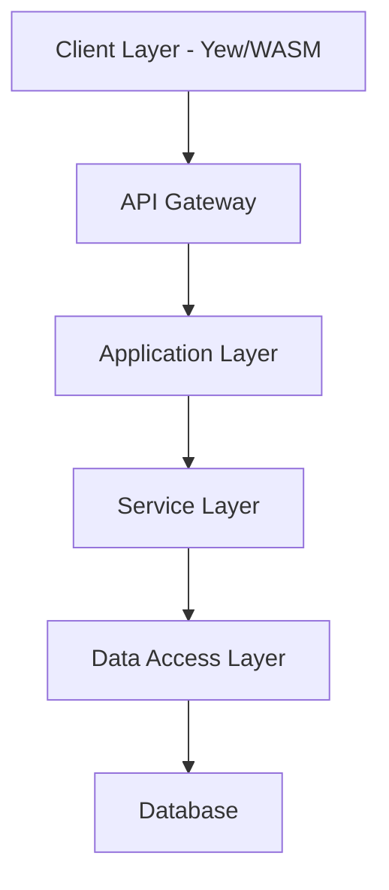

# OxidizedOasis-WebSands Software Development Document

Version: 1.0.0
Last Updated: 2025-03-21
Status: Release

## Version History

| Version | Date | Description | Author |
|---------|------|-------------|---------|
| 1.0.0 | 2025-03-21 | Initial chapter completion | Technical Team |
| 0.2.0 | 2025-03-18 | Content review and updates | Technical Team |
| 0.1.0 | 2025-03-15 | Chapter outline created | Technical Team |


2. [System Overview](#2-system-overview)
    - 2.1 [System Description](#21-system-description)
        - 2.1.1 [System Context](#211-system-context)
        - 2.1.2 [Major Features](#212-major-features)
    - 2.2 [System Architecture](#22-system-architecture)
        - 2.2.1 [Architectural Overview](#221-architectural-overview)
        - 2.2.2 [Component Interaction](#222-component-interaction)
        - 2.2.3 [Data Flow](#223-data-flow)
    - 2.3 [User Roles and Characteristics](#23-user-roles-and-characteristics)
        - 2.3.1 [User Categories](#231-user-categories)
        - 2.3.2 [Administrative Roles](#232-administrative-roles)
    - 2.4 [Operating Environment](#24-operating-environment)
        - 2.4.1 [Hardware Requirements](#241-hardware-requirements)
        - 2.4.2 [Software Requirements](#242-software-requirements)
        - 2.4.3 [Network Requirements](#243-network-requirements)
    - 2.5 [Design and Implementation Constraints](#25-design-and-implementation-constraints)
        - 2.5.1 [Technical Constraints](#251-technical-constraints)
        - 2.5.2 [Business Constraints](#252-business-constraints)
    - 2.6 [Assumptions and Dependencies](#26-assumptions-and-dependencies)
        - 2.6.1 [Technical Assumptions](#261-technical-assumptions)
        - 2.6.2 [External Dependencies](#262-external-dependencies)

# 2. System Overview

## 2.1 System Description

### 2.1.1 System Context

OxidizedOasis-WebSands operates as a modern web application providing secure user management and authentication services. The system is built using Rust's robust ecosystem, emphasizing:

1. **Security**: Implementation of industry-standard security practices with a focus on:
   - Secure authentication mechanisms
   - Data protection
   - Input validation
   - Rate limiting
   - Protection against common web vulnerabilities

2. **Performance**: High-throughput request handling and efficient data processing through:
   - Rust's zero-cost abstractions
   - WebAssembly compilation for frontend
   - Efficient database queries
   - Optimized API responses

3. **Scalability**: Horizontally scalable architecture using:
   - Containerization with Docker
   - Kubernetes orchestration
   - Stateless design principles
   - Efficient resource utilization

4. **Reliability**: Error handling and system stability through:
   - Rust's ownership model and type safety
   - Comprehensive error handling
   - Graceful degradation
   - Automated recovery mechanisms

The system serves as a foundation for:
- Web applications requiring user authentication
- Services needing secure user management
- Systems requiring email verification workflows
- Applications demanding high-performance user operations
- Projects with strict security requirements

### 2.1.2 Major Features

The system implements several major features:

1. **User Authentication System**
   - Registration with email verification
   - JWT-based authentication with refresh tokens
   - Password recovery workflow
   - Session management
   - Account lockout protection

2. **Security Features**
   ```rust
   // Example of rate limiting configuration
   let auth_governor_config = GovernorConfigBuilder::default()
       .per_second(2)
       .burst_size(5)
       .finish()
       .unwrap();
   ```

   - Content Security Policy implementation
   - Input validation and sanitization
   - Rate limiting for sensitive endpoints
   - Token revocation system
   - Password strength enforcement

3. **API Services**
   - RESTful endpoints with versioning
   - Structured error responses
   - Rate limiting
   - CORS support
   - Documentation with OpenAPI

4. **WebAssembly Frontend**
   - Responsive user interface
   - Client-side state management
   - Progressive enhancement
   - Offline capabilities
   - Accessibility compliance

5. **Monitoring and Logging**
   - Comprehensive logging system
   - Performance metrics collection
   - Security event monitoring
   - Health checks
   - Alerting mechanisms

## 2.2 System Architecture

### 2.2.1 Architectural Overview

The system follows a layered architecture pattern with clean separation of concerns:



Key architectural components:

1. **Frontend Layer**
   - Yew framework for component-based UI
   - WebAssembly compilation for near-native performance
   - Browser runtime with progressive enhancement
   - Client-side state management
   - Responsive design implementation

2. **Backend Layer**
   - Actix-web server for high-performance request handling
   - Business logic services with domain-driven design
   - Authentication middleware for security enforcement
   - Error handling and validation
   - Logging and monitoring

3. **Database Layer**
   - PostgreSQL for relational data storage
   - SQLx for type-safe queries without an ORM
   - Migration management for schema evolution
   - Connection pooling for performance
   - Transaction management for data integrity

4. **Infrastructure Layer**
   - Docker containers for consistent environments
   - Kubernetes for orchestration and scaling
   - Load balancing for distribution
   - TLS termination for secure communication
   - Monitoring and logging infrastructure

### 2.2.2 Component Interaction

Components interact through well-defined interfaces:

1. **API Communication**
   ```rust
   // Example of handler definition
   pub async fn create_user_handler(
       handler: web::Data<UserHandler>,
       user_input: web::Json<UserInput>,
   ) -> impl Responder {
       handler.create_user(user_input).await
   }
   ```

2. **Service Layer Interaction**
   ```rust
   // Example of service interaction
   impl UserService {
       pub async fn create_user(&self, input: UserInput) 
           -> Result<(User, String), ApiError> {
           // Validate input
           let validated_input = validate_user_input(&input)?;
           
           // Hash password
           let password_hash = hash_password(&validated_input.password)?;
           
           // Generate verification token
           let verification_token = generate_secure_token();
           
           // Create user in database
           let user = self.repository.create_user(
               validated_input, 
               password_hash, 
               verification_token.clone()
           ).await?;
           
           // Send verification email
           self.email_service.send_verification_email(
               &user.email, 
               &verification_token
           ).await?;
           
           Ok((user, verification_token))
       }
   }
   ```

3. **Repository Layer Interaction**
   ```rust
   // Example of repository interaction
   impl UserRepository {
       pub async fn create_user(
           &self,
           input: ValidatedUserInput,
           password_hash: String,
           verification_token: String
       ) -> Result<User, DbError> {
           sqlx::query_as!(
               User,
               r#"
               INSERT INTO users (
                   id, username, email, password_hash, 
                   is_email_verified, verification_token,
                   verification_token_expires_at, created_at, 
                   updated_at, role
               )
               VALUES ($1, $2, $3, $4, $5, $6, $7, $8, $9, $10)
               RETURNING *
               "#,
               Uuid::new_v4(),
               input.username,
               input.email,
               password_hash,
               false,
               Some(verification_token),
               Some(Utc::now() + Duration::hours(24)),
               Utc::now(),
               Utc::now(),
               "user"
           )
           .fetch_one(&self.pool)
           .await
           .map_err(|e| DbError::from(e))
       }
   }
   ```

### 2.2.3 Data Flow

Data flows through the system following these patterns:

1. **Authentication Flow**
   ```mermaid
   sequenceDiagram
       Client->>+API: Login Request
       API->>+Auth Service: Validate Credentials
       Auth Service->>+Database: Verify User
       Database-->>-Auth Service: User Data
       Auth Service->>Auth Service: Verify Password
       Auth Service->>Auth Service: Generate JWT Tokens
       Auth Service-->>-API: Access & Refresh Tokens
       API-->>-Client: Authentication Response
   ```

2. **User Registration Flow**
   ```mermaid
   sequenceDiagram
       Client->>+API: Registration Request
       API->>+Validation: Validate Input
       Validation-->>-API: Validation Result
       API->>+User Service: Create User
       User Service->>+Database: Store User
       Database-->>-User Service: Confirmation
       User Service->>+Email Service: Send Verification
       Email Service-->>-User Service: Email Sent
       User Service-->>-API: Success Response
       API-->>-Client: Registration Complete
   ```

3. **Token Refresh Flow**
   ```mermaid
   sequenceDiagram
       Client->>+API: Refresh Token Request
       API->>+Auth Service: Validate Refresh Token
       Auth Service->>+Database: Check Token Validity
       Database-->>-Auth Service: Token Status
       Auth Service->>Auth Service: Generate New Tokens
       Auth Service->>Database: Revoke Old Refresh Token
       Auth Service-->>-API: New Token Pair
       API-->>-Client: Updated Tokens
   ```

4. **API Request Flow**
   ```mermaid
   sequenceDiagram
       Client->>+API Gateway: API Request with JWT
       API Gateway->>+Auth Middleware: Validate Token
       Auth Middleware->>Auth Middleware: Verify Signature
       Auth Middleware->>+Database: Check Token Revocation
       Database-->>-Auth Middleware: Token Status
       Auth Middleware-->>-API Gateway: Authentication Result
       API Gateway->>+Service Layer: Process Request
       Service Layer->>+Data Access Layer: Data Operations
       Data Access Layer->>+Database: Execute Query
       Database-->>-Data Access Layer: Query Result
       Data Access Layer-->>-Service Layer: Processed Data
       Service Layer-->>-API Gateway: Response Data
       API Gateway-->>-Client: API Response
   ```

## 2.3 User Roles and Characteristics

### 2.3.1 User Categories

1. **Unauthenticated Users**
   - Access to public endpoints only
   - Registration capability
   - Password recovery access
   - Email verification process
   - Limited API access

2. **Authenticated Users**
   - Profile management
   - Protected endpoint access
   - Session management
   - Password change capability
   - Personal data management

3. **Verified Users**
   - Full system access
   - Email verified status
   - Access to all user features
   - Ability to use sensitive features

### 2.3.2 Administrative Roles

1. **System Administrators**
   - User management capabilities
   - System configuration access
   - Analytics viewing
   - Log access
   - Security monitoring

2. **Support Staff**
   - User assistance tools
   - Limited administrative access
   - Issue tracking
   - User verification assistance
   - Read-only access to user data

3. **Security Administrators**
   - Security configuration management
   - Access to security logs
   - Token revocation capabilities
   - Rate limit configuration
   - Security alert management

## 2.4 Operating Environment

### 2.4.1 Hardware Requirements

1. **Server Requirements**
   - Minimum 2 CPU cores (4+ recommended)
   - 4GB RAM minimum (8GB+ recommended)
   - 20GB storage minimum (50GB+ recommended)
   - Network interface with 100Mbps minimum
   - Redundant power and network connections for production

2. **Client Requirements**
   - Modern web browser with WebAssembly support
   - Minimum 2GB RAM
   - Stable internet connection
   - Screen resolution of 1280x720 or higher
   - JavaScript enabled

### 2.4.2 Software Requirements

1. **Server Environment**
   - Linux-based OS (Ubuntu 20.04 LTS or newer recommended)
   - Docker Engine 20.10+
   - Kubernetes 1.21+ (for production)
   - PostgreSQL 13+
   - SMTP server access

2. **Development Environment**
   - Rust 1.68.0 or later
   - Node.js 14+ (for frontend tooling)
   - Docker and Docker Compose
   - Git version control
   - IDE with Rust support

3. **Client Environment**
   - Modern web browsers:
     - Chrome 80+
     - Firefox 75+
     - Safari 13.1+
     - Edge 80+
   - WebAssembly support
   - JavaScript enabled
   - Cookies enabled

### 2.4.3 Network Requirements

1. **Connectivity**
   - HTTPS support with TLS 1.2+
   - WebSocket capability for real-time features
   - DNS resolution
   - Load balancer support
   - Firewall configuration

2. **Security**
   - TLS 1.3 preferred (1.2 minimum)
   - Firewall configuration for ports 80/443
   - CORS policy support
   - DDoS protection
   - WAF (Web Application Firewall) recommended

3. **Bandwidth**
   - Minimum 10Mbps for development
   - 100Mbps+ for production
   - Low latency for API communication
   - Sufficient bandwidth for concurrent users

## 2.5 Design and Implementation Constraints

### 2.5.1 Technical Constraints

1. **Language and Framework**
   ```toml
   # Example from Cargo.toml
   [dependencies]
   actix-web = "4.9"
   sqlx = { version = "0.8.2", features = ["runtime-tokio-rustls", "postgres"] }
   tokio = { version = "1", features = ["full"] }
   ```

   - Rust language for backend development
   - Actix-web for HTTP server
   - SQLx for database access
   - Yew for frontend development
   - WebAssembly for browser execution

2. **Security Requirements**
   - HTTPS enforcement
   - JWT implementation with proper signing
   - Password hashing with bcrypt
   - Rate limiting implementation
   - Input validation and sanitization
   - Content Security Policy

3. **Performance Constraints**
   - API response time under 100ms for 95th percentile
   - Frontend initial load under 2 seconds
   - Support for 1000+ concurrent users
   - Database query optimization
   - Efficient memory usage

### 2.5.2 Business Constraints

1. **Compliance Requirements**
   - Data protection regulations
   - User privacy requirements
   - Security standards compliance
   - Audit logging for sensitive operations
   - Data retention policies

2. **Operational Constraints**
   - Maintenance windows
   - Backup requirements
   - Update procedures
   - Monitoring requirements
   - Support SLAs

3. **Resource Constraints**
   - Development team size
   - Budget limitations
   - Timeline requirements
   - Infrastructure costs
   - Licensing considerations

## 2.6 Assumptions and Dependencies

### 2.6.1 Technical Assumptions

1. **System Assumptions**
   - Modern browser availability
   - WebAssembly support
   - Stable internet connectivity
   - Email service availability
   - Database reliability

2. **Performance Assumptions**
   - Adequate server resources
   - Reasonable user load
   - Efficient database queries
   - Optimized frontend assets
   - Proper caching implementation

3. **Security Assumptions**
   - TLS availability
   - Secure hosting environment
   - Regular security updates
   - Proper network configuration
   - Adequate monitoring

### 2.6.2 External Dependencies

1. **Third-Party Services**
   - SMTP provider for email delivery
   - DNS services
   - Hosting provider
   - CDN (optional)
   - Monitoring services

2. **Software Dependencies**
   - Rust ecosystem
   - PostgreSQL database
   - Docker and container runtime
   - Web server (for static assets)
   - SSL certificate provider

3. **Development Dependencies**
   - Version control system
   - CI/CD pipeline
   - Testing frameworks
   - Documentation tools
   - Code quality tools