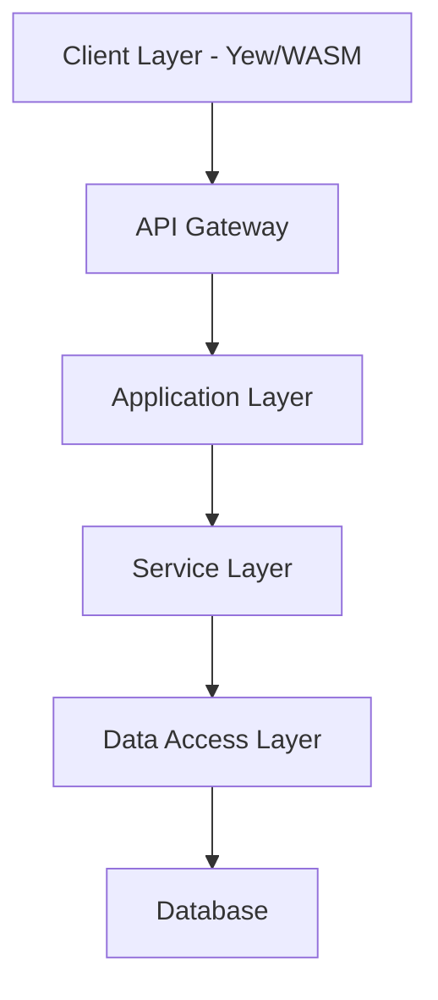

# OxidizedOasis-WebSands Software Development Document

Version: 2.0.0
Last Updated: 2025-03-15
Status: Release

## Version History

| Version | Date | Description | Author |
|---------|------|-------------|---------|
| 2.0.0 | 2025-03-15 | Major revision with updated architecture and security details | Technical Team |
| 1.0.0 | 2024-01-23 | Initial document creation | Technical Team |
| 0.9.0 | 2024-01-15 | Draft completion | Technical Team |
| 0.8.0 | 2024-01-01 | First draft | Technical Team |

## System Requirements Matrix

| Component | Minimum | Recommended |
|-----------|---------|-------------|
| CPU | 2 cores | 4+ cores |
| RAM | 4GB | 8GB+ |
| Storage | 20GB | 50GB+ |
| Network | 10Mbps | 100Mbps+ |
| Operating System | Ubuntu 20.04 LTS | Ubuntu 22.04 LTS |
| Database | PostgreSQL 13 | PostgreSQL 14+ |
| Rust Version | 1.68.0 | 1.70.0+ |
| Node.js Version | 14.x | 16.x+ |

## Table of Contents

1. [Introduction](#1-introduction)
    - 1.1 [Purpose](#11-purpose)
        - 1.1.1 [Document Objectives](#111-document-objectives)
        - 1.1.2 [Intended Audience](#112-intended-audience)
    - 1.2 [Scope](#12-scope)
        - 1.2.1 [System Overview](#121-system-overview)
        - 1.2.2 [Core Functionalities](#122-core-functionalities)
        - 1.2.3 [Project Boundaries](#123-project-boundaries)
    - 1.3 [Definitions, Acronyms, and Abbreviations](#13-definitions-acronyms-and-abbreviations)
    - 1.4 [References](#14-references)
    - 1.5 [Overview](#15-overview)

2. [System Overview](#2-system-overview)
    - 2.1 [System Description](#21-system-description)
        - 2.1.1 [System Context](#211-system-context)
        - 2.1.2 [Major Features](#212-major-features)
    - 2.2 [System Architecture](#22-system-architecture)
        - 2.2.1 [Architectural Overview](#221-architectural-overview)
        - 2.2.2 [Component Interaction](#222-component-interaction)
        - 2.2.3 [Data Flow](#223-data-flow)
    - 2.3 [User Roles and Characteristics](#23-user-roles-and-characteristics)
        - 2.3.1 [User Categories](#231-user-categories)
        - 2.3.2 [Administrative Roles](#232-administrative-roles)
    - 2.4 [Operating Environment](#24-operating-environment)
        - 2.4.1 [Hardware Requirements](#241-hardware-requirements)
        - 2.4.2 [Software Requirements](#242-software-requirements)
        - 2.4.3 [Network Requirements](#243-network-requirements)
    - 2.5 [Design and Implementation Constraints](#25-design-and-implementation-constraints)
        - 2.5.1 [Technical Constraints](#251-technical-constraints)
        - 2.5.2 [Business Constraints](#252-business-constraints)
    - 2.6 [Assumptions and Dependencies](#26-assumptions-and-dependencies)
        - 2.6.1 [Technical Assumptions](#261-technical-assumptions)
        - 2.6.2 [External Dependencies](#262-external-dependencies)

3. [System Features](#3-system-features)
    - 3.1 [User Management](#31-user-management)
        - 3.1.1 [User Registration](#311-user-registration)
        - 3.1.2 [User Authentication](#312-user-authentication)
        - 3.1.3 [Profile Management](#313-profile-management)
    - 3.2 [Authentication and Authorization](#32-authentication-and-authorization)
        - 3.2.1 [JWT Implementation](#321-jwt-implementation)
        - 3.2.2 [Role-based Access Control](#322-role-based-access-control)
        - 3.2.3 [Security Mechanisms](#323-security-mechanisms)
    - 3.3 [Security Features](#33-security-features)
        - 3.3.1 [Password Management](#331-password-management)
        - 3.3.2 [Input Validation](#332-input-validation)
        - 3.3.3 [Rate Limiting](#333-rate-limiting)
    - 3.4 [API Endpoints](#34-api-endpoints)
        - 3.4.1 [Public Endpoints](#341-public-endpoints)
        - 3.4.2 [Protected Endpoints](#342-protected-endpoints)
        - 3.4.3 [Admin Endpoints](#343-admin-endpoints)
    - 3.5 [Frontend Interface](#35-frontend-interface)
        - 3.5.1 [WebAssembly Components](#351-webassembly-components)
        - 3.5.2 [User Interface Design](#352-user-interface-design)
        - 3.5.3 [Client-Side Features](#353-client-side-features)

4. [Data Model](#4-data-model)
    - 4.1 [Database Schema](#41-database-schema)
        - 4.1.1 [Table Structures](#411-table-structures)
        - 4.1.2 [Indexes and Constraints](#412-indexes-and-constraints)
    - 4.2 [Entity Relationships](#42-entity-relationships)
        - 4.2.2 [Relationship Definitions](#422-relationship-definitions)
    - 4.3 [Data Access Layer](#43-data-access-layer)
        - 4.3.1 [Repository Pattern](#431-repository-pattern)
        - 4.3.2 [SQLx Integration](#432-sqlx-integration)

5. [External Interfaces](#5-external-interfaces)
    - 5.1 [User Interfaces](#51-user-interfaces)
        - 5.1.1 [Web Interface](#511-web-interface)
        - 5.1.2 [Administrative Interface](#512-administrative-interface)
    - 5.2 [Software Interfaces](#52-software-interfaces)
        - 5.2.1 [Database Interface](#521-database-interface)
        - 5.2.2 [External Services](#522-external-services)
    - 5.3 [Communication Interfaces](#53-communication-interfaces)
        - 5.3.1 [API Communication](#531-api-communication)
        - 5.3.2 [Email Communication](#532-email-communication)

6. [Non-functional Requirements](#6-non-functional-requirements)
    - 6.1 [Performance Requirements](#61-performance-requirements)
        - 6.1.1 [Response Time](#611-response-time)
        - 6.1.2 [Throughput](#612-throughput)
    - 6.2 [Security Requirements](#62-security-requirements)
        - 6.2.1 [Authentication Requirements](#621-authentication-requirements)
        - 6.2.2 [Data Protection](#622-data-protection)
    - 6.3 [Reliability and Availability](#63-reliability-and-availability)
        - 6.3.1 [Uptime Requirements](#631-uptime-requirements)
        - 6.3.2 [Fault Tolerance](#632-fault-tolerance)
    - 6.4 [Scalability](#64-scalability)
        - 6.4.1 [Horizontal Scaling](#641-horizontal-scaling)
        - 6.4.2 [Vertical Scaling](#642-vertical-scaling)

7. [Implementation Details](#7-implementation-details)
    - 7.1 [Programming Languages and Frameworks](#71-programming-languages-and-frameworks)
        - 7.1.1 [Backend Technologies](#711-backend-technologies)
        - 7.1.2 [Frontend Technologies](#712-frontend-technologies)
    - 7.2 [Development Tools and Environment](#72-development-tools-and-environment)
        - 7.2.1 [Development Tools](#721-development-tools)
        - 7.2.2 [Build Tools](#722-build-tools)
    - 7.3 [Coding Standards and Best Practices](#73-coding-standards-and-best-practices)
        - 7.3.1 [Code Organization](#731-code-organization)
        - 7.3.2 [Documentation Standards](#732-documentation-standards)
    - 7.4 [Error Handling and Logging](#74-error-handling-and-logging)
        - 7.4.1 [Error Management](#741-error-management)
        - 7.4.2 [Logging Strategy](#742-logging-strategy)

8. [Testing](#8-testing)
    - 8.1 [Test Approach](#81-test-approach)
        - 8.1.1 [Testing Strategy](#811-testing-strategy)
        - 8.1.2 [Testing Tools](#812-testing-tools)
    - 8.2 [Test Categories](#82-test-categories)
        - 8.2.1 [Unit Testing](#821-unit-testing)
        - 8.2.2 [Integration Testing](#822-integration-testing)
    - 8.3 [Test Environment](#83-test-environment)
        - 8.3.1 [Environment Setup](#831-environment-setup)
        - 8.3.2 [Test Data](#832-test-data)
    - 8.4 [Security Testing](#84-security-testing)
        - 8.4.1 [Penetration Testing](#841-penetration-testing)
        - 8.4.2 [Security Scanning](#842-security-scanning)

9. [Deployment](#9-deployment)
    - 9.1 [Deployment Architecture](#91-deployment-architecture)
        - 9.1.1 [Infrastructure Overview](#911-infrastructure-overview)
        - 9.1.2 [Component Distribution](#912-component-distribution)
    - 9.2 [Deployment Process](#92-deployment-process)
        - 9.2.1 [Build Process](#921-build-process)
        - 9.2.2 [Deployment Steps](#922-deployment-steps)
    - 9.3 [System Dependencies](#93-system-dependencies)
        - 9.3.1 [Runtime Dependencies](#931-runtime-dependencies)
        - 9.3.2 [External Services](#932-external-services)
    - 9.4 [Configuration Management](#94-configuration-management)
        - 9.4.1 [Environment Configuration](#941-environment-configuration)
        - 9.4.2 [Secrets Management](#942-secrets-management)

10. [Maintenance and Support](#10-maintenance-and-support)
    - 10.1 [Maintenance Tasks](#101-maintenance-tasks)
        - 10.1.1 [Routine Maintenance](#1011-routine-maintenance)
        - 10.1.2 [Emergency Maintenance](#1012-emergency-maintenance)
    - 10.2 [Support Procedures](#102-support-procedures)
        - 10.2.1 [User Support](#1021-user-support)
        - 10.2.2 [Technical Support](#1022-technical-support)
    - 10.3 [Monitoring and Logging](#103-monitoring-and-logging)
        - 10.3.1 [System Monitoring](#1031-system-monitoring)
        - 10.3.2 [Log Management](#1032-log-management)

11. [Troubleshooting Guide](#11-troubleshooting-guide)
    - 11.1 [Common Issues and Solutions](#111-common-issues-and-solutions)
        - 11.1.1 [Authentication Issues](#1111-authentication-issues)
        - 11.1.2 [Database Connection Issues](#1112-database-connection-issues)
        - 11.1.3 [WebAssembly Issues](#1113-webassembly-issues)
    - 11.2 [Performance Optimization](#112-performance-optimization)
        - 11.2.1 [API Response Times](#1121-api-response-times)
        - 11.2.2 [Frontend Performance](#1122-frontend-performance)

12. [Future Enhancements](#12-future-enhancements)
    - 12.1 [Advanced User Profile Features](#121-advanced-user-profile-features)
        - 12.1.1 [Profile Customization](#1211-profile-customization)
        - 12.1.2 [User Preferences](#1212-user-preferences)
    - 12.2 [Analytics and Reporting](#122-analytics-and-reporting)
        - 12.2.1 [User Analytics](#1221-user-analytics)
        - 12.2.2 [System Analytics](#1222-system-analytics)
    - 12.3 [Integration with External Services](#123-integration-with-external-services)
        - 12.3.1 [Third-party Authentication](#1231-third-party-authentication)
        - 12.3.2 [API Integrations](#1232-api-integrations)

13. [Appendices](#13-appendices)
    - 13.1 [Glossary](#131-glossary)
        - 13.1.1 [Technical Terms](#1311-technical-terms)
        - 13.1.2 [Business Terms](#1312-business-terms)
    - 13.2 [Reference Documents](#132-reference-documents)
        - 13.2.1 [Technical References](#1321-technical-references)
        - 13.2.2 [Standards References](#1322-standards-references)
    - 13.3 [API Documentation](#133-api-documentation)
        - 13.3.1 [API Endpoints](#1331-api-endpoints)
        - 13.3.2 [Request/Response Formats](#1332-requestresponse-formats)

# 1. Introduction

## 1.1 Purpose

### 1.1.1 Document Objectives

This Software Development Document (SDD) serves as the authoritative technical specification for the OxidizedOasis-WebSands project. The document's primary objectives are:

1. To provide comprehensive technical documentation of the system architecture, emphasizing:
   - The modular Rust-based backend implementation
   - WebAssembly frontend architecture using Yew
   - Security-first design principles
   - Integration patterns between components

2. To establish clear guidelines for:
   - Code organization and structure
   - Implementation standards
   - Security protocols
   - Testing requirements
   - Deployment procedures

3. To serve as a reference for:
   - Technical decision-making
   - Architectural choices
   - Implementation patterns
   - Future development efforts

4. To facilitate knowledge transfer and onboarding by documenting:
   - System components and their interactions
   - Development workflows
   - Testing procedures
   - Deployment processes

### 1.1.2 Intended Audience

This document is intended for:

1. **Development Team Members**
   - Backend developers working with Rust and Actix-web
   - Frontend developers working with Yew and WebAssembly
   - Database engineers working with PostgreSQL and SQLx

2. **System Architects**
   - Those responsible for system design decisions
   - Those evaluating architectural choices
   - Those planning system extensions

3. **Quality Assurance Team**
   - Test engineers designing test cases
   - QA specialists verifying system behavior
   - Security testers evaluating system safety

4. **System Administrators**
   - DevOps engineers managing deployment
   - System operators maintaining the production environment
   - Database administrators managing data operations

5. **Security Specialists**
   - Security engineers implementing security controls
   - Auditors evaluating security compliance
   - Penetration testers assessing vulnerabilities

## 1.2 Scope

### 1.2.1 System Overview

OxidizedOasis-WebSands is a high-performance web application built with Rust, providing robust user management and authentication services. The system comprises:

1. **Backend Services**
   - Rust-based API server using Actix-web
   - PostgreSQL database with SQLx
   - JWT-based authentication system
   - Email verification service
   - Rate limiting and security controls

2. **Frontend Application**
   - WebAssembly-based UI using Yew
   - Responsive design implementation
   - Client-side state management
   - Progressive Web App capabilities
   - Secure token handling

3. **Infrastructure Components**
   - Docker containerization
   - Kubernetes orchestration
   - Cloud deployment support
   - Monitoring and logging systems
   - Security scanning and protection

### 1.2.2 Core Functionalities

The system implements the following core functionalities:

1. **User Management**
   - User registration with email verification
   - Secure authentication using JWT
   - Profile management
   - Password recovery
   - Session management

2. **Security Features**
   - Bcrypt password hashing
   - Rate limiting
   - Input validation and sanitization
   - CORS configuration
   - XSS protection
   - Token revocation

3. **API Services**
   - RESTful API endpoints
   - Structured error handling
   - Response formatting
   - Authentication middleware
   - Role-based access control

4. **Frontend Interface**
   - Responsive design
   - WebAssembly performance
   - Progressive enhancement
   - Accessibility compliance
   - Secure state management

### 1.2.3 Project Boundaries

The project explicitly includes:
- User authentication and authorization
- Profile management
- Security implementations
- API development
- Frontend user interface
- Database operations
- Email notifications
- Logging and monitoring
- Deployment automation

The project explicitly excludes:
- Business logic beyond user management
- Third-party integrations (except for email)
- Payment processing
- Content management
- Social media features
- Analytics systems
- Custom reporting
- Mobile application development

## 1.3 Definitions, Acronyms, and Abbreviations

| Term | Definition |
|------|------------|
| API | Application Programming Interface |
| CORS | Cross-Origin Resource Sharing |
| CRUD | Create, Read, Update, Delete operations |
| CSP | Content Security Policy |
| DDoS | Distributed Denial of Service |
| JWT | JSON Web Token |
| OWASP | Open Web Application Security Project |
| RBAC | Role-Based Access Control |
| REST | Representational State Transfer |
| SQLx | Async, pure Rust SQL toolkit |
| TLS | Transport Layer Security |
| WASM | WebAssembly |
| XSS | Cross-Site Scripting |
| Yew | A modern Rust framework for creating multi-threaded front-end web apps |
| Actix-web | High-performance Rust web framework |
| WebAssembly | Binary instruction format for stack-based virtual machines |
| DDD | Domain-Driven Design |
| PWA | Progressive Web Application |
| SPA | Single Page Application |
| ORM | Object-Relational Mapping |

## 1.4 References

1. [Rust Programming Language](https://www.rust-lang.org/)
   - Version: 1.68.0 or later
   - Core language documentation
   - Standard library reference

2. [Actix Web Framework](https://actix.rs/)
   - Version: 4.9
   - API documentation
   - Server implementation guidelines
   - Middleware documentation

3. [SQLx](https://github.com/launchbadge/sqlx)
   - Version: 0.8.2
   - Database operations documentation
   - Migration management
   - Type-safe query building

4. [Yew Framework](https://yew.rs/)
   - Frontend framework documentation
   - Component lifecycle
   - State management
   - WebAssembly integration

5. [JWT Specification](https://jwt.io/)
   - Token structure
   - Validation procedures
   - Security considerations

6. [OWASP Security Guidelines](https://owasp.org/www-project-web-security-testing-guide/)
   - Security best practices
   - Vulnerability prevention
   - Testing procedures

7. [PostgreSQL Documentation](https://www.postgresql.org/docs/)
   - Version: 13 or later
   - Database management
   - Performance optimization

8. [Docker Documentation](https://docs.docker.com/)
   - Container management
   - Image building
   - Deployment strategies

9. [Kubernetes Documentation](https://kubernetes.io/docs/home/)
   - Orchestration
   - Service management
   - Scaling strategies

## 1.5 Overview

The subsequent sections of this document provide detailed information about OxidizedOasis-WebSands:

- Section 2: Provides comprehensive system overview and architecture
- Section 3: Details system features and functionalities
- Section 4: Describes data model and database design
- Section 5: Specifies external interfaces and integrations
- Section 6: Outlines non-functional requirements and constraints
- Section 7: Covers implementation details and practices
- Section 8: Describes testing strategies and procedures
- Section 9: Details deployment and operational procedures
- Section 10: Outlines maintenance and support processes
- Section 11: Provides troubleshooting guidance and solutions
- Section 12: Discusses planned future enhancements
- Section 13: Includes supporting documentation and references

Each section is designed to provide comprehensive information while maintaining focus on practical implementation aspects and maintaining system quality standards.

# 2. System Overview

## 2.1 System Description

### 2.1.1 System Context

OxidizedOasis-WebSands operates as a modern web application providing secure user management and authentication services. The system is built using Rust's robust ecosystem, emphasizing:

1. **Security**: Implementation of industry-standard security practices with a focus on:
   - Secure authentication mechanisms
   - Data protection
   - Input validation
   - Rate limiting
   - Protection against common web vulnerabilities

2. **Performance**: High-throughput request handling and efficient data processing through:
   - Rust's zero-cost abstractions
   - WebAssembly compilation for frontend
   - Efficient database queries
   - Optimized API responses

3. **Scalability**: Horizontally scalable architecture using:
   - Containerization with Docker
   - Kubernetes orchestration
   - Stateless design principles
   - Efficient resource utilization

4. **Reliability**: Error handling and system stability through:
   - Rust's ownership model and type safety
   - Comprehensive error handling
   - Graceful degradation
   - Automated recovery mechanisms

The system serves as a foundation for:
- Web applications requiring user authentication
- Services needing secure user management
- Systems requiring email verification workflows
- Applications demanding high-performance user operations
- Projects with strict security requirements

### 2.1.2 Major Features

The system implements several major features:

1. **User Authentication System**
   - Registration with email verification
   - JWT-based authentication with refresh tokens
   - Password recovery workflow
   - Session management
   - Account lockout protection

2. **Security Features**
   ```rust
   // Example of rate limiting configuration
   let auth_governor_config = GovernorConfigBuilder::default()
       .per_second(2)
       .burst_size(5)
       .finish()
       .unwrap();
   ```

   - Content Security Policy implementation
   - Input validation and sanitization
   - Rate limiting for sensitive endpoints
   - Token revocation system
   - Password strength enforcement

3. **API Services**
   - RESTful endpoints with versioning
   - Structured error responses
   - Rate limiting
   - CORS support
   - Documentation with OpenAPI

4. **WebAssembly Frontend**
   - Responsive user interface
   - Client-side state management
   - Progressive enhancement
   - Offline capabilities
   - Accessibility compliance

5. **Monitoring and Logging**
   - Comprehensive logging system
   - Performance metrics collection
   - Security event monitoring
   - Health checks
   - Alerting mechanisms

## 2.2 System Architecture

### 2.2.1 Architectural Overview

The system follows a layered architecture pattern with clean separation of concerns:



Key architectural components:

1. **Frontend Layer**
   - Yew framework for component-based UI
   - WebAssembly compilation for near-native performance
   - Browser runtime with progressive enhancement
   - Client-side state management
   - Responsive design implementation

2. **Backend Layer**
   - Actix-web server for high-performance request handling
   - Business logic services with domain-driven design
   - Authentication middleware for security enforcement
   - Error handling and validation
   - Logging and monitoring

3. **Database Layer**
   - PostgreSQL for relational data storage
   - SQLx for type-safe queries without an ORM
   - Migration management for schema evolution
   - Connection pooling for performance
   - Transaction management for data integrity

4. **Infrastructure Layer**
   - Docker containers for consistent environments
   - Kubernetes for orchestration and scaling
   - Load balancing for distribution
   - TLS termination for secure communication
   - Monitoring and logging infrastructure

### 2.2.2 Component Interaction

Components interact through well-defined interfaces:

1. **API Communication**
   ```rust
   // Example of handler definition
   pub async fn create_user_handler(
       handler: web::Data<UserHandler>,
       user_input: web::Json<UserInput>,
   ) -> impl Responder {
       handler.create_user(user_input).await
   }
   ```

2. **Service Layer Interaction**
   ```rust
   // Example of service interaction
   impl UserService {
       pub async fn create_user(&self, input: UserInput) 
           -> Result<(User, String), ApiError> {
           // Validate input
           let validated_input = validate_user_input(&input)?;
           
           // Hash password
           let password_hash = hash_password(&validated_input.password)?;
           
           // Generate verification token
           let verification_token = generate_secure_token();
           
           // Create user in database
           let user = self.repository.create_user(
               validated_input, 
               password_hash, 
               verification_token.clone()
           ).await?;
           
           // Send verification email
           self.email_service.send_verification_email(
               &user.email, 
               &verification_token
           ).await?;
           
           Ok((user, verification_token))
       }
   }
   ```

3. **Repository Layer Interaction**
   ```rust
   // Example of repository interaction
   impl UserRepository {
       pub async fn create_user(
           &self,
           input: ValidatedUserInput,
           password_hash: String,
           verification_token: String
       ) -> Result<User, DbError> {
           sqlx::query_as!(
               User,
               r#"
               INSERT INTO users (
                   id, username, email, password_hash, 
                   is_email_verified, verification_token,
                   verification_token_expires_at, created_at, 
                   updated_at, role
               )
               VALUES ($1, $2, $3, $4, $5, $6, $7, $8, $9, $10)
               RETURNING *
               "#,
               Uuid::new_v4(),
               input.username,
               input.email,
               password_hash,
               false,
               Some(verification_token),
               Some(Utc::now() + Duration::hours(24)),
               Utc::now(),
               Utc::now(),
               "user"
           )
           .fetch_one(&self.pool)
           .await
           .map_err(|e| DbError::from(e))
       }
   }
   ```

### 2.2.3 Data Flow

Data flows through the system following these patterns:

1. **Authentication Flow**
   ```mermaid
   sequenceDiagram
       Client->>+API: Login Request
       API->>+Auth Service: Validate Credentials
       Auth Service->>+Database: Verify User
       Database-->>-Auth Service: User Data
       Auth Service->>Auth Service: Verify Password
       Auth Service->>Auth Service: Generate JWT Tokens
       Auth Service-->>-API: Access & Refresh Tokens
       API-->>-Client: Authentication Response
   ```

2. **User Registration Flow**
   ```mermaid
   sequenceDiagram
       Client->>+API: Registration Request
       API->>+Validation: Validate Input
       Validation-->>-API: Validation Result
       API->>+User Service: Create User
       User Service->>+Database: Store User
       Database-->>-User Service: Confirmation
       User Service->>+Email Service: Send Verification
       Email Service-->>-User Service: Email Sent
       User Service-->>-API: Success Response
       API-->>-Client: Registration Complete
   ```

3. **Token Refresh Flow**
   ```mermaid
   sequenceDiagram
       Client->>+API: Refresh Token Request
       API->>+Auth Service: Validate Refresh Token
       Auth Service->>+Database: Check Token Validity
       Database-->>-Auth Service: Token Status
       Auth Service->>Auth Service: Generate New Tokens
       Auth Service->>Database: Revoke Old Refresh Token
       Auth Service-->>-API: New Token Pair
       API-->>-Client: Updated Tokens
   ```

4. **API Request Flow**
   ```mermaid
   sequenceDiagram
       Client->>+API Gateway: API Request with JWT
       API Gateway->>+Auth Middleware: Validate Token
       Auth Middleware->>Auth Middleware: Verify Signature
       Auth Middleware->>+Database: Check Token Revocation
       Database-->>-Auth Middleware: Token Status
       Auth Middleware-->>-API Gateway: Authentication Result
       API Gateway->>+Service Layer: Process Request
       Service Layer->>+Data Access Layer: Data Operations
       Data Access Layer->>+Database: Execute Query
       Database-->>-Data Access Layer: Query Result
       Data Access Layer-->>-Service Layer: Processed Data
       Service Layer-->>-API Gateway: Response Data
       API Gateway-->>-Client: API Response
   ```

## 2.3 User Roles and Characteristics

### 2.3.1 User Categories

1. **Unauthenticated Users**
   - Access to public endpoints only
   - Registration capability
   - Password recovery access
   - Email verification process
   - Limited API access

2. **Authenticated Users**
   - Profile management
   - Protected endpoint access
   - Session management
   - Password change capability
   - Personal data management

3. **Verified Users**
   - Full system access
   - Email verified status
   - Access to all user features
   - Ability to use sensitive features

### 2.3.2 Administrative Roles

1. **System Administrators**
   - User management capabilities
   - System configuration access
   - Analytics viewing
   - Log access
   - Security monitoring

2. **Support Staff**
   - User assistance tools
   - Limited administrative access
   - Issue tracking
   - User verification assistance
   - Read-only access to user data

3. **Security Administrators**
   - Security configuration management
   - Access to security logs
   - Token revocation capabilities
   - Rate limit configuration
   - Security alert management

## 2.4 Operating Environment

### 2.4.1 Hardware Requirements

1. **Server Requirements**
   - Minimum 2 CPU cores (4+ recommended)
   - 4GB RAM minimum (8GB+ recommended)
   - 20GB storage minimum (50GB+ recommended)
   - Network interface with 100Mbps minimum
   - Redundant power and network connections for production

2. **Client Requirements**
   - Modern web browser with WebAssembly support
   - Minimum 2GB RAM
   - Stable internet connection
   - Screen resolution of 1280x720 or higher
   - JavaScript enabled

### 2.4.2 Software Requirements

1. **Server Environment**
   - Linux-based OS (Ubuntu 20.04 LTS or newer recommended)
   - Docker Engine 20.10+
   - Kubernetes 1.21+ (for production)
   - PostgreSQL 13+
   - SMTP server access

2. **Development Environment**
   - Rust 1.68.0 or later
   - Node.js 14+ (for frontend tooling)
   - Docker and Docker Compose
   - Git version control
   - IDE with Rust support

3. **Client Environment**
   - Modern web browsers:
     - Chrome 80+
     - Firefox 75+
     - Safari 13.1+
     - Edge 80+
   - WebAssembly support
   - JavaScript enabled
   - Cookies enabled

### 2.4.3 Network Requirements

1. **Connectivity**
   - HTTPS support with TLS 1.2+
   - WebSocket capability for real-time features
   - DNS resolution
   - Load balancer support
   - Firewall configuration

2. **Security**
   - TLS 1.3 preferred (1.2 minimum)
   - Firewall configuration for ports 80/443
   - CORS policy support
   - DDoS protection
   - WAF (Web Application Firewall) recommended

3. **Bandwidth**
   - Minimum 10Mbps for development
   - 100Mbps+ for production
   - Low latency for API communication
   - Sufficient bandwidth for concurrent users

## 2.5 Design and Implementation Constraints

### 2.5.1 Technical Constraints

1. **Language and Framework**
   ```toml
   # Example from Cargo.toml
   [dependencies]
   actix-web = "4.9"
   sqlx = { version = "0.8.2", features = ["runtime-tokio-rustls", "postgres"] }
   tokio = { version = "1", features = ["full"] }
   ```

   - Rust language for backend development
   - Actix-web for HTTP server
   - SQLx for database access
   - Yew for frontend development
   - WebAssembly for browser execution

2. **Security Requirements**
   - HTTPS enforcement
   - JWT implementation with proper signing
   - Password hashing with bcrypt
   - Rate limiting implementation
   - Input validation and sanitization
   - Content Security Policy

3. **Performance Constraints**
   - API response time under 100ms for 95th percentile
   - Frontend initial load under 2 seconds
   - Support for 1000+ concurrent users
   - Database query optimization
   - Efficient memory usage

### 2.5.2 Business Constraints

1. **Compliance Requirements**
   - Data protection regulations
   - User privacy requirements
   - Security standards compliance
   - Audit logging for sensitive operations
   - Data retention policies

2. **Operational Constraints**
   - Maintenance windows
   - Backup requirements
   - Update procedures
   - Monitoring requirements
   - Support SLAs

3. **Resource Constraints**
   - Development team size
   - Budget limitations
   - Timeline requirements
   - Infrastructure costs
   - Licensing considerations

## 2.6 Assumptions and Dependencies

### 2.6.1 Technical Assumptions

1. **System Assumptions**
   - Modern browser availability
   - WebAssembly support
   - Stable internet connectivity
   - Email service availability
   - Database reliability

2. **Performance Assumptions**
   - Expected user load patterns
   - Response time requirements
   - Data storage growth
   - Network reliability
   - Hardware scaling capabilities

3. **Security Assumptions**
   - Threat model understanding
   - Security control effectiveness
   - User security awareness
   - Infrastructure security
   - Third-party dependency security

### 2.6.2 External Dependencies

1. **Runtime Dependencies**
   - PostgreSQL database
   - SMTP server for emails
   - DNS services
   - SSL certificate provider
   - Monitoring services

2. **Development Dependencies**
   - Build tools
   - CI/CD services
   - Version control system
   - Container registry
   - Development environments

3. **Third-Party Services**
   - Email delivery service
   - Monitoring and logging services
   - Security scanning tools
   - Backup services
   - CDN for static assets

# 3. System Features

## 3.1 User Management

### 3.1.1 User Registration

The registration process is implemented in the `UserHandler` and includes email verification:

```rust
pub async fn create_user(&self, input: UserInput) -> Result<(User, String), ApiError> {
    debug!("Creating new user with username: {}", input.username);

    let validated_input = validate_and_sanitize_user_input(input)
        .map_err(|_| ApiError::new("Invalid input", ApiErrorType::Validation))?;

    // Check if username or email already exists
    if self.repository.username_exists(&validated_input.username).await? {
        return Err(ApiError::new("Username already taken", ApiErrorType::Validation));
    }
    
    if let Some(email) = &validated_input.email {
        if self.repository.email_exists(email).await? {
            return Err(ApiError::new("Email already registered", ApiErrorType::Validation));
        }
    }

    // Password hashing
    let password_hash = hash_password(&validated_input.password)?;

    // Generate verification token
    let verification_token = generate_secure_token();
    let token_expiry = Utc::now() + Duration::hours(24);
    
    // Create user and send verification email
    let user = self.repository.create(
        &validated_input,
        password_hash,
        verification_token.clone(),
        token_expiry
    ).await?;

    // Send verification email
    if let Some(email) = &user.email {
        self.email_service.send_verification_email(email, &verification_token).await?;
    }

    // Log successful registration
    info!("User registered successfully: {}", user.username);

    Ok((user, verification_token))
}
```

Key features:
1. Input validation and sanitization
2. Duplicate username/email checking
3. Secure password hashing with bcrypt
4. Email verification token generation with expiration
5. Automated verification email dispatch
6. Comprehensive error handling
7. Security logging

The registration flow includes:
1. Client submits registration form
2. Server validates input data
3. Server checks for existing username/email
4. Server hashes password securely
5. Server generates verification token
6. Server stores user in database with unverified status
7. Server sends verification email
8. User clicks verification link
9. Server verifies token and activates account

### 3.1.2 User Authentication

The authentication system uses JWT tokens with separate access and refresh tokens:

```rust
pub async fn login(&self, input: LoginInput) -> Result<TokenPair, AuthError> {
    // Find user
    let user = self.user_repository.find_by_username(&input.username)
        .await?
        .ok_or_else(|| AuthError::new(AuthErrorType::InvalidCredentials))?;

    // Verify email status
    if !user.is_email_verified {
        return Err(AuthError::new(AuthErrorType::EmailNotVerified));
    }

    // Verify password
    verify_password(&input.password, &user.password_hash)?;

    // Check for account lockout
    if self.is_account_locked(user.id).await? {
        return Err(AuthError::new(AuthErrorType::AccountLocked));
    }

    // Generate token pair
    let token_pair = self.token_service.create_token_pair(user.id, &user.role).await?;

    // Log successful login
    info!("User logged in successfully: {}", user.username);
    
    // Reset failed login attempts
    self.reset_failed_login_attempts(user.id).await?;

    Ok(token_pair)
}

pub async fn refresh_token(&self, refresh_token: &str) -> Result<TokenPair, AuthError> {
    // Validate refresh token
    let claims = self.token_service.validate_token(
        refresh_token, 
        TokenType::Refresh
    ).await?;
    
    // Revoke the old refresh token
    self.token_service.revoke_token(&claims.jti, claims.sub).await?;
    
    // Generate new token pair
    let token_pair = self.token_service.create_token_pair(
        claims.sub, 
        &claims.role
    ).await?;
    
    Ok(token_pair)
}

pub async fn request_password_reset(&self, email: &str) -> Result<(), ApiError> {
    // Find user by email
    let user = match self.repository.find_user_by_email(email).await {
        Ok(Some(user)) => user,
        Ok(None) => return Ok(()), // Return success to prevent email enumeration
        Err(e) => return Err(ApiError::from(DbError::from(e))),
    };

    // Verify email is verified
    if !user.is_email_verified {
        return Err(ApiError::new("Email not verified", ApiErrorType::Validation));
    }

    // Create password reset token
    let reset_token = self.repository.create_password_reset_token(user.id).await?;

    // Send password reset email
    self.email_service.send_password_reset_email(email, &reset_token.token).await?;

    // Log password reset request
    info!("Password reset requested for user: {}", user.username);

    Ok(())
}
```

Features:
1. Credential validation with security against timing attacks
2. Email verification check
3. Account lockout protection
4. JWT token generation with separate access and refresh tokens
5. Token rotation for security
6. Secure password reset flow
7. Protection against email enumeration

### 3.1.3 Profile Management

Profile management functionality allows users to update their information:

```rust
pub async fn update_user(
    &self,
    id: Uuid,
    input: UserUpdateInput,
    current_user: &AuthenticatedUser
) -> Result<User, ApiError> {
    // Authorization check
    if id != current_user.id && current_user.role != "admin" {
        return Err(ApiError::new("Unauthorized", ApiErrorType::Authorization));
    }

    // Validate input
    let validated_input = validate_and_sanitize_user_update_input(input)?;
    
    // Check if email change requires verification
    let email_verification_required = if let Some(ref email) = validated_input.email {
        let current_user = self.repository.find_by_id(id).await?
            .ok_or_else(|| ApiError::new("User not found", ApiErrorType::NotFound))?;
        
        if let Some(current_email) = &current_user.email {
            email != current_email
        } else {
            true
        }
    } else {
        false
    };
    
    // Handle password update
    let password_hash = if let Some(ref password) = validated_input.password {
        Some(hash_password(password)?)
    } else {
        None
    };

    // Update user
    let mut user = self.repository.update(
        id, 
        &validated_input, 
        password_hash
    ).await?;
    
    // Handle email verification if needed
    if email_verification_required {
        let verification_token = generate_secure_token();
        let token_expiry = Utc::now() + Duration::hours(24);
        
        // Update user with verification token
        self.repository.update_verification_token(
            id, 
            &verification_token, 
            token_expiry
        ).await?;
        
        // Set user as unverified
        self.repository.set_email_verified(id, false).await?;
        
        // Send verification email
        if let Some(email) = &validated_input.email {
            self.email_service.send_verification_email(
                email, 
                &verification_token
            ).await?;
        }
        
        // Update user object to reflect changes
        user.is_email_verified = false;
        user.verification_token = Some(verification_token);
        user.verification_token_expires_at = Some(token_expiry);
    }

    // Log profile update
    info!("User profile updated: {}", user.username);

    Ok(user)
}
```

Features:
1. Profile updates with validation
2. Password changes with secure hashing
3. Email updates with verification
4. Authorization checks
5. Audit logging
6. Comprehensive error handling

## 3.2 Authentication and Authorization

### 3.2.1 JWT Implementation

JWT authentication is implemented using the `jsonwebtoken` crate with a dual-token approach:

```rust
#[derive(Debug, Serialize, Deserialize)]
pub struct Claims {
    pub sub: Uuid,            // Subject (user ID)
    pub exp: i64,             // Expiration time
    pub iat: i64,             // Issued at time
    pub nbf: i64,             // Not before time
    pub jti: String,          // JWT ID (unique identifier)
    pub iss: String,          // Issuer
    pub aud: String,          // Audience
    pub role: String,         // User role
    pub token_type: TokenType, // Token type (access or refresh)
}

pub fn create_access_token(
    user_id: Uuid, 
    role: &str, 
    secret: &str
) -> Result<String, JwtError> {
    let expiration = Utc::now()
        .checked_add_signed(Duration::minutes(30))
        .expect("valid timestamp")
        .timestamp();

    let claims = Claims {
        sub: user_id,
        exp: expiration,
        iat: Utc::now().timestamp(),
        nbf: Utc::now().timestamp(),
        jti: Uuid::new_v4().to_string(),
        iss: "oxidizedoasis-websands".to_string(),
        aud: "api".to_string(),
        role: role.to_string(),
        token_type: TokenType::Access,
    };

    encode(
        &Header::default(),
        &claims,
        &EncodingKey::from_secret(secret.as_ref()),
    ).map_err(|e| JwtError::Encoding(e.to_string()))
}

pub fn create_refresh_token(
    user_id: Uuid, 
    role: &str, 
    secret: &str
) -> Result<String, JwtError> {
    let expiration = Utc::now()
        .checked_add_signed(Duration::days(7))
        .expect("valid timestamp")
        .timestamp();

    let claims = Claims {
        sub: user_id,
        exp: expiration,
        iat: Utc::now().timestamp(),
        nbf: Utc::now().timestamp(),
        jti: Uuid::new_v4().to_string(),
        iss: "oxidizedoasis-websands".to_string(),
        aud: "api".to_string(),
        role: role.to_string(),
        token_type: TokenType::Refresh,
    };

    encode(
        &Header::default(),
        &claims,
        &EncodingKey::from_secret(secret.as_ref()),
    ).map_err(|e| JwtError::Encoding(e.to_string()))
}

pub async fn validate_token(
    token: &str, 
    expected_type: TokenType, 
    secret: &str
) -> Result<Claims, JwtError> {
    // Decode and verify signature
    let token_data = decode::<Claims>(
        token,
        &DecodingKey::from_secret(secret.as_ref()),
        &Validation::default()
    ).map_err(|e| JwtError::InvalidToken(e.to_string()))?;
    
    // Verify token type
    if token_data.claims.token_type != expected_type {
        return Err(JwtError::InvalidTokenType);
    }
    
    // Check if token is revoked
    if is_token_revoked(&token_data.claims.jti).await? {
        return Err(JwtError::TokenRevoked);
    }
    
    // Return claims if all checks pass
    Ok(token_data.claims)
}
```

Features:
1. Token generation with comprehensive claims
2. Separate access and refresh tokens
3. Token validation with signature verification
4. Token type verification
5. Token revocation checking
6. Expiration handling
7. Role-based claims

### 3.2.2 Role-based Access Control

RBAC is implemented through middleware and guards:

```rust
pub async fn jwt_auth_middleware(
    req: ServiceRequest,
    credentials: BearerAuth
) -> Result<ServiceRequest, (Error, ServiceRequest)> {
    let config = req.app_data::<web::Data<AppConfig>>()
        .expect("AppConfig must be set");
    
    match validate_jwt(credentials.token(), &config.jwt_secret).await {
        Ok(claims) => {
            // Add authenticated user to request extensions
            let user = AuthenticatedUser {
                id: claims.sub,
                role: claims.role,
                token_jti: claims.jti,
            };
            
            req.extensions_mut().insert(user);
            Ok(req)
        },
        Err(e) => {
            log::warn!("JWT validation failed: {:?}", e);
            Err((AuthError::from(e).into(), req))
        }
    }
}

pub struct RoleGuard {
    pub allowed_roles: Vec<String>,
}

impl RoleGuard {
    pub fn new(allowed_roles: Vec<&str>) -> Self {
        Self {
            allowed_roles: allowed_roles.iter().map(|r| r.to_string()).collect(),
        }
    }
}

impl<S, B> Transform<S, ServiceRequest> for RoleGuard
where
    S: Service<ServiceRequest, Response = ServiceResponse<B>, Error = Error>,
    S::Future: 'static,
    B: 'static,
{
    type Response = ServiceResponse<B>;
    type Error = Error;
    type Transform = RoleGuardMiddleware<S>;
    type InitError = ();
    type Future = Ready<Result<Self::Transform, Self::InitError>>;

    fn new_transform(&self, service: S) -> Self::Future {
        ok(RoleGuardMiddleware {
            service,
            allowed_roles: self.allowed_roles.clone(),
        })
    }
}

impl<S, B> Service<ServiceRequest> for RoleGuardMiddleware<S>
where
    S: Service<ServiceRequest, Response = ServiceResponse<B>, Error = Error>,
    S::Future: 'static,
    B: 'static,
{
    type Response = ServiceResponse<B>;
    type Error = Error;
    type Future = Pin<Box<dyn Future<Output = Result<Self::Response, Self::Error>>>>;

    fn call(&self, req: ServiceRequest) -> Self::Future {
        let user = req.extensions().get::<AuthenticatedUser>().cloned();
        
        if let Some(user) = user {
            if self.allowed_roles.contains(&user.role) {
                let fut = self.service.call(req);
                return Box::pin(async move {
                    let res = fut.await?;
                    Ok(res)
                });
            }
        }
        
        Box::pin(async move {
            Err(AuthError::new(AuthErrorType::InsufficientPermissions).into())
        })
    }
}
```

Features:
1. JWT token validation middleware
2. Role verification
3. Permission checking
4. Access control enforcement
5. Authentication state management
6. Comprehensive error handling

### 3.2.3 Security Mechanisms

Various security mechanisms are implemented:

```rust
// CORS Configuration
let cors = Cors::default()
    .allowed_origin(&allowed_origin)
    .allowed_methods(vec!["GET", "POST", "PUT", "DELETE"])
    .allowed_headers(vec![
        header::AUTHORIZATION,
        header::ACCEPT,
        header::CONTENT_TYPE,
    ])
    .expose_headers(vec![header::CONTENT_DISPOSITION])
    .max_age(3600);

// Security Headers
.wrap(
    actix_web::middleware::DefaultHeaders::new()
        .add(("X-XSS-Protection", "1; mode=block"))
        .add(("X-Frame-Options", "DENY"))
        .add(("X-Content-Type-Options", "nosniff"))
        .add(("Referrer-Policy", "strict-origin-when-cross-origin"))
        .add(("Permissions-Policy", "camera=(), microphone=(), geolocation=()"))
)

// Content Security Policy
.wrap(
    actix_web::middleware::DefaultHeaders::new()
        .add((
            "Content-Security-Policy",
            "default-src 'self'; \
             script-src 'self' 'wasm-unsafe-eval'; \
             style-src 'self' 'unsafe-inline'; \
             img-src 'self' data:; \
             connect-src 'self'; \
             font-src 'self'; \
             object-src 'none'; \
             base-uri 'self'; \
             form-action 'self'; \
             frame-ancestors 'none';"
        ))
)

// Rate Limiting
.wrap(
    RateLimiter::new(
        SimpleInputFunctionBuilder::new(Duration::from_secs(60), 100)
            .real_ip_key()
            .build(),
        SimpleOutput
    )
)
```

Additional security mechanisms include:
1. Token revocation system
2. Password strength requirements
3. Input validation and sanitization
4. Secure password hashing
5. Account lockout protection
6. Audit logging
7. HTTPS enforcement

## 3.3 Security Features

### 3.3.1 Password Management

Password security implementation:

```rust
pub fn validate_password(password: &str) -> Result<(), ValidationError> {
    if password.len() < 8 || password.len() > 100 {
        return Err(ValidationError::new("Password must be between 8 and 100 characters"));
    }
    
    if !PASSWORD_UPPERCASE.is_match(password) {
        return Err(ValidationError::new("Password must contain at least one uppercase letter"));
    }
    
    if !PASSWORD_LOWERCASE.is_match(password) {
        return Err(ValidationError::new("Password must contain at least one lowercase letter"));
    }
    
    if !PASSWORD_NUMBER.is_match(password) {
        return Err(ValidationError::new("Password must contain at least one number"));
    }
    
    if !PASSWORD_SPECIAL.is_match(password) {
        return Err(ValidationError::new("Password must contain at least one special character"));
    }
    
    Ok(())
}

pub fn hash_password(password: &str) -> Result<String, BcryptError> {
    hash(password, DEFAULT_COST)
}

pub fn verify_password(password: &str, hash: &str) -> Result<(), AuthError> {
    verify(password, hash)
        .map_err(|_| AuthError::new(AuthErrorType::InvalidCredentials))
}

pub fn is_common_password(password: &str) -> bool {
    COMMON_PASSWORDS.contains(&password.to_lowercase())
}

pub fn calculate_password_strength(password: &str) -> PasswordStrength {
    let length_score = (password.len() as f32 / 20.0).min(1.0);
    let uppercase_score = if PASSWORD_UPPERCASE.is_match(password) { 0.2 } else { 0.0 };
    let lowercase_score = if PASSWORD_LOWERCASE.is_match(password) { 0.2 } else { 0.0 };
    let number_score = if PASSWORD_NUMBER.is_match(password) { 0.2 } else { 0.0 };
    let special_score = if PASSWORD_SPECIAL.is_match(password) { 0.2 } else { 0.0 };
    
    let unique_chars = password.chars().collect::<HashSet<_>>().len();
    let unique_ratio = unique_chars as f32 / password.len() as f32;
    let entropy_score = unique_ratio * 0.2;
    
    let total_score = length_score + uppercase_score + lowercase_score + 
                      number_score + special_score + entropy_score;
    
    match total_score {
        s if s >= 1.2 => PasswordStrength::Strong,
        s if s >= 0.8 => PasswordStrength::Medium,
        s if s >= 0.5 => PasswordStrength::Weak,
        _ => PasswordStrength::VeryWeak,
    }
}
```

Features:
1. Password complexity requirements
2. Secure password hashing with bcrypt
3. Password verification
4. Common password checking
5. Password strength calculation
6. Comprehensive validation rules

### 3.3.2 Input Validation

Comprehensive input validation:

```rust
pub fn validate_and_sanitize_user_input(
    input: UserInput
) -> Result<ValidatedUserInput, ValidationError> {
    // Validate username
    if input.username.len() < 3 || input.username.len() > 50 {
        return Err(ValidationError::new("Username must be between 3 and 50 characters"));
    }
    
    if !USERNAME_REGEX.is_match(&input.username) {
        return Err(ValidationError::new("Username can only contain letters, numbers, underscores, and hyphens"));
    }
    
    // Validate email if provided
    let sanitized_email = if let Some(email) = &input.email {
        if !EMAIL_REGEX.is_match(email) {
            return Err(ValidationError::new("Invalid email format"));
        }
        
        Some(email.to_lowercase())
    } else {
        None
    };
    
    // Validate password
    if let Some(password) = &input.password {
        validate_password(password)?;
        
        if is_common_password(password) {
            return Err(ValidationError::new("Password is too common"));
        }
    } else {
        return Err(ValidationError::new("Password is required"));
    }
    
    // Sanitize input
    Ok(ValidatedUserInput {
        username: sanitize_input(&input.username),
        email: sanitized_email.map(|e| sanitize_input(&e)),
        password: input.password.unwrap(),
    })
}

pub fn sanitize_input(input: &str) -> String {
    // Remove potentially dangerous characters
    let sanitized = input
        .replace('<', "&lt;")
        .replace('>', "&gt;")
        .replace('&', "&amp;")
        .replace('"', "&quot;")
        .replace('\'', "&#x27;")
        .replace('/', "&#x2F;");
    
    // Trim whitespace
    sanitized.trim().to_string()
}

pub fn sanitize_html(html: &str) -> String {
    let clean_html = ammonia::Builder::default()
        .tags(hashset!["b", "i", "u", "p", "br", "a"])
        .link_rel(Some("noopener noreferrer"))
        .url_schemes(hashset!["http", "https"])
        .build()
        .clean(html)
        .to_string();
    
    clean_html
}
```

Features:
1. Username validation
2. Email validation
3. Password validation
4. Input sanitization
5. HTML sanitization
6. Regex-based validation
7. Length constraints

### 3.3.3 Rate Limiting

Rate limiting implementation:

```rust
// Rate limiting configuration
const RATE_LIMITS: &[RateLimit] = &[
    RateLimit {
        path: "/api/auth/login",
        max_requests: 5,
        window_seconds: 300, // 5 minutes
        error_message: "Too many login attempts",
    },
    RateLimit {
        path: "/api/users/register",
        max_requests: 3,
        window_seconds: 3600, // 1 hour
        error_message: "Too many registration attempts",
    },
    RateLimit {
        path: "/api/auth/password-reset",
        max_requests: 3,
        window_seconds: 3600, // 1 hour
        error_message: "Too many password reset attempts",
    },
    RateLimit {
        path: "/api/auth/refresh",
        max_requests: 10,
        window_seconds: 60, // 1 minute
        error_message: "Too many token refresh attempts",
    },
];

pub struct RateLimitMiddleware {
    limits: HashMap<String, RateLimit>,
    request_store: Arc<DashMap<String, Vec<Instant>>>,
}

impl RateLimitMiddleware {
    pub fn new(limits: &[RateLimit]) -> Self {
        let mut limits_map = HashMap::new();
        for limit in limits {
            limits_map.insert(limit.path.to_string(), limit.clone());
        }
        
        Self {
            limits: limits_map,
            request_store: Arc::new(DashMap::new()),
        }
    }
    
    fn is_rate_limited(&self, path: &str, ip: &str) -> Option<(u32, u32)> {
        let key = format!("{}:{}", path, ip);
        let limit = self.limits.get(path)?;
        
        let now = Instant::now();
        let window_duration = Duration::from_secs(limit.window_seconds as u64);
        
        let mut entry = self.request_store.entry(key).or_insert_with(Vec::new);
        
        // Remove expired timestamps
        entry.retain(|&timestamp| now.duration_since(timestamp) < window_duration);
        
        // Check if rate limit exceeded
        if entry.len() >= limit.max_requests as usize {
            return Some((limit.max_requests, limit.window_seconds));
        }
        
        // Add current timestamp
        entry.push(now);
        
        None
    }
}

impl<S, B> Transform<S, ServiceRequest> for RateLimitMiddleware
where
    S: Service<ServiceRequest, Response = ServiceResponse<B>, Error = Error>,
    S::Future: 'static,
    B: 'static,
{
    type Response = ServiceResponse<B>;
    type Error = Error;
    type Transform = RateLimitMiddlewareService<S>;
    type InitError = ();
    type Future = Ready<Result<Self::Transform, Self::InitError>>;

    fn new_transform(&self, service: S) -> Self::Future {
        ok(RateLimitMiddlewareService {
            service,
            limits: self.limits.clone(),
            request_store: self.request_store.clone(),
        })
    }
}
```

Features:
1. Per-endpoint rate limiting
2. Configurable request thresholds
3. Configurable time windows
4. IP-based tracking
5. Custom error messages
6. Automatic cleanup of expired entries
7. Efficient implementation with concurrent access

## 3.4 API Endpoints

### 3.4.1 Public Endpoints

```rust
pub fn configure_public_routes(cfg: &mut web::ServiceConfig) {
    cfg.service(
        web::scope("/api")
            .service(
                web::scope("/auth")
                    .route("/login", web::post().to(login_handler))
