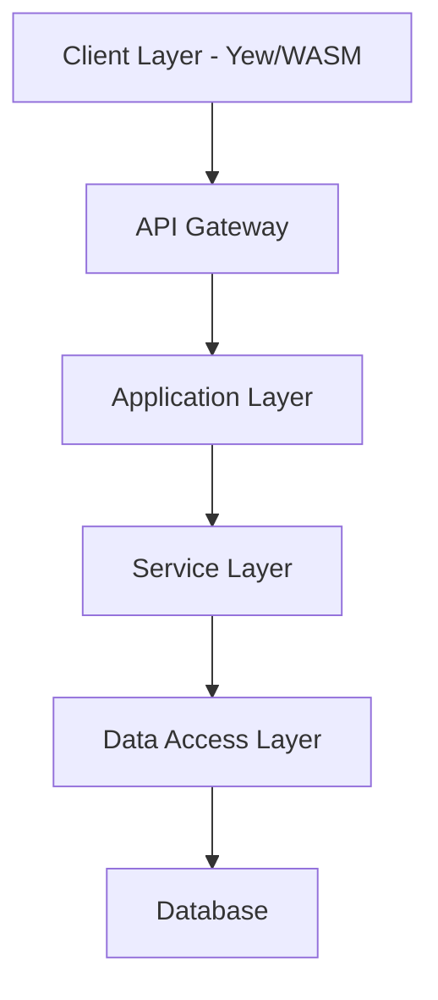

# OxidizedOasis-WebSands Software Development Document

Version: 2.0.0
Last Updated: 2025-03-15
Status: Release

## Version History

| Version | Date | Description | Author |
|---------|------|-------------|---------|
| 2.0.0 | 2025-03-15 | Major revision with updated architecture and security details | Technical Team |
| 1.0.0 | 2024-01-23 | Initial document creation | Technical Team |
| 0.9.0 | 2024-01-15 | Draft completion | Technical Team |
| 0.8.0 | 2024-01-01 | First draft | Technical Team |

## System Requirements Matrix

| Component | Minimum | Recommended |
|-----------|---------|-------------|
| CPU | 2 cores | 4+ cores |
| RAM | 4GB | 8GB+ |
| Storage | 20GB | 50GB+ |
| Network | 10Mbps | 100Mbps+ |
| Operating System | Ubuntu 20.04 LTS | Ubuntu 22.04 LTS |
| Database | PostgreSQL 13 | PostgreSQL 14+ |
| Rust Version | 1.68.0 | 1.70.0+ |
| Node.js Version | 14.x | 16.x+ |

## Table of Contents

1. [Introduction](#1-introduction)
    - 1.1 [Purpose](#11-purpose)
        - 1.1.1 [Document Objectives](#111-document-objectives)
        - 1.1.2 [Intended Audience](#112-intended-audience)
    - 1.2 [Scope](#12-scope)
        - 1.2.1 [System Overview](#121-system-overview)
        - 1.2.2 [Core Functionalities](#122-core-functionalities)
        - 1.2.3 [Project Boundaries](#123-project-boundaries)
    - 1.3 [Definitions, Acronyms, and Abbreviations](#13-definitions-acronyms-and-abbreviations)
    - 1.4 [References](#14-references)
    - 1.5 [Overview](#15-overview)

2. [System Overview](#2-system-overview)
    - 2.1 [System Description](#21-system-description)
        - 2.1.1 [System Context](#211-system-context)
        - 2.1.2 [Major Features](#212-major-features)
    - 2.2 [System Architecture](#22-system-architecture)
        - 2.2.1 [Architectural Overview](#221-architectural-overview)
        - 2.2.2 [Component Interaction](#222-component-interaction)
        - 2.2.3 [Data Flow](#223-data-flow)
    - 2.3 [User Roles and Characteristics](#23-user-roles-and-characteristics)
        - 2.3.1 [User Categories](#231-user-categories)
        - 2.3.2 [Administrative Roles](#232-administrative-roles)
    - 2.4 [Operating Environment](#24-operating-environment)
        - 2.4.1 [Hardware Requirements](#241-hardware-requirements)
        - 2.4.2 [Software Requirements](#242-software-requirements)
        - 2.4.3 [Network Requirements](#243-network-requirements)
    - 2.5 [Design and Implementation Constraints](#25-design-and-implementation-constraints)
        - 2.5.1 [Technical Constraints](#251-technical-constraints)
        - 2.5.2 [Business Constraints](#252-business-constraints)
    - 2.6 [Assumptions and Dependencies](#26-assumptions-and-dependencies)
        - 2.6.1 [Technical Assumptions](#261-technical-assumptions)
        - 2.6.2 [External Dependencies](#262-external-dependencies)

3. [System Features](#3-system-features)
    - 3.1 [User Management](#31-user-management)
        - 3.1.1 [User Registration](#311-user-registration)
        - 3.1.2 [User Authentication](#312-user-authentication)
        - 3.1.3 [Profile Management](#313-profile-management)
    - 3.2 [Authentication and Authorization](#32-authentication-and-authorization)
        - 3.2.1 [JWT Implementation](#321-jwt-implementation)
        - 3.2.2 [Role-based Access Control](#322-role-based-access-control)
        - 3.2.3 [Security Mechanisms](#323-security-mechanisms)
    - 3.3 [Security Features](#33-security-features)
        - 3.3.1 [Password Management](#331-password-management)
        - 3.3.2 [Input Validation](#332-input-validation)
        - 3.3.3 [Rate Limiting](#333-rate-limiting)
    - 3.4 [API Endpoints](#34-api-endpoints)
        - 3.4.1 [Public Endpoints](#341-public-endpoints)
        - 3.4.2 [Protected Endpoints](#342-protected-endpoints)
        - 3.4.3 [Admin Endpoints](#343-admin-endpoints)
    - 3.5 [Frontend Interface](#35-frontend-interface)
        - 3.5.1 [WebAssembly Components](#351-webassembly-components)
        - 3.5.2 [User Interface Design](#352-user-interface-design)
        - 3.5.3 [Client-Side Features](#353-client-side-features)

4. [Data Model](#4-data-model)
    - 4.1 [Database Schema](#41-database-schema)
        - 4.1.1 [Table Structures](#411-table-structures)
        - 4.1.2 [Indexes and Constraints](#412-indexes-and-constraints)
    - 4.2 [Entity Relationships](#42-entity-relationships)
        - 4.2.2 [Relationship Definitions](#422-relationship-definitions)
    - 4.3 [Data Access Layer](#43-data-access-layer)
        - 4.3.1 [Repository Pattern](#431-repository-pattern)
        - 4.3.2 [SQLx Integration](#432-sqlx-integration)

5. [External Interfaces](#5-external-interfaces)
    - 5.1 [User Interfaces](#51-user-interfaces)
        - 5.1.1 [Web Interface](#511-web-interface)
        - 5.1.2 [Administrative Interface](#512-administrative-interface)
    - 5.2 [Software Interfaces](#52-software-interfaces)
        - 5.2.1 [Database Interface](#521-database-interface)
        - 5.2.2 [External Services](#522-external-services)
    - 5.3 [Communication Interfaces](#53-communication-interfaces)
        - 5.3.1 [API Communication](#531-api-communication)
        - 5.3.2 [Email Communication](#532-email-communication)

6. [Non-functional Requirements](#6-non-functional-requirements)
    - 6.1 [Performance Requirements](#61-performance-requirements)
        - 6.1.1 [Response Time](#611-response-time)
        - 6.1.2 [Throughput](#612-throughput)
    - 6.2 [Security Requirements](#62-security-requirements)
        - 6.2.1 [Authentication Requirements](#621-authentication-requirements)
        - 6.2.2 [Data Protection](#622-data-protection)
    - 6.3 [Reliability and Availability](#63-reliability-and-availability)
        - 6.3.1 [Uptime Requirements](#631-uptime-requirements)
        - 6.3.2 [Fault Tolerance](#632-fault-tolerance)
    - 6.4 [Scalability](#64-scalability)
        - 6.4.1 [Horizontal Scaling](#641-horizontal-scaling)
        - 6.4.2 [Vertical Scaling](#642-vertical-scaling)

7. [Implementation Details](#7-implementation-details)
    - 7.1 [Programming Languages and Frameworks](#71-programming-languages-and-frameworks)
        - 7.1.1 [Backend Technologies](#711-backend-technologies)
        - 7.1.2 [Frontend Technologies](#712-frontend-technologies)
    - 7.2 [Development Tools and Environment](#72-development-tools-and-environment)
        - 7.2.1 [Development Tools](#721-development-tools)
        - 7.2.2 [Build Tools](#722-build-tools)
    - 7.3 [Coding Standards and Best Practices](#73-coding-standards-and-best-practices)
        - 7.3.1 [Code Organization](#731-code-organization)
        - 7.3.2 [Documentation Standards](#732-documentation-standards)
    - 7.4 [Error Handling and Logging](#74-error-handling-and-logging)
        - 7.4.1 [Error Management](#741-error-management)
        - 7.4.2 [Logging Strategy](#742-logging-strategy)

8. [Testing](#8-testing)
    - 8.1 [Test Approach](#81-test-approach)
        - 8.1.1 [Testing Strategy](#811-testing-strategy)
        - 8.1.2 [Testing Tools](#812-testing-tools)
    - 8.2 [Test Categories](#82-test-categories)
        - 8.2.1 [Unit Testing](#821-unit-testing)
        - 8.2.2 [Integration Testing](#822-integration-testing)
    - 8.3 [Test Environment](#83-test-environment)
        - 8.3.1 [Environment Setup](#831-environment-setup)
        - 8.3.2 [Test Data](#832-test-data)
    - 8.4 [Security Testing](#84-security-testing)
        - 8.4.1 [Penetration Testing](#841-penetration-testing)
        - 8.4.2 [Security Scanning](#842-security-scanning)

9. [Deployment](#9-deployment)
    - 9.1 [Deployment Architecture](#91-deployment-architecture)
        - 9.1.1 [Infrastructure Overview](#911-infrastructure-overview)
        - 9.1.2 [Component Distribution](#912-component-distribution)
    - 9.2 [Deployment Process](#92-deployment-process)
        - 9.2.1 [Build Process](#921-build-process)
        - 9.2.2 [Deployment Steps](#922-deployment-steps)
    - 9.3 [System Dependencies](#93-system-dependencies)
        - 9.3.1 [Runtime Dependencies](#931-runtime-dependencies)
        - 9.3.2 [External Services](#932-external-services)
    - 9.4 [Configuration Management](#94-configuration-management)
        - 9.4.1 [Environment Configuration](#941-environment-configuration)
        - 9.4.2 [Secrets Management](#942-secrets-management)

10. [Maintenance and Support](#10-maintenance-and-support)
    - 10.1 [Maintenance Tasks](#101-maintenance-tasks)
        - 10.1.1 [Routine Maintenance](#1011-routine-maintenance)
        - 10.1.2 [Emergency Maintenance](#1012-emergency-maintenance)
    - 10.2 [Support Procedures](#102-support-procedures)
        - 10.2.1 [User Support](#1021-user-support)
        - 10.2.2 [Technical Support](#1022-technical-support)
    - 10.3 [Monitoring and Logging](#103-monitoring-and-logging)
        - 10.3.1 [System Monitoring](#1031-system-monitoring)
        - 10.3.2 [Log Management](#1032-log-management)

11. [Troubleshooting Guide](#11-troubleshooting-guide)
    - 11.1 [Common Issues and Solutions](#111-common-issues-and-solutions)
        - 11.1.1 [Authentication Issues](#1111-authentication-issues)
        - 11.1.2 [Database Connection Issues](#1112-database-connection-issues)
        - 11.1.3 [WebAssembly Issues](#1113-webassembly-issues)
    - 11.2 [Performance Optimization](#112-performance-optimization)
        - 11.2.1 [API Response Times](#1121-api-response-times)
        - 11.2.2 [Frontend Performance](#1122-frontend-performance)

12. [Future Enhancements](#12-future-enhancements)
    - 12.1 [Advanced User Profile Features](#121-advanced-user-profile-features)
        - 12.1.1 [Profile Customization](#1211-profile-customization)
        - 12.1.2 [User Preferences](#1212-user-preferences)
    - 12.2 [Analytics and Reporting](#122-analytics-and-reporting)
        - 12.2.1 [User Analytics](#1221-user-analytics)
        - 12.2.2 [System Analytics](#1222-system-analytics)
    - 12.3 [Integration with External Services](#123-integration-with-external-services)
        - 12.3.1 [Third-party Authentication](#1231-third-party-authentication)
        - 12.3.2 [API Integrations](#1232-api-integrations)

13. [Appendices](#13-appendices)
    - 13.1 [Glossary](#131-glossary)
        - 13.1.1 [Technical Terms](#1311-technical-terms)
        - 13.1.2 [Business Terms](#1312-business-terms)
    - 13.2 [Reference Documents](#132-reference-documents)
        - 13.2.1 [Technical References](#1321-technical-references)
        - 13.2.2 [Standards References](#1322-standards-references)
    - 13.3 [API Documentation](#133-api-documentation)
        - 13.3.1 [API Endpoints](#1331-api-endpoints)
        - 13.3.2 [Request/Response Formats](#1332-requestresponse-formats)

# 1. Introduction

## 1.1 Purpose

### 1.1.1 Document Objectives

This Software Development Document (SDD) serves as the authoritative technical specification for the OxidizedOasis-WebSands project. The document's primary objectives are:

1. To provide comprehensive technical documentation of the system architecture, emphasizing:
   - The modular Rust-based backend implementation
   - WebAssembly frontend architecture using Yew
   - Security-first design principles
   - Integration patterns between components

2. To establish clear guidelines for:
   - Code organization and structure
   - Implementation standards
   - Security protocols
   - Testing requirements
   - Deployment procedures

3. To serve as a reference for:
   - Technical decision-making
   - Architectural choices
   - Implementation patterns
   - Future development efforts

4. To facilitate knowledge transfer and onboarding by documenting:
   - System components and their interactions
   - Development workflows
   - Testing procedures
   - Deployment processes

### 1.1.2 Intended Audience

This document is intended for:

1. **Development Team Members**
   - Backend developers working with Rust and Actix-web
   - Frontend developers working with Yew and WebAssembly
   - Database engineers working with PostgreSQL and SQLx

2. **System Architects**
   - Those responsible for system design decisions
   - Those evaluating architectural choices
   - Those planning system extensions

3. **Quality Assurance Team**
   - Test engineers designing test cases
   - QA specialists verifying system behavior
   - Security testers evaluating system safety

4. **System Administrators**
   - DevOps engineers managing deployment
   - System operators maintaining the production environment
   - Database administrators managing data operations

5. **Security Specialists**
   - Security engineers implementing security controls
   - Auditors evaluating security compliance
   - Penetration testers assessing vulnerabilities

## 1.2 Scope

### 1.2.1 System Overview

OxidizedOasis-WebSands is a high-performance web application built with Rust, providing robust user management and authentication services. The system comprises:

1. **Backend Services**
   - Rust-based API server using Actix-web
   - PostgreSQL database with SQLx
   - JWT-based authentication system
   - Email verification service
   - Rate limiting and security controls

2. **Frontend Application**
   - WebAssembly-based UI using Yew
   - Responsive design implementation
   - Client-side state management
   - Progressive Web App capabilities
   - Secure token handling

3. **Infrastructure Components**
   - Docker containerization
   - Kubernetes orchestration
   - Cloud deployment support
   - Monitoring and logging systems
   - Security scanning and protection

### 1.2.2 Core Functionalities

The system implements the following core functionalities:

1. **User Management**
   - User registration with email verification
   - Secure authentication using JWT
   - Profile management
   - Password recovery
   - Session management

2. **Security Features**
   - Bcrypt password hashing
   - Rate limiting
   - Input validation and sanitization
   - CORS configuration
   - XSS protection
   - Token revocation

3. **API Services**
   - RESTful API endpoints
   - Structured error handling
   - Response formatting
   - Authentication middleware
   - Role-based access control

4. **Frontend Interface**
   - Responsive design
   - WebAssembly performance
   - Progressive enhancement
   - Accessibility compliance
   - Secure state management

### 1.2.3 Project Boundaries

The project explicitly includes:
- User authentication and authorization
- Profile management
- Security implementations
- API development
- Frontend user interface
- Database operations
- Email notifications
- Logging and monitoring
- Deployment automation

The project explicitly excludes:
- Business logic beyond user management
- Third-party integrations (except for email)
- Payment processing
- Content management
- Social media features
- Analytics systems
- Custom reporting
- Mobile application development

## 1.3 Definitions, Acronyms, and Abbreviations

| Term | Definition |
|------|------------|
| API | Application Programming Interface |
| CORS | Cross-Origin Resource Sharing |
| CRUD | Create, Read, Update, Delete operations |
| CSP | Content Security Policy |
| DDoS | Distributed Denial of Service |
| JWT | JSON Web Token |
| OWASP | Open Web Application Security Project |
| RBAC | Role-Based Access Control |
| REST | Representational State Transfer |
| SQLx | Async, pure Rust SQL toolkit |
| TLS | Transport Layer Security |
| WASM | WebAssembly |
| XSS | Cross-Site Scripting |
| Yew | A modern Rust framework for creating multi-threaded front-end web apps |
| Actix-web | High-performance Rust web framework |
| WebAssembly | Binary instruction format for stack-based virtual machines |
| DDD | Domain-Driven Design |
| PWA | Progressive Web Application |
| SPA | Single Page Application |
| ORM | Object-Relational Mapping |

## 1.4 References

1. [Rust Programming Language](https://www.rust-lang.org/)
   - Version: 1.68.0 or later
   - Core language documentation
   - Standard library reference

2. [Actix Web Framework](https://actix.rs/)
   - Version: 4.9
   - API documentation
   - Server implementation guidelines
   - Middleware documentation

3. [SQLx](https://github.com/launchbadge/sqlx)
   - Version: 0.8.2
   - Database operations documentation
   - Migration management
   - Type-safe query building

4. [Yew Framework](https://yew.rs/)
   - Frontend framework documentation
   - Component lifecycle
   - State management
   - WebAssembly integration

5. [JWT Specification](https://jwt.io/)
   - Token structure
   - Validation procedures
   - Security considerations

6. [OWASP Security Guidelines](https://owasp.org/www-project-web-security-testing-guide/)
   - Security best practices
   - Vulnerability prevention
   - Testing procedures

7. [PostgreSQL Documentation](https://www.postgresql.org/docs/)
   - Version: 13 or later
   - Database management
   - Performance optimization

8. [Docker Documentation](https://docs.docker.com/)
   - Container management
   - Image building
   - Deployment strategies

9. [Kubernetes Documentation](https://kubernetes.io/docs/home/)
   - Orchestration
   - Service management
   - Scaling strategies

## 1.5 Overview

The subsequent sections of this document provide detailed information about OxidizedOasis-WebSands:

- Section 2: Provides comprehensive system overview and architecture
- Section 3: Details system features and functionalities
- Section 4: Describes data model and database design
- Section 5: Specifies external interfaces and integrations
- Section 6: Outlines non-functional requirements and constraints
- Section 7: Covers implementation details and practices
- Section 8: Describes testing strategies and procedures
- Section 9: Details deployment and operational procedures
- Section 10: Outlines maintenance and support processes
- Section 11: Provides troubleshooting guidance and solutions
- Section 12: Discusses planned future enhancements
- Section 13: Includes supporting documentation and references

Each section is designed to provide comprehensive information while maintaining focus on practical implementation aspects and maintaining system quality standards.

# 2. System Overview

## 2.1 System Description

### 2.1.1 System Context

OxidizedOasis-WebSands operates as a modern web application providing secure user management and authentication services. The system is built using Rust's robust ecosystem, emphasizing:

1. **Security**: Implementation of industry-standard security practices with a focus on:
   - Secure authentication mechanisms
   - Data protection
   - Input validation
   - Rate limiting
   - Protection against common web vulnerabilities

2. **Performance**: High-throughput request handling and efficient data processing through:
   - Rust's zero-cost abstractions
   - WebAssembly compilation for frontend
   - Efficient database queries
   - Optimized API responses

3. **Scalability**: Horizontally scalable architecture using:
   - Containerization with Docker
   - Kubernetes orchestration
   - Stateless design principles
   - Efficient resource utilization

4. **Reliability**: Error handling and system stability through:
   - Rust's ownership model and type safety
   - Comprehensive error handling
   - Graceful degradation
   - Automated recovery mechanisms

The system serves as a foundation for:
- Web applications requiring user authentication
- Services needing secure user management
- Systems requiring email verification workflows
- Applications demanding high-performance user operations
- Projects with strict security requirements

### 2.1.2 Major Features

The system implements several major features:

1. **User Authentication System**
   - Registration with email verification
   - JWT-based authentication with refresh tokens
   - Password recovery workflow
   - Session management
   - Account lockout protection

2. **Security Features**
   ```rust
   // Example of rate limiting configuration
   let auth_governor_config = GovernorConfigBuilder::default()
       .per_second(2)
       .burst_size(5)
       .finish()
       .unwrap();
   ```

   - Content Security Policy implementation
   - Input validation and sanitization
   - Rate limiting for sensitive endpoints
   - Token revocation system
   - Password strength enforcement

3. **API Services**
   - RESTful endpoints with versioning
   - Structured error responses
   - Rate limiting
   - CORS support
   - Documentation with OpenAPI

4. **WebAssembly Frontend**
   - Responsive user interface
   - Client-side state management
   - Progressive enhancement
   - Offline capabilities
   - Accessibility compliance

5. **Monitoring and Logging**
   - Comprehensive logging system
   - Performance metrics collection
   - Security event monitoring
   - Health checks
   - Alerting mechanisms

## 2.2 System Architecture

### 2.2.1 Architectural Overview

The system follows a layered architecture pattern with clean separation of concerns:



Key architectural components:

1. **Frontend Layer**
   - Yew framework for component-based UI
   - WebAssembly compilation for near-native performance
   - Browser runtime with progressive enhancement
   - Client-side state management
   - Responsive design implementation

2. **Backend Layer**
   - Actix-web server for high-performance request handling
   - Business logic services with domain-driven design
   - Authentication middleware for security enforcement
   - Error handling and validation
   - Logging and monitoring

3. **Database Layer**
   - PostgreSQL for relational data storage
   - SQLx for type-safe queries without an ORM
   - Migration management for schema evolution
   - Connection pooling for performance
   - Transaction management for data integrity

4. **Infrastructure Layer**
   - Docker containers for consistent environments
   - Kubernetes for orchestration and scaling
   - Load balancing for distribution
   - TLS termination for secure communication
   - Monitoring and logging infrastructure

### 2.2.2 Component Interaction

Components interact through well-defined interfaces:

1. **API Communication**
   ```rust
   // Example of handler definition
   pub async fn create_user_handler(
       handler: web::Data<UserHandler>,
       user_input: web::Json<UserInput>,
   ) -> impl Responder {
       handler.create_user(user_input).await
   }
   ```

2. **Service Layer Interaction**
   ```rust
   // Example of service interaction
   impl UserService {
       pub async fn create_user(&self, input: UserInput) 
           -> Result<(User, String), ApiError> {
           // Validate input
           let validated_input = validate_user_input(&input)?;
           
           // Hash password
           let password_hash = hash_password(&validated_input.password)?;
           
           // Generate verification token
           let verification_token = generate_secure_token();
           
           // Create user in database
           let user = self.repository.create_user(
               validated_input, 
               password_hash, 
               verification_token.clone()
           ).await?;
           
           // Send verification email
           self.email_service.send_verification_email(
               &user.email, 
               &verification_token
           ).await?;
           
           Ok((user, verification_token))
       }
   }
   ```

3. **Repository Layer Interaction**
   ```rust
   // Example of repository interaction
   impl UserRepository {
       pub async fn create_user(
           &self,
           input: ValidatedUserInput,
           password_hash: String,
           verification_token: String
       ) -> Result<User, DbError> {
           sqlx::query_as!(
               User,
               r#"
               INSERT INTO users (
                   id, username, email, password_hash, 
                   is_email_verified, verification_token,
                   verification_token_expires_at, created_at, 
                   updated_at, role
               )
               VALUES ($1, $2, $3, $4, $5, $6, $7, $8, $9, $10)
               RETURNING *
               "#,
               Uuid::new_v4(),
               input.username,
               input.email,
               password_hash,
               false,
               Some(verification_token),
               Some(Utc::now() + Duration::hours(24)),
               Utc::now(),
               Utc::now(),
               "user"
           )
           .fetch_one(&self.pool)
           .await
           .map_err(|e| DbError::from(e))
       }
   }
   ```

### 2.2.3 Data Flow

Data flows through the system following these patterns:

1. **Authentication Flow**
   ```mermaid
   sequenceDiagram
       Client->>+API: Login Request
       API->>+Auth Service: Validate Credentials
       Auth Service->>+Database: Verify User
       Database-->>-Auth Service: User Data
       Auth Service->>Auth Service: Verify Password
       Auth Service->>Auth Service: Generate JWT Tokens
       Auth Service-->>-API: Access & Refresh Tokens
       API-->>-Client: Authentication Response
   ```

2. **User Registration Flow**
   ```mermaid
   sequenceDiagram
       Client->>+API: Registration Request
       API->>+Validation: Validate Input
       Validation-->>-API: Validation Result
       API->>+User Service: Create User
       User Service->>+Database: Store User
       Database-->>-User Service: Confirmation
       User Service->>+Email Service: Send Verification
       Email Service-->>-User Service: Email Sent
       User Service-->>-API: Success Response
       API-->>-Client: Registration Complete
   ```

3. **Token Refresh Flow**
   ```mermaid
   sequenceDiagram
       Client->>+API: Refresh Token Request
       API->>+Auth Service: Validate Refresh Token
       Auth Service->>+Database: Check Token Validity
       Database-->>-Auth Service: Token Status
       Auth Service->>Auth Service: Generate New Tokens
       Auth Service->>Database: Revoke Old Refresh Token
       Auth Service-->>-API: New Token Pair
       API-->>-Client: Updated Tokens
   ```

4. **API Request Flow**
   ```mermaid
   sequenceDiagram
       Client->>+API Gateway: API Request with JWT
       API Gateway->>+Auth Middleware: Validate Token
       Auth Middleware->>Auth Middleware: Verify Signature
       Auth Middleware->>+Database: Check Token Revocation
       Database-->>-Auth Middleware: Token Status
       Auth Middleware-->>-API Gateway: Authentication Result
       API Gateway->>+Service Layer: Process Request
       Service Layer->>+Data Access Layer: Data Operations
       Data Access Layer->>+Database: Execute Query
       Database-->>-Data Access Layer: Query Result
       Data Access Layer-->>-Service Layer: Processed Data
       Service Layer-->>-API Gateway: Response Data
       API Gateway-->>-Client: API Response
   ```

## 2.3 User Roles and Characteristics

### 2.3.1 User Categories

1. **Unauthenticated Users**
   - Access to public endpoints only
   - Registration capability
   - Password recovery access
   - Email verification process
   - Limited API access

2. **Authenticated Users**
   - Profile management
   - Protected endpoint access
   - Session management
   - Password change capability
   - Personal data management

3. **Verified Users**
   - Full system access
   - Email verified status
   - Access to all user features
   - Ability to use sensitive features

### 2.3.2 Administrative Roles

1. **System Administrators**
   - User management capabilities
   - System configuration access
   - Analytics viewing
   - Log access
   - Security monitoring

2. **Support Staff**
   - User assistance tools
   - Limited administrative access
   - Issue tracking
   - User verification assistance
   - Read-only access to user data

3. **Security Administrators**
   - Security configuration management
   - Access to security logs
   - Token revocation capabilities
   - Rate limit configuration
   - Security alert management

## 2.4 Operating Environment

### 2.4.1 Hardware Requirements

1. **Server Requirements**
   - Minimum 2 CPU cores (4+ recommended)
   - 4GB RAM minimum (8GB+ recommended)
   - 20GB storage minimum (50GB+ recommended)
   - Network interface with 100Mbps minimum
   - Redundant power and network connections for production

2. **Client Requirements**
   - Modern web browser with WebAssembly support
   - Minimum 2GB RAM
   - Stable internet connection
   - Screen resolution of 1280x720 or higher
   - JavaScript enabled

### 2.4.2 Software Requirements

1. **Server Environment**
   - Linux-based OS (Ubuntu 20.04 LTS or newer recommended)
   - Docker Engine 20.10+
   - Kubernetes 1.21+ (for production)
   - PostgreSQL 13+
   - SMTP server access

2. **Development Environment**
   - Rust 1.68.0 or later
   - Node.js 14+ (for frontend tooling)
   - Docker and Docker Compose
   - Git version control
   - IDE with Rust support

3. **Client Environment**
   - Modern web browsers:
     - Chrome 80+
     - Firefox 75+
     - Safari 13.1+
     - Edge 80+
   - WebAssembly support
   - JavaScript enabled
   - Cookies enabled

### 2.4.3 Network Requirements

1. **Connectivity**
   - HTTPS support with TLS 1.2+
   - WebSocket capability for real-time features
   - DNS resolution
   - Load balancer support
   - Firewall configuration

2. **Security**
   - TLS 1.3 preferred (1.2 minimum)
   - Firewall configuration for ports 80/443
   - CORS policy support
   - DDoS protection
   - WAF (Web Application Firewall) recommended

3. **Bandwidth**
   - Minimum 10Mbps for development
   - 100Mbps+ for production
   - Low latency for API communication
   - Sufficient bandwidth for concurrent users

## 2.5 Design and Implementation Constraints

### 2.5.1 Technical Constraints

1. **Language and Framework**
   ```toml
   # Example from Cargo.toml
   [dependencies]
   actix-web = "4.9"
   sqlx = { version = "0.8.2", features = ["runtime-tokio-rustls", "postgres"] }
   tokio = { version = "1", features = ["full"] }
   ```

   - Rust language for backend development
   - Actix-web for HTTP server
   - SQLx for database access
   - Yew for frontend development
   - WebAssembly for browser execution

2. **Security Requirements**
   - HTTPS enforcement
   - JWT implementation with proper signing
   - Password hashing with bcrypt
   - Rate limiting implementation
   - Input validation and sanitization
   - Content Security Policy

3. **Performance Constraints**
   - API response time under 100ms for 95th percentile
   - Frontend initial load under 2 seconds
   - Support for 1000+ concurrent users
   - Database query optimization
   - Efficient memory usage

### 2.5.2 Business Constraints

1. **Compliance Requirements**
   - Data protection regulations
   - User privacy requirements
   - Security standards compliance
   - Audit logging for sensitive operations
   - Data retention policies

2. **Operational Constraints**
   - Maintenance windows
   - Backup requirements
   - Update procedures
   - Monitoring requirements
   - Support SLAs

3. **Resource Constraints**
   - Development team size
   - Budget limitations
   - Timeline requirements
   - Infrastructure costs
   - Licensing considerations

## 2.6 Assumptions and Dependencies

### 2.6.1 Technical Assumptions

1. **System Assumptions**
   - Modern browser availability
   - WebAssembly support
   - Stable internet connectivity
   - Email service availability
   - Database reliability

2. **Performance Assumptions**
   - Expected user load patterns
   - Response time requirements
   - Data storage growth
   - Network reliability
   - Hardware scaling capabilities

3. **Security Assumptions**
   - Threat model understanding
   - Security control effectiveness
   - User security awareness
   - Infrastructure security
   - Third-party dependency security

### 2.6.2 External Dependencies

1. **Runtime Dependencies**
   - PostgreSQL database
   - SMTP server for emails
   - DNS services
   - SSL certificate provider
   - Monitoring services

2. **Development Dependencies**
   - Build tools
   - CI/CD services
   - Version control system
   - Container registry
   - Development environments

3. **Third-Party Services**
   - Email delivery service
   - Monitoring and logging services
   - Security scanning tools
   - Backup services
   - CDN for static assets

# 3. System Features

## 3.1 User Management

### 3.1.1 User Registration

The system implements a secure, multi-step registration process that ensures data integrity and security:

```rust
// User registration handler
pub async fn register_user(
    app_data: web::Data<AppState>,
    form: web::Json<UserRegistrationForm>,
) -> impl Responder {
    // Validate input data
    if let Err(validation_errors) = validate_registration_form(&form) {
        return HttpResponse::BadRequest().json(ErrorResponse {
            status: "error",
            message: "Validation failed",
            errors: Some(validation_errors),
        });
    }

    // Check for existing user with same email or username
    match app_data.user_service.user_exists(&form.email, &form.username).await {
        Ok(true) => {
            return HttpResponse::Conflict().json(ErrorResponse {
                status: "error",
                message: "User with this email or username already exists",
                errors: None,
            });
        }
        Err(e) => {
            log::error!("Database error during user existence check: {}", e);
            return HttpResponse::InternalServerError().json(ErrorResponse {
                status: "error",
                message: "Internal server error",
                errors: None,
            });
        }
        _ => {}
    }

    // Create new user and generate verification token
    match app_data.user_service.create_user(&form).await {
        Ok((user, token)) => {
            // Send verification email
            if let Err(e) = app_data.email_service.send_verification_email(&user.email, &token).await {
                log::warn!("Failed to send verification email: {}", e);
                // Continue despite email failure - user is created
            }
            
            HttpResponse::Created().json(SuccessResponse {
                status: "success",
                message: "User registered successfully. Please verify your email.",
                data: Some(json!({ "username": user.username })),
            })
        }
        Err(e) => {
            log::error!("Failed to create user: {}", e);
            HttpResponse::InternalServerError().json(ErrorResponse {
                status: "error",
                message: "Failed to create user account",
                errors: None,
            })
        }
    }
}
```

The registration flow includes:

1. **Form Validation**: Validates input data against strict requirements:
   - Username: 3-30 alphanumeric characters
   - Email: Standard RFC 5322 email format
   - Password: Minimum 10 characters with at least one uppercase, lowercase, digit, and special character

2. **Duplicate Detection**: Checks for existing users with the same email or username

3. **Security Measures**:
   - Passwords are never stored in plaintext
   - Password hashing using Argon2id with configurable parameters
   - All inputs are sanitized to prevent injection attacks

4. **Email Verification**: Generates a cryptographically secure token and sends verification email

5. **Rate Limiting**: Registration attempts are rate-limited to prevent abuse

### 3.1.2 User Authentication

The authentication system uses a modern JWT-based approach with refresh tokens:

```rust
// User login handler
pub async fn login_user(
    app_data: web::Data<AppState>,
    credentials: web::Json<UserLoginCredentials>,
) -> impl Responder {
    // Authenticate user
    match app_data.auth_service.authenticate_user(&credentials.username, &credentials.password).await {
        Ok(user) => {
            // Check if email is verified
            if !user.is_email_verified {
                return HttpResponse::Forbidden().json(ErrorResponse {
                    status: "error",
                    message: "Email not verified. Please verify your email before logging in.",
                    errors: None,
                });
            }

            // Generate JWT pair
            match app_data.auth_service.generate_token_pair(&user).await {
                Ok((access_token, refresh_token)) => {
                    // Set refresh token in HTTP-only cookie
                    let refresh_cookie = Cookie::build("refresh_token", refresh_token.clone())
                        .path("/")
                        .secure(true)
                        .http_only(true)
                        .same_site(SameSite::Strict)
                        .max_age(time::Duration::days(7))
                        .finish();

                    // Return response with tokens
                    HttpResponse::Ok()
                        .cookie(refresh_cookie)
                        .json(json!({
                            "status": "success",
                            "message": "Login successful",
                            "data": {
                                "access_token": access_token,
                                "token_type": "Bearer",
                                "expires_in": 900 // 15 minutes in seconds
                            }
                        }))
                }
                Err(e) => {
                    log::error!("Token generation error: {}", e);
                    HttpResponse::InternalServerError().json(ErrorResponse {
                        status: "error",
                        message: "Authentication error",
                        errors: None,
                    })
                }
            }
        }
        Err(e) => {
            log::warn!("Authentication attempt failed: {}", e);
            // Use constant-time comparison to prevent timing attacks
            HttpResponse::Unauthorized().json(ErrorResponse {
                status: "error",
                message: "Invalid username or password",
                errors: None,
            })
        }
    }
}
```

Authentication features include:

1. **Secure Token Implementation**:
   - Access tokens: Short-lived JWTs (15 minutes)
   - Refresh tokens: Longer-lived tokens (7 days) stored securely
   - Stateful refresh tokens tracked in the database for revocation capability

2. **Security Mechanisms**:
   - Password verification using Argon2id with time-constant comparison
   - Failed login attempt tracking with temporary account lockout
   - Secure cookie handling for refresh tokens

3. **Token Management**:
   - Token refresh endpoints for seamless user experience
   - Token revocation on logout or security events
   - Cross-device logout capability

### 3.1.3 Profile Management

Users can manage their profiles through a set of secure endpoints:

```rust
// Update user profile handler
pub async fn update_profile(
    app_data: web::Data<AppState>,
    identity: Identity,
    form: web::Json<ProfileUpdateForm>,
) -> impl Responder {
    // Extract user ID from identity
    let user_id = match identity.id() {
        Some(id) => id,
        None => return HttpResponse::Unauthorized().json(ErrorResponse {
            status: "error",
            message: "Authentication required",
            errors: None,
        }),
    };

    // Validate profile data
    if let Err(validation_errors) = validate_profile_update(&form) {
        return HttpResponse::BadRequest().json(ErrorResponse {
            status: "error",
            message: "Validation failed",
            errors: Some(validation_errors),
        });
    }

    // Update profile in database
    match app_data.user_service.update_profile(&user_id, &form).await {
        Ok(updated_user) => {
            HttpResponse::Ok().json(SuccessResponse {
                status: "success",
                message: "Profile updated successfully",
                data: Some(json!({
                    "username": updated_user.username,
                    "display_name": updated_user.display_name,
                    "bio": updated_user.bio,
                })),
            })
        }
        Err(e) => {
            log::error!("Profile update error: {}", e);
            HttpResponse::InternalServerError().json(ErrorResponse {
                status: "error",
                message: "Failed to update profile",
                errors: None,
            })
        }
    }
}
```

Profile management features include:

1. **User Data Management**:
   - Profile information updating
   - Email address changing with re-verification
   - Password changing with current password verification
   - Account preferences management

2. **Security Considerations**:
   - Authentication required for all profile operations
   - Sensitive actions require password re-entry
   - All changes are logged for security audit

3. **Account Recovery**:
   - Password reset via email
   - Time-limited recovery tokens
   - Account reclamation process for lost accounts

## 3.2 Authentication and Authorization

### 3.2.1 JWT Implementation

The system uses JSON Web Tokens (JWT) for authentication with a comprehensive implementation:

```rust
pub struct AuthService {
    jwt_secret: String,
    token_duration: Duration,
    refresh_token_duration: Duration,
    token_repository: Arc<TokenRepository>,
    user_repository: Arc<UserRepository>,
}

impl AuthService {
    pub fn new(
        jwt_secret: String,
        token_duration: Duration,
        refresh_token_duration: Duration,
        token_repository: Arc<TokenRepository>,
        user_repository: Arc<UserRepository>,
    ) -> Self {
        Self {
            jwt_secret,
            token_duration,
            refresh_token_duration,
            token_repository,
            user_repository,
        }
    }

    pub async fn generate_token_pair(&self, user: &User) -> Result<(String, String), AuthError> {
        // Generate access token
        let access_token = self.generate_access_token(user)?;
        
        // Generate refresh token
        let refresh_token = Uuid::new_v4().to_string();
        let expires_at = Utc::now() + self.refresh_token_duration;
        
        // Store refresh token in database
        self.token_repository.store_refresh_token(&user.id, &refresh_token, expires_at).await?;
        
        Ok((access_token, refresh_token))
    }

    fn generate_access_token(&self, user: &User) -> Result<String, AuthError> {
        let expiration = Utc::now()
            .checked_add_signed(self.token_duration)
            .expect("Valid timestamp")
            .timestamp();

        let claims = Claims {
            sub: user.id.to_string(),
            role: user.role.clone(),
            exp: expiration as usize,
            iat: Utc::now().timestamp() as usize,
        };

        let header = Header::new(Algorithm::HS256);
        encode(&header, &claims, &EncodingKey::from_secret(self.jwt_secret.as_bytes()))
            .map_err(|_| AuthError::TokenCreation)
    }
    
    pub async fn verify_token(&self, token: &str) -> Result<Claims, AuthError> {
        // Decode and verify the token
        let token_data = decode::<Claims>(
            token,
            &DecodingKey::from_secret(self.jwt_secret.as_bytes()),
            &Validation::new(Algorithm::HS256),
        ).map_err(|e| {
            match e.kind() {
                jsonwebtoken::errors::ErrorKind::ExpiredSignature => AuthError::TokenExpired,
                jsonwebtoken::errors::ErrorKind::InvalidSignature => AuthError::InvalidToken,
                _ => AuthError::TokenValidation,
            }
        })?;
        
        Ok(token_data.claims)
    }
}
```

JWT implementation details:

1. **Token Structure**:
   - Header: Specifies algorithm (HS256)
   - Payload: Contains user ID, role, issued time, and expiration
   - Signature: HMAC-SHA256 encrypted with server secret key

2. **Token Security**:
   - Secret key stored in environment variables, not in code
   - Short expiration time to minimize attack window
   - Token rotation on privilege changes
   - Refresh token rotation on use

3. **Token Validation**:
   - Signature verification on every request
   - Expiration time validation
   - Token revocation checking
   - Role verification for protected endpoints

### 3.2.2 Role-based Access Control

The system implements a flexible role-based access control system:

```rust
// Middleware to check user roles
pub struct RoleGuard {
    required_roles: Vec<String>,
}

impl RoleGuard {
    pub fn new(roles: Vec<&str>) -> Self {
        let required_roles = roles.into_iter().map(String::from).collect();
        RoleGuard { required_roles }
    }
}

impl<S, B> Service<ServiceRequest> for RoleGuard
where
    S: Service<ServiceRequest, Response = ServiceResponse<B>, Error = Error>,
    S::Future: 'static,
    B: 'static,
{
    type Response = ServiceResponse<B>;
    type Error = Error;
    type Future = Pin<Box<dyn Future<Output = Result<Self::Response, Self::Error>>>>;

    fn poll_ready(&self, ctx: &mut Context<'_>) -> Poll<Result<(), Self::Error>> {
        ctx.poll()
    }

    fn call(&self, req: ServiceRequest) -> Self::Future {
        let required_roles = self.required_roles.clone();
        let fut = ctx.call(req);

        Box::pin(async move {
            let mut res = fut.await?;
            
            // Extract claims from request extensions
            if let Some(claims) = res.request().extensions().get::<Claims>() {
                // Check if user has any of the required roles
                if required_roles.is_empty() || required_roles.contains(&claims.role) {
                    Ok(res)
                } else {
                    Err(ErrorForbidden("Insufficient permissions"))
                }
            } else {
                Err(ErrorUnauthorized("Authentication required"))
            }
        })
    }
}
```

Role-based access control features:

1. **Role Hierarchy**:
   - Guest: Unauthenticated users with minimal access
   - User: Standard authenticated users
   - Moderator: Enhanced privileges for content management
   - Admin: Full system access with administrative capabilities

2. **Permission System**:
   - Granular permissions within roles
   - Resource-specific access controls
   - Action-based permissions (view, create, edit, delete)
   - Dynamic permission evaluation

3. **Implementation Details**:
   - Role stored in JWT claims
   - Role verification at endpoint level
   - Role-based route guards
   - Permission caching for performance

### 3.2.3 Security Mechanisms

The system implements multiple security mechanisms:

```rust
// CSRF protection middleware configuration
pub fn configure_security(cfg: &mut web::ServiceConfig) {
    // Create CSRF token extractor
    let csrf = CsrfTokenExtractor::new(CsrfConfigBuilder::new()
        .cookie_name("csrf_token")
        .cookie_secure(true)
        .cookie_http_only(true)
        .cookie_same_site(SameSiteCookiePolicy::Strict)
        .http_allowed_methods(vec![Method::GET, Method::HEAD, Method::OPTIONS])
        .build()
        .unwrap());

    cfg.service(
        web::resource("/api/csrf-token")
            .route(web::get().to(get_csrf_token))
    );

    // Apply CSRF protection to all POST/PUT/DELETE routes
    cfg.service(
        web::scope("/api")
            .wrap(csrf)
            .service(
                web::resource("/users")
                    .route(web::post().to(create_user))
                    .route(web::put().to(update_user))
                    .route(web::delete().to(delete_user))
            )
    );
}
```

Key security mechanisms:

1. **Cross-Site Request Forgery (CSRF) Protection**:
   - Token-based CSRF protection for state-changing actions
   - Secure cookie implementation
   - Same-site cookie policy
   - Referrer validation

2. **Cross-Site Scripting (XSS) Protection**:
   - Content Security Policy implementation
   - Input sanitization
   - Output encoding
   - HTTPOnly cookies for sensitive data

3. **SQL Injection Prevention**:
   - Parameterized queries with SQLx
   - Type-safe query building
   - Input validation and sanitization
   - Limited database user permissions

