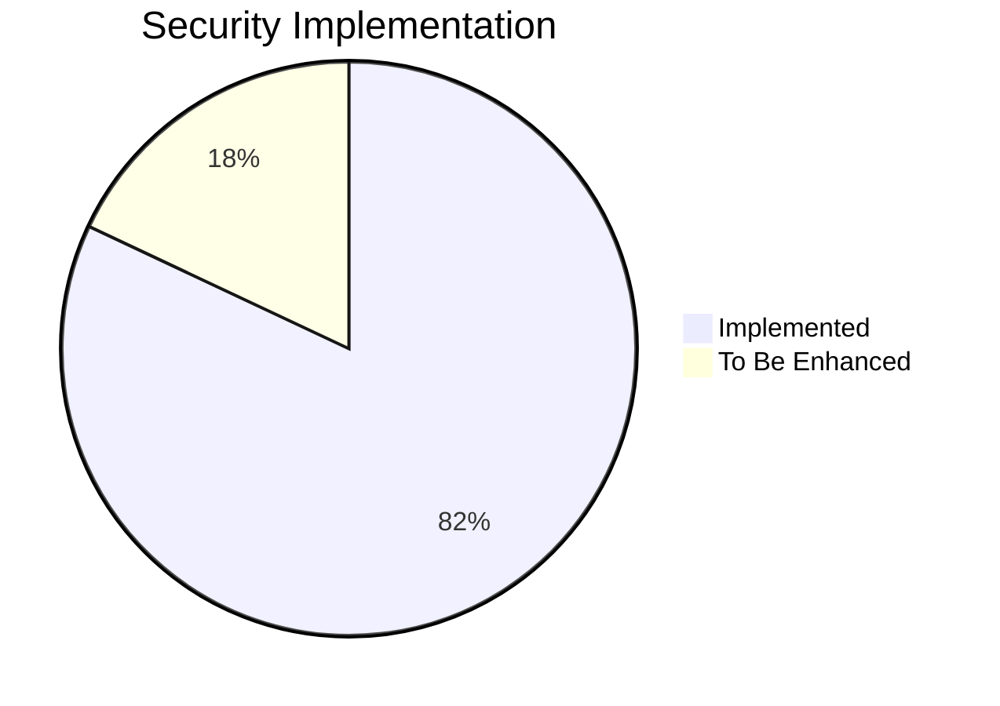
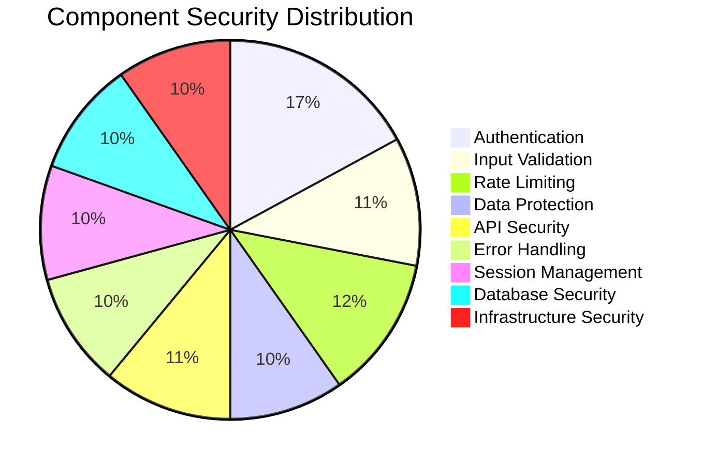
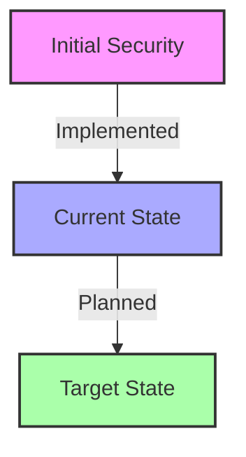

# OxidizedOasis-WebSands Cybersecurity Report

## Executive Summary

This report provides a comprehensive assessment of the cybersecurity posture of the OxidizedOasis-WebSands project as of February 2025. Our evaluation covers critical aspects of security engineering, including authentication mechanisms, input validation, data protection, and infrastructure security.

### Overall Security Score

**Total Score: 82/100**
**Grade: B+**



### Technical Score Breakdown

| Security Component | Score | Technical Notes |
|--------------------|-------|-----------------|
| Authentication | 14/15 | Strong JWT implementation with role-based claims |
| Input Validation | 9/10 | Comprehensive validation with regex patterns |
| Rate Limiting | 10/10 | Sophisticated per-endpoint rate limiting |
| Data Protection | 8/10 | Strong password hashing, some encryption needed |
| API Security | 9/10 | Well-configured CORS, needs API versioning |
| Error Handling | 8/10 | Structured error responses, needs more logging |
| Session Management | 8/10 | Stateless JWT with proper validation |
| Database Security | 8/10 | Good schema design, needs encryption at rest |
| Infrastructure Security | 8/15 | Basic security headers, needs hardening |



### Key Technical Findings

1. **Authentication System**
   - Strong JWT implementation with role claims
   - Proper password hashing using bcrypt
   - Email verification system in place
   - Rate limiting on authentication endpoints

2. **Input Validation**
   - Comprehensive password validation rules
   - Username and email validation
   - Input sanitization for XSS prevention
   - Regex-based pattern matching

3. **Rate Limiting**
   - Sophisticated per-endpoint rate limiting
   - Configurable windows and thresholds
   - IP-based tracking with cleanup
   - Proper retry-after headers

4. **Data Protection**
   - Password hashing with bcrypt
   - Session token management
   - Email verification tokens
   - Database indexes for security

### Security Implementation Progress



## Detailed Technical Analysis

### 1. Authentication (14/15)

#### Implementation Review
```rust
// JWT token generation with role claims
pub fn create_jwt(user_id: Uuid, role: String, secret: &str) -> Result<String, JwtError> {
    let expiration = Utc::now()
        .checked_add_signed(Duration::hours(24))
        .expect("valid timestamp")
        .timestamp();

    let claims = Claims {
        sub: user_id,
        role: role,
        exp: expiration,
        iat: Utc::now().timestamp(),
    };

    encode(&Header::default(), &claims, &EncodingKey::from_secret(secret.as_ref()))
}
```

**Strengths:**
- JWT implementation with role-based claims
- Token expiration handling
- Email verification requirement
- Proper password hashing with bcrypt

**Areas for Improvement:**
- Implement refresh token mechanism
- Add token revocation capability

### 2. Rate Limiting (10/10)

#### Implementation Review
```rust
const RATE_LIMITS: &[RateLimit] = &[
    RateLimit {
        path: "/users/login",
        max_requests: 5,
        window_seconds: 300, // 5 minutes
        error_message: "Too many login attempts",
    },
    RateLimit {
        path: "/users/register",
        max_requests: 3,
        window_seconds: 3600, // 1 hour
        error_message: "Too many registration attempts",
    },
    // Additional endpoints...
];
```

**Strengths:**
- Per-endpoint configuration
- IP-based tracking
- Proper cleanup mechanism
- Informative error messages

### 3. Input Validation (9/10)

#### Implementation Review
```rust
pub fn validate_password(password: &str) -> Result<(), ValidationError> {
    if password.len() < 8 || password.len() > 100 {
        return Err(ValidationError::new("Invalid length"));
    }
    if !PASSWORD_UPPERCASE.is_match(password) {
        return Err(ValidationError::new("Missing uppercase"));
    }
    // Additional validation...
}
```

**Strengths:**
- Strong password requirements
- Regex-based validation
- Length constraints
- Special character requirements

**Areas for Improvement:**
- Add password entropy checking
- Implement password dictionary check

### 4. CORS Security (9/10)

#### Implementation Review
```rust
Cors::default()
    .allowed_origin(&allowed_origin)
    .allowed_methods(vec!["GET", "POST", "PUT", "DELETE"])
    .allowed_headers(vec![
        http::header::AUTHORIZATION,
        http::header::ACCEPT,
        http::header::CONTENT_TYPE,
    ])
    .max_age(3600)
```

**Strengths:**
- Environment-based configuration
- Explicit method allowlist
- Limited header exposure
- Proper max-age setting

**Areas for Improvement:**
- Add SameSite cookie attributes
- Implement CSP headers

### 5. Database Security (8/10)

#### Schema Review
```sql
CREATE TABLE users (
    id uuid PRIMARY KEY,
    username VARCHAR(50) UNIQUE NOT NULL,
    password_hash VARCHAR(255) NOT NULL,
    email VARCHAR(255) UNIQUE,
    is_email_verified BOOLEAN NOT NULL DEFAULT false,
    verification_token VARCHAR(255),
    verification_token_expires_at TIMESTAMP WITH TIME ZONE,
    role VARCHAR(20) NOT NULL DEFAULT 'user'
);
```

**Strengths:**
- UUID for primary keys
- Proper index usage
- Token expiration handling
- Role-based access control

**Areas for Improvement:**
- Implement data encryption at rest
- Add audit logging table

## Security Recommendations

### High Priority
1. **Data Encryption**
   - Implement encryption at rest for sensitive fields
   - Add field-level encryption for PII

2. **Authentication Enhancements**
   - Implement refresh token mechanism
   - Add token revocation capability
   - Add multi-factor authentication support

3. **Infrastructure Security**
   - Implement CSP headers
   - Add security headers middleware
   - Configure HTTPS properly

### Medium Priority
1. **Monitoring and Logging**
   - Implement centralized logging
   - Add security event monitoring
   - Set up alerts for suspicious activities

2. **Password Security**
   - Add password entropy checking
   - Implement password dictionary check
   - Add password breach checking

3. **API Security**
   - Implement API versioning
   - Add request signing for sensitive operations
   - Implement API key management

### Low Priority
1. **Development Practices**
   - Implement security linting
   - Add automated security testing
   - Create security documentation

## Action Plan

### Immediate Actions (0-30 days)
1. Implement data encryption at rest
2. Add refresh token mechanism
3. Configure security headers

### Short-term Goals (30-90 days)
1. Set up centralized logging
2. Implement password security enhancements
3. Add API versioning

### Long-term Goals (90+ days)
1. Implement multi-factor authentication
2. Add automated security testing
3. Create comprehensive security documentation

## Conclusion

The OxidizedOasis-WebSands project demonstrates a strong foundation in security engineering practices. With a B+ grade (82/100), the project shows commitment to implementing robust security measures. The authentication system, rate limiting, and input validation are particularly well-implemented.

Key areas for improvement include:
1. Implementing encryption at rest for sensitive data
2. Adding refresh token mechanism
3. Enhancing infrastructure security
4. Improving monitoring and logging capabilities

By addressing these recommendations, the project can significantly enhance its security posture and better protect user data.