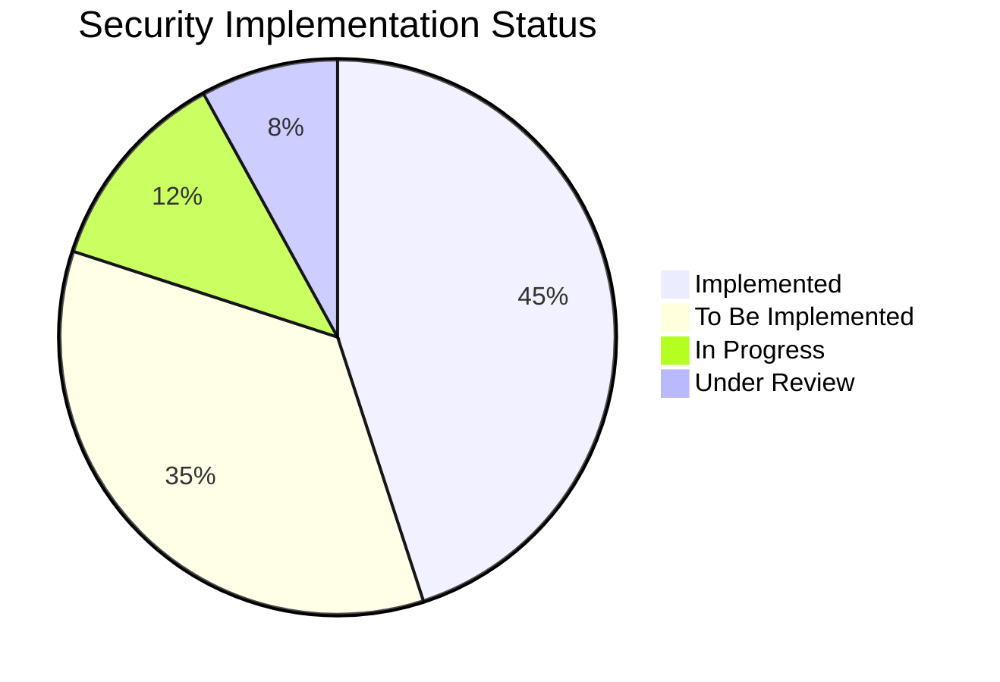
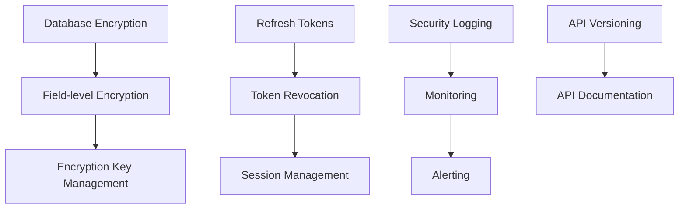

# OxidizedOasis-WebSands Security Backlog

## Legend
✅ Implemented  
🔷 To be implemented  
🚧 In progress  
🔍 Under review  

## 1. Authentication and Authorization

### 1.1 Core Authentication
- ✅ JWT-based authentication
- ✅ Password hashing with bcrypt
- ✅ Role-based authorization
- ✅ Email verification system
- 🔷 Refresh token mechanism
- 🔷 Token revocation system
- 🔷 Multi-factor authentication
- 🚧 Session management improvements

### 1.2 Password Security
- ✅ Password complexity requirements
- ✅ Password validation
- ✅ Secure password reset flow
- 🔷 Password entropy checking
- 🔷 Password dictionary attack prevention
- 🔷 Password breach checking
- 🚧 Password expiration policy

### 1.3 Access Control
- ✅ Role-based access control
- ✅ Route protection middleware
- ✅ Admin authorization checks
- 🔷 Resource-level permissions
- 🔷 API key management
- 🔷 OAuth integration support

## 2. Data Protection

### 2.1 Data at Rest
- ✅ Password hashing
- ✅ Secure token storage
- 🔷 Database encryption
- 🔷 Field-level encryption for PII
- 🔷 Encryption key management
- 🚧 Secure backup system

### 2.2 Data in Transit
- ✅ CORS configuration
- ✅ Secure headers
- 🔷 HTTPS enforcement
- 🔷 Certificate management
- 🔷 Perfect forward secrecy
- 🚧 API request signing

### 2.3 Data Validation
- ✅ Input sanitization
- ✅ XSS prevention
- ✅ SQL injection prevention
- ✅ Input length validation
- 🔷 Content security policy
- 🔷 File upload validation

## 3. Rate Limiting and DDoS Protection

### 3.1 Rate Limiting
- ✅ Per-endpoint rate limiting
- ✅ IP-based tracking
- ✅ Configurable windows
- ✅ Retry-after headers
- 🔷 Rate limit by user
- 🔷 Distributed rate limiting

### 3.2 DDoS Protection
- ✅ Basic request throttling
- 🔷 Advanced DDoS mitigation
- 🔷 Load balancing configuration
- 🔷 Traffic analysis
- 🚧 Automatic blocking rules

## 4. Monitoring and Logging

### 4.1 Security Logging
- ✅ Error logging
- ✅ Authentication logging
- 🔷 Security event logging
- 🔷 Audit logging
- 🔷 Log aggregation
- 🚧 Log rotation policy

### 4.2 Monitoring
- ✅ Basic health checks
- 🔷 Security metrics collection
- 🔷 Real-time alerting
- 🔷 Anomaly detection
- 🔷 Performance monitoring
- 🚧 Dashboard implementation

### 4.3 Incident Response
- 🔷 Incident response plan
- 🔷 Automated notifications
- 🔷 Forensics capabilities
- 🔷 Recovery procedures
- 🚧 Incident playbooks

## 5. Infrastructure Security

### 5.1 Server Security
- ✅ Environment configuration
- 🔷 Server hardening
- 🔷 Container security
- 🔷 Network segmentation
- 🚧 Vulnerability scanning

### 5.2 Database Security
- ✅ Connection pooling
- ✅ Prepared statements
- ✅ Access control
- 🔷 Database encryption
- 🔷 Audit logging
- 🚧 Backup encryption

### 5.3 API Security
- ✅ Input validation
- ✅ Authentication checks
- ✅ Error handling
- 🔷 API versioning
- 🔷 Request signing
- 🚧 API documentation

## 6. Compliance and Privacy

### 6.1 Data Privacy
- ✅ PII handling
- 🔷 Data anonymization
- 🔷 Privacy policy implementation
- 🔷 Data retention policy
- 🚧 GDPR compliance

### 6.2 Compliance
- ✅ Security headers
- 🔷 Compliance documentation
- 🔷 Security certifications
- 🔷 Regular audits
- 🚧 Policy enforcement

## 7. Security Testing

### 7.1 Automated Testing
- ✅ Unit tests
- ✅ Integration tests
- 🔷 Security testing
- 🔷 Penetration testing
- 🔷 Fuzz testing
- 🚧 CI/CD security checks

### 7.2 Code Security
- ✅ Code reviews
- ✅ Dependency scanning
- 🔷 Static analysis
- 🔷 Dynamic analysis
- 🔷 Security linting
- 🚧 Secure coding guidelines

## Implementation Priorities

### High Priority (0-30 days)
1. Implement refresh token mechanism
2. Set up database encryption
3. Configure security headers
4. Implement security event logging
5. Add API versioning

### Medium Priority (30-90 days)
1. Implement multi-factor authentication
2. Set up monitoring and alerting
3. Configure automated security testing
4. Implement API request signing
5. Add password breach checking

### Low Priority (90+ days)
1. Implement OAuth integration
2. Set up advanced DDoS protection
3. Configure automated security audits
4. Implement privacy features
5. Add security certifications

## Task Dependencies

## Success Criteria

### Authentication
- Zero successful unauthorized access attempts
- 100% password compliance
- < 0.1% authentication failure rate

### Data Protection
- All sensitive data encrypted
- Zero data breaches
- 100% input validation coverage

### Monitoring
- 100% security event logging
- < 5 minute alert response time
- Zero undetected security incidents

### Testing
- 95% test coverage
- Zero high-risk vulnerabilities
- Weekly security scans