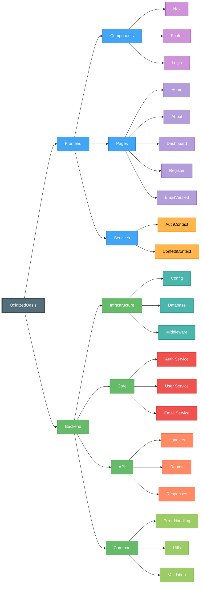

# OxidizedOasis Project Structure

## System Architecture Diagram



## 🌐 Frontend
The frontend is built with Rust + Yew, providing a modern web application interface.

### 🧩 Components
- **Navigation**
  - Main navigation bar
  - Site-wide navigation elements
- **Footer**
  - Site footer component
- **Login**
  - Authentication interface
  - User login forms

### 📄 Pages
- **Core Pages**
  - Home - Landing page
  - About - Project information
  - Register - User registration
  - Email Verified - Confirmation page
- **Dashboard**
  - Main dashboard interface
  - User-specific content

### 🔧 Services
- **Authentication Context**
  - User authentication state
  - Login/logout functionality
- **Confetti Context**
  - Visual feedback system
  - Celebration effects

## 🖥️ Backend
The backend provides robust server-side functionality and API endpoints.

### 🏗️ Infrastructure
- **Configuration**
  - Application settings
  - Environment configuration
- **Database**
  - Data persistence layer
  - Connection management
- **Middleware**
  - Request processing
  - Authentication checks
  - Error handling

### 🎯 Core Services
- **Authentication Service**
  - User authentication
  - Session management
- **User Service**
  - User management
  - Profile handling
- **Email Service**
  - Email notifications
  - Verification system

### 🔌 API Layer
- **Handlers**
  - Request handlers
  - Business logic
- **Routes**
  - API endpoints
  - Request routing
- **Responses**
  - Response formatting
  - Data serialization

### 🛠️ Common Utilities
- **Error Handling**
  - Error types
  - Error processing
- **Utilities**
  - Helper functions
  - Common operations
- **Validation**
  - Input validation
  - Data verification

## 🎨 Styling
```
Frontend
├── Components: #42A5F5
├── Pages: #B39DDB
└── Services: #FFB74D

Backend
├── Infrastructure: #4DB6AC
├── Core: #EF5350
├── API: #FF8A65
└── Common: #9CCC65
```

## 📊 Visual Structure

```
OxidizedOasis
├── 🌐 Frontend
│   ├── 🧩 Components
│   │   ├── Navigation
│   │   ├── Footer
│   │   └── Login
│   │
│   ├── 📄 Pages
│   │   ├── Home
│   │   ├── About
│   │   ├── Register
│   │   ├── Email Verified
│   │   └── Dashboard
│   │       ├── Overview
│   │       ├── Profile
│   │       ├── Settings
│   │       ├── Chat
│   │       └── Admin
│   │           ├── Security Incidents
│   │           ├── System Logs
│   │           └── User Management
│   │
│   └── 🔧 Services
│       ├── Auth Context
│       ├── Confetti Context
│       └── Reset Token Context
│
└── 🖥️ Backend
    ├── 🏗️ Infrastructure
    │   ├── Config
    │   ├── Database
    │   └── Middleware
    │       ├── Auth
    │       ├── CORS
    │       ├── Logger
    │       └── Rate Limit
    │
    ├── 🎯 Core
    │   ├── Auth Service
    │   ├── User Service
    │   └── Email Service
    │
    ├── 🔌 API
    │   ├── Handlers
    │   ├── Routes
    │   └── Responses
    │
    └── 🛠️ Common
        ├── Error Handling
        ├── Utils
        └── Validation
```

This color scheme is used throughout the application to maintain visual consistency and improve code organization.