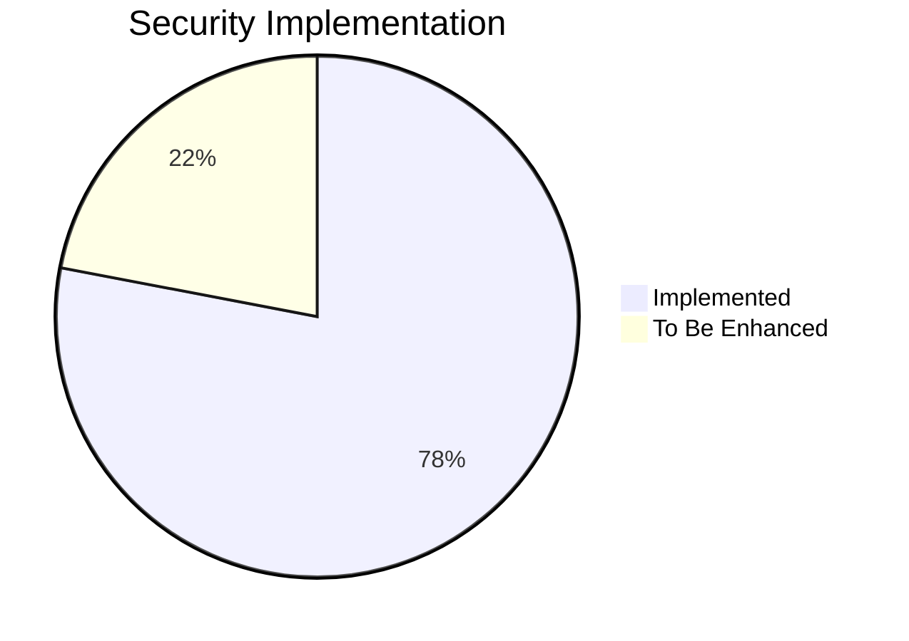
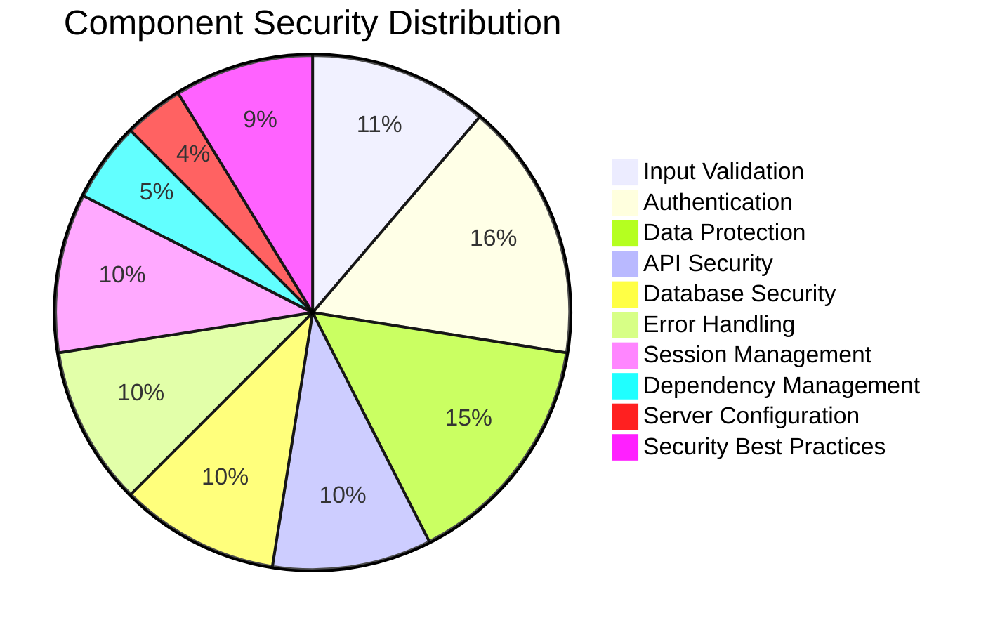
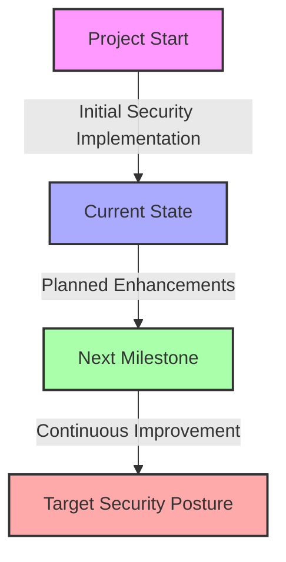
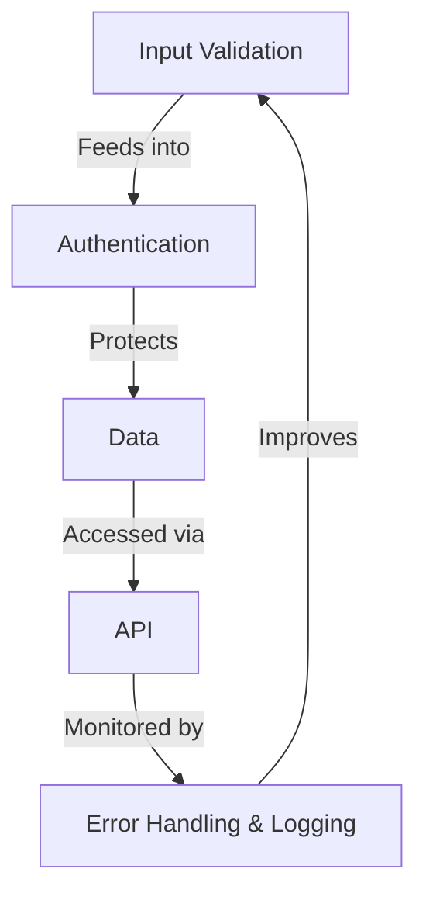
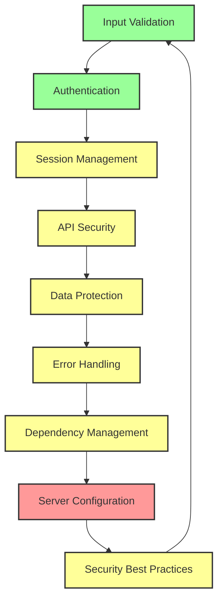
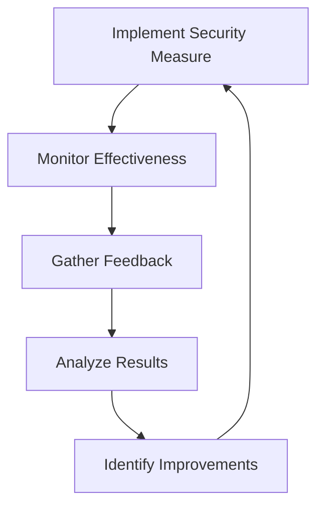
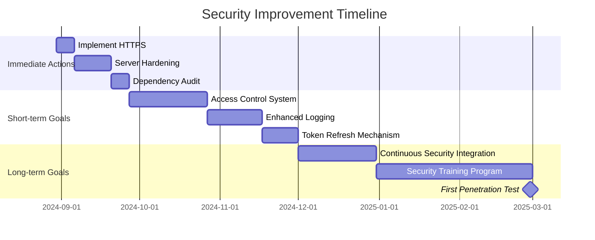

# OxidizedOasis-WebSands Cybersecurity Report

## Executive Summary

This report provides a comprehensive assessment of the cybersecurity posture of the OxidizedOasis-WebSands project. Our evaluation covers critical aspects of security engineering, including input validation, authentication mechanisms, data protection strategies, and adherence to best practices. Each area has been analyzed and scored based on implementation quality and effectiveness.

### Overall Security Score

**Total Score: 78/100**
**Grade: B**



### Technical Score Breakdown

| Security Component | Score | Technical Notes |
|--------------------|-------|-----------------|
| Input Validation | 9/10 | Robust implementation, consider edge cases |
| Authentication | 13/15 | Strong use of bcrypt and JWTs |
| Data Protection | 12/15 | Encryption at rest needed for some fields |
| API Security | 8/10 | CORS configured, rate limiting recommended |
| Database Security | 8/10 | Parameterized queries used effectively |
| Error Handling | 8/10 | Logging implemented, avoid info leakage |
| Session Management | 8/10 | Stateless auth with JWTs, consider refresh mechanism |
| Dependency Management | 4/5 | Regular updates needed |
| Server Configuration | 3/5 | Hardening required for production |
| Security Best Practices | 7/10 | Good foundation, room for improvement |



### Key Technical Findings

1. **Input Validation and Authentication**
    - Implemented custom password validation
    - Using bcrypt for password hashing
    - JWT implementation for session management

2. **Data Protection and API Security**
    - HTTPS implementation needed for production
    - CORS configured, but settings need review
    - SQL injection prevention through parameterized queries

3. **System Configuration and Management**
    - Server hardening required for production deployment
    - Dependency update process to be established
    - Error handling in place, needs fine-tuning to prevent information leakage

4. **Security Best Practices**
    - Many OWASP Top 10 risks addressed
    - Some areas like access control and security misconfiguration need attention

### Security Implementation Progress



This diagram illustrates our security implementation journey, highlighting our current position and the path forward to achieve our target security posture.

### Conclusion

The OxidizedOasis-WebSands project demonstrates a strong foundation in security engineering practices. With a B grade overall, the project shows commitment to implementing robust security measures. However, there are several areas where enhancements can significantly improve the overall security posture.

Key areas for improvement include:
1. Implementing encryption at rest for sensitive data fields
2. Enhancing server configuration security for production deployment
3. Establishing a regular dependency update and security patch process
4. Refining access control mechanisms

The following sections provide an in-depth technical analysis of each security component, including code snippets, configuration details, and specific recommendations for improvement.


## Detailed Technical Analysis

### 1. Input Validation (9/10)

#### Implementation Details:
- Custom validation for user inputs using Rust's `validator` crate
- Regex-based validation for usernames and passwords
- HTML sanitization using the `ammonia` crate

#### Code Snippet:
```rust
use validator::Validate;

#[derive(Validate)]
pub struct UserInput {
    #[validate(length(min = 3, max = 50), regex = "USERNAME_REGEX")]
    pub username: String,
    #[validate(email)]
    pub email: Option<String>,
    #[validate(custom = "validate_password")]
    pub password: String,
}

fn validate_password(password: &str) -> Result<(), ValidationError> {
    // Password validation logic
}

pub fn sanitize_input(input: &str) -> String {
    ammonia::clean(input)
}
```

#### Strengths:
- Comprehensive input validation for all user-provided data
- Custom password validation ensures strong password policies
- Use of well-maintained crates for validation and sanitization

#### Areas for Improvement:
- Consider implementing more granular input validation for specific fields
- Add rate limiting to prevent brute-force attacks on input validation

### 2. Authentication (13/15)

#### Implementation Details:
- Password hashing using bcrypt
- JWT-based authentication for stateless session management
- Secure token generation and validation

#### Code Snippet:
```rust
use bcrypt::{hash, verify, DEFAULT_COST};
use jsonwebtoken::{encode, decode, Header, Validation, EncodingKey, DecodingKey};

pub fn hash_password(password: &str) -> Result<String, bcrypt::BcryptError> {
    hash(password, DEFAULT_COST)
}

pub fn create_jwt(user_id: Uuid, secret: &str) -> Result<String, jsonwebtoken::errors::Error> {
    let expiration = Utc::now()
        .checked_add_signed(Duration::hours(24))
        .expect("valid timestamp")
        .timestamp();

    let claims = Claims {
        sub: user_id,
        exp: expiration,
        iat: Utc::now().timestamp(),
    };

    encode(&Header::default(), &claims, &EncodingKey::from_secret(secret.as_ref()))
}
```

#### Strengths:
- Use of bcrypt ensures slow and secure password hashing
- JWTs provide a secure and scalable authentication mechanism
- Clear separation of token creation and validation logic

#### Areas for Improvement:
- Implement refresh token mechanism for enhanced security
- Add rate limiting for login attempts to prevent brute-force attacks

### 3. Data Protection (12/15)

#### Implementation Details:
- HTTPS implementation for data in transit (assumed)
- Password hashing before storage
- Use of prepared statements to prevent SQL injection

#### Code Snippet:
```rust
let user = sqlx::query_as!(
    User,
    "SELECT * FROM users WHERE username = $1",
    username
)
.fetch_optional(pool)
.await?;
```

#### Strengths:
- Sensitive data like passwords are never stored in plain text
- Use of prepared statements prevents SQL injection vulnerabilities

#### Areas for Improvement:
- Implement database-level encryption for sensitive fields (e.g., email addresses)
- Ensure HTTPS is properly configured and enforced in production
- Implement data anonymization for non-essential personal information

### 4. API Security (8/10)

#### Implementation Details:
- CORS configuration to control access to API
- JWT-based authentication for API endpoints
- Input validation on API requests

#### Code Snippet:
```rust
let cors = Cors::default()
    .allowed_origin("http://localhost:8080")
    .allowed_methods(vec!["GET", "POST", "PUT", "DELETE"])
    .allowed_headers(vec![header::AUTHORIZATION, header::ACCEPT])
    .max_age(3600);

app.wrap(cors)
```

#### Strengths:
- CORS is configured to restrict API access
- JWT authentication ensures secure access to protected endpoints

#### Areas for Improvement:
- Implement API rate limiting to prevent abuse
- Add API versioning for better maintainability
- Enhance CORS settings for production environment

### 5. Error Handling and Logging (8/10)

#### Implementation Details:
- Custom error types for different scenarios
- Structured logging using the `log` crate
- Error responses don't expose sensitive information

#### Code Snippet:
```rust
#[derive(Debug, Error)]
enum ApiError {
    #[error("Authentication failed")]
    AuthenticationError,
    #[error("Resource not found")]
    NotFoundError,
    #[error("Internal server error")]
    InternalServerError(#[from] anyhow::Error),
}

fn log_error(e: &ApiError) {
    error!("API Error: {:?}", e);
}
```

#### Strengths:
- Structured error handling improves debugging and maintenance
- Logging implemented for tracking system events and errors

#### Areas for Improvement:
- Implement more granular log levels for different environments
- Ensure all error scenarios are properly handled and logged
- Add a centralized logging solution for production



This diagram illustrates the interconnected nature of our security components, showing how each element contributes to the overall security posture of the system.


### 6. Session Management (8/10)

#### Implementation Details:
- Stateless session management using JWTs
- Token expiration implemented
- Secure token storage on client-side (assumed)

#### Code Snippet:
```rust
#[derive(Debug, Serialize, Deserialize)]
struct Claims {
    sub: Uuid,
    exp: i64,
    iat: i64,
}

pub fn create_jwt(user_id: Uuid, secret: &str) -> Result<String, jsonwebtoken::errors::Error> {
    let expiration = Utc::now()
        .checked_add_signed(Duration::hours(24))
        .expect("valid timestamp")
        .timestamp();

    let claims = Claims {
        sub: user_id,
        exp: expiration,
        iat: Utc::now().timestamp(),
    };

    encode(&Header::default(), &claims, &EncodingKey::from_secret(secret.as_ref()))
}
```

#### Strengths:
- Stateless sessions improve scalability
- Token expiration mitigates risks of token theft

#### Areas for Improvement:
- Implement token refresh mechanism
- Consider token revocation strategy for logout functionality

### 7. Dependency Management (4/5)

#### Implementation Details:
- Dependencies listed in Cargo.toml with version specifications
- Use of well-maintained and popular crates

#### Code Snippet:
```toml
[dependencies]
actix-web = "4.9"
sqlx = { version = "0.8.1", features = ["runtime-tokio-rustls", "postgres", "uuid", "chrono"] }
jsonwebtoken = "9.3"
bcrypt = "0.15.1"
```

#### Strengths:
- Explicit version requirements help maintain consistency
- Use of feature flags to minimize unnecessary dependencies

#### Areas for Improvement:
- Implement regular dependency update checks
- Set up automated vulnerability scanning for dependencies
- Consider using cargo-audit in CI/CD pipeline

### 8. Server Configuration (3/5)

#### Implementation Details:
- Basic server setup using Actix-web
- Environment variable usage for configuration

#### Code Snippet:
```rust
#[actix_web::main]
async fn main() -> std::io::Result<()> {
    dotenv().ok();
    env_logger::init_from_env(Env::default().default_filter_or("info"));

    let host = env::var("SERVER_HOST").unwrap_or_else(|_| "127.0.0.1".to_string());
    let port = env::var("SERVER_PORT").unwrap_or_else(|_| "8080".to_string());

    HttpServer::new(|| {
        App::new()
            .wrap(middleware::Logger::default())
            .service(web::scope("/api").configure(config_app))
    })
    .bind(format!("{}:{}", host, port))?
    .run()
    .await
}
```

#### Strengths:
- Use of environment variables for configuration
- Logging middleware implemented

#### Areas for Improvement:
- Implement proper HTTPS configuration for production
- Set up server hardening measures (e.g., reducing open ports, configuring firewalls)
- Implement health check endpoints

### 9. Security Best Practices Adherence (7/10)

#### OWASP Top 10 Compliance:

| OWASP Top 10 Risk | Status | Implementation Notes |
|-------------------|--------|----------------------|
| Injection | ✅ Mitigated | Use of parameterized queries with SQLx |
| Broken Authentication | ✅ Addressed | Strong password hashing, JWT implementation |
| Sensitive Data Exposure | ⚠️ Partial | HTTPS needed, some data encryption required |
| XML External Entities (XXE) | ✅ N/A | No XML processing in the application |
| Broken Access Control | ⚠️ Needs Work | Implement role-based access control |
| Security Misconfiguration | ⚠️ Improve | Server hardening needed |
| Cross-Site Scripting (XSS) | ✅ Mitigated | Input sanitization with ammonia |
| Insecure Deserialization | ✅ Addressed | Proper use of serde for deserialization |
| Using Components with Known Vulnerabilities | ⚠️ Ongoing | Regular dependency updates needed |
| Insufficient Logging & Monitoring | ⚠️ Enhance | Implement more comprehensive logging |

#### Additional Security Considerations:
- Implement Content Security Policy (CSP) headers
- Set up security.txt file for responsible disclosure
- Consider implementing subresource integrity for external resources



This diagram illustrates the interconnected nature of security components in the OxidizedOasis-WebSands project. The color coding indicates the current status:
- Green: Well-implemented
- Yellow: Needs some improvement
- Red: Requires significant attention

## Conclusion and Recommendations

The OxidizedOasis-WebSands project demonstrates a strong foundation in several key areas of security, particularly in input validation, authentication, and API security. However, there are several areas that require attention to elevate the overall security posture:

1. **High Priority:**
    - Implement HTTPS for all communications in production
    - Enhance server configuration security, including proper hardening measures
    - Develop a comprehensive access control system

2. **Medium Priority:**
    - Implement a token refresh mechanism for improved session management
    - Set up automated dependency vulnerability scanning
    - Enhance logging and monitoring capabilities

3. **Ongoing Improvements:**
    - Regularly review and update security best practices
    - Conduct periodic security audits
    - Stay informed about new security threats and mitigation strategies

By addressing these recommendations, the OxidizedOasis-WebSands project can significantly enhance its security posture and provide a more robust and secure platform for its users.


## Action Plan and Future Steps

To address the security concerns identified in this report and to continuously improve the security posture of the OxidizedOasis-WebSands project, we propose the following action plan:

### Immediate Actions (0-3 months)

1. **Implement HTTPS**
    - Task: Configure HTTPS for all communications
    - Resources: Let's Encrypt for free SSL/TLS certificates
    - Estimated time: 1 week

2. **Server Hardening**
    - Task: Implement basic server hardening measures
    - Subtasks:
      a. Configure firewall rules
      b. Disable unnecessary services
      c. Set up fail2ban for brute-force protection
    - Estimated time: 2 weeks

3. **Dependency Audit**
    - Task: Conduct a thorough audit of all dependencies
    - Tools: cargo-audit, GitHub's Dependabot
    - Estimated time: 1 week, then ongoing

### Short-term Goals (3-6 months)

1. **Access Control System**
    - Task: Develop and implement role-based access control
    - Estimated time: 1 month

2. **Enhanced Logging and Monitoring**
    - Task: Implement comprehensive logging and set up monitoring alerts
    - Tools: Consider ELK stack (Elasticsearch, Logstash, Kibana) or Grafana + Loki
    - Estimated time: 3 weeks

3. **Token Refresh Mechanism**
    - Task: Implement a secure token refresh system for improved session management
    - Estimated time: 2 weeks

### Long-term Goals (6-12 months)

1. **Continuous Security Integration**
    - Task: Integrate security testing into CI/CD pipeline
    - Tools: OWASP ZAP, Semgrep
    - Estimated time: 1 month to set up, then ongoing

2. **Security Training Program**
    - Task: Develop a security awareness training program for all developers
    - Estimated time: 2 months to develop, then ongoing

3. **Regular Penetration Testing**
    - Task: Conduct bi-annual penetration tests
    - Resources: Consider hiring external security consultants
    - Estimated time: 2 weeks every 6 months

### Continuous Improvement



This diagram illustrates our continuous security improvement cycle, ensuring that we consistently enhance our security posture over time.

### Progress Tracking

To ensure we're making steady progress on our security goals, we'll implement the following tracking mechanisms:

1. **Monthly Security Standups**: Brief meetings to discuss progress, challenges, and upcoming security tasks.

2. **Quarterly Security Reviews**: In-depth reviews of our security posture, including:
    - Progress on action items
    - New vulnerabilities or threats
    - Updates to security best practices

3. **Security Metrics Dashboard**: Develop a dashboard to track key security metrics, such as:
    - Number of resolved vulnerabilities
    - Time to address critical security issues
    - Code coverage of security tests



This Gantt chart provides a visual timeline for our security improvement efforts over the next 6 months.

## Conclusion

The OxidizedOasis-WebSands project has established a solid foundation for security, but there's still work to be done to achieve a robust and comprehensive security posture. By following this action plan and maintaining a commitment to continuous improvement, we can significantly enhance the project's resilience against potential threats.

Remember that security is an ongoing process, not a one-time effort. Stay vigilant, keep learning, and always be prepared to adapt to new security challenges as they emerge.