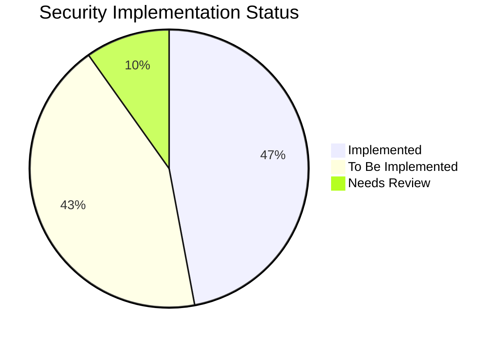

# OxidizedOasis-WebSands Security Backlog

## Legend
✅ Implemented  
🔷 To be implemented  
🔍 Implemented but needs review

## 1. Input Validation and Authentication

### 1.1 Input Validation
- ✅ Implement validation for all user inputs
- ✅ Implement custom validation for passwords
- ✅ Implement input sanitization using ammonia
- ✅ Implement additional validation for email addresses

### 1.2 Authentication
- ✅ Implement bcrypt for password hashing
- ✅ Implement JWT for session management
- ✅ Implement rate limiting for login attempts
- 🔷 Implement multi-factor authentication (MFA) option
- 🔷 Implement account lockout after multiple failed login attempts

### 1.3 Authorization
- ✅ Implement bearer token authentication for protected routes
- ✅ Implement role-based access control (RBAC) for more granular permissions
- 🔷 Implement attribute-based access control (ABAC) for complex authorization scenarios

## 2. Data Protection

- ✅ Implement password hashing before storage
- 🔷 Implement encryption for sensitive data in the database (e.g., email addresses)
- 🔷 Implement data masking for sensitive information in logs and error messages
- 🔷 Implement secure key management for encryption keys

## 3. Network Security

### 3.1 HTTPS
- 🔷 Enforce HTTPS in production
- 🔷 Implement HTTP Strict Transport Security (HSTS)
- 🔷 Implement proper SSL/TLS configuration (e.g., disable outdated protocols)

### 3.2 CORS (Cross-Origin Resource Sharing)
- ✅ Implement CORS configuration
- 🔍 Review and update CORS settings for production environment
- ✅ Implement stricter CORS policies for sensitive endpoints

## 4. Injection Prevention

### 4.1 SQL Injection
- ✅ Use parameterized queries with sqlx
- ✅ Review all database queries to ensure proper parameterization

### 4.2 XSS (Cross-Site Scripting)
- ✅ Implement input sanitization
- ✅ Use ammonia for HTML sanitization
- ✅ Implement Content Security Policy (CSP) headers

### 4.3 CSRF (Cross-Site Request Forgery)
- 🔷 Implement CSRF tokens for state-changing operations
- 🔷 Implement SameSite cookie attribute

## 5. Error Handling and Logging

### 5.1 Error Handling
- ✅ Implement custom error responses
- 🔍 Ensure production errors don't leak sensitive information
- ✅ Implement centralized error handling middleware

### 5.2 Logging
- ✅ Implement logging
- 🔍 Review logging implementation
- 🔍 Ensure sensitive data is not logged in production
- ✅ Implement structured logging for better analysis
- 🔷 Implement log rotation and retention policies

## 6. Dependency Security

- 🔷 Implement regular dependency updates
- 🔷 Implement regular vulnerability checks with `cargo audit`
- 🔷 Implement a process for reviewing and approving dependency updates

## 7. Email Security

- ✅ Implement email verification for new user registrations
- 🔷 Implement re-verification for email changes
- 🔷 Implement SPF, DKIM, and DMARC for email authentication
- ✅ Implement email sending rate limiting

## 8. Password Policies

- ✅ Implement password complexity requirements
- 🔷 Consider implementing password expiration policy
- 🔷 Consider implementing password history policy
- 🔷 Implement secure password reset mechanism

## 9. API Security

- ✅ Implement HTTPS for API (assumed based on server setup)
- ✅ Implement API rate limiting
- 🔷 Implement API versioning
- ✅ Implement proper error responses for API endpoints

## 10. Session Management

- ✅ Implement JWTs for stateless authentication
- 🔷 Implement token revocation mechanism (e.g., a blacklist for logged-out tokens)
- 🔷 Implement token refresh mechanism
- 🔷 Implement session timeout for inactive users

## 11. File Upload Security (Future Implementation)

- 🔷 Implement strict file type checking
- 🔷 Implement file size limits
- 🔷 Implement virus/malware scanning for uploaded files
- 🔷 Implement secure storage for uploaded files

## 12. Server Configuration

- 🔷 Implement proper server hardening in production
- 🔷 Disable unnecessary services
- 🔷 Implement firewall rules
- 🔷 Implement regular security patching process
- 🔷 Implement secure configurations for all server components

## 13. Database Security

- ✅ Apply least privilege principle to database user
- 🔷 Implement database connection encryption
- 🔷 Implement database access auditing
- 🔷 Implement database backup and recovery procedures

## 14. Secrets Management

- ✅ Implement secure management of secrets (e.g., JWT_SECRET)
- ✅ Ensure no hard-coded secrets in the codebase
- 🔷 Implement secret rotation policies
- 🔷 Use a secure secrets management solution (e.g., HashiCorp Vault)

## 15. Monitoring and Incident Response

- ✅ Implement basic error logging
- ✅ Implement security event logging and alerting
- 🔷 Develop an incident response plan
- 🔷 Implement real-time monitoring for suspicious activities

## 16. Compliance and Privacy

- 🔍 Review current data protection measures
- 🔷 Implement data protection measures compliant with relevant regulations (e.g., GDPR, CCPA)
- 🔷 Implement user data export functionality
- 🔷 Implement user data deletion functionality

## 17. Security Testing

- ✅ Implement basic unit tests for security functions
- 🔷 Implement regular penetration testing
- 🔷 Implement automated security scanning in CI/CD pipeline
- 🔷 Implement fuzz testing for input handling functions