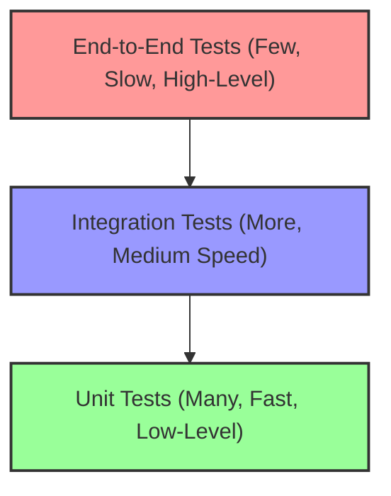

# OxidizedOasis-WebSands: Test Coverage Plan & To-Do List

**Last Updated:** 2025-05-20

## 1. Introduction

### Purpose
This document outlines a comprehensive testing strategy and a detailed to-do list for achieving robust test coverage across the OxidizedOasis-WebSands project. Its aim is to guide the development of a thorough test suite that ensures application stability, prevents regressions, and increases confidence in deployments.

### Goals
*   Ensure application stability and reliability through rigorous testing.
*   Prevent regressions when making changes or adding new features.
*   Increase confidence in the deployment process.
*   Provide a clear, actionable path to a "green" `cargo test` (backend) and a comprehensive frontend test suite.
*   Establish a culture of quality and test-driven development where appropriate.

### Scope
This plan covers:
*   **Unit Tests:** For individual functions, methods, components, and modules in isolation.
*   **Integration Tests:** For interactions between different parts of the application (e.g., service to repository, API handler to service, frontend component to service).
*   **End-to-End (E2E) Tests:** For user scenarios spanning multiple components and layers, from the UI/API down to the database.
*   Considerations for **Non-Functional Testing** (performance, security).

This plan addresses both the backend (Rust/Actix-web) and frontend (Rust/Yew/WebAssembly) parts of the application.

## 2. Current Testing Status

Based on the project structure, the following test files exist:
*   `tests/user_crud_tests.rs`
*   `tests/user_tests.rs`

**Progress & Current State (as of 2025-05-20):**
*   **Dependency Injection Refactoring:** Significant refactoring has been undertaken in the `core/auth` layer (`jwt.rs`, `service.rs`) to replace static global services with dependency injection. This is a crucial step for improving testability and has involved updates to `main.rs`, `core/user/service.rs`, and middleware (`auth.rs`, `admin.rs`) to propagate these dependencies.
*   **`common/validation` Tests:**
    *   `test_validate_password_strength`: Fixed by changing validation logic from unsupported regex to manual checks.
    *   `test_validate_username`: Fixed by adding length validation.
*   **`core/auth/jwt.rs` Tests:** Unit tests within `jwt.rs` have been updated to reflect DI changes (passing mock services).
*   **`core/auth/service.rs` Tests:** Tests have been partially updated for DI. Some mock setup and predicate issues were still present in the last `cargo test` run, leading to compilation errors.
*   **Overall `cargo test` Status:** Still failing due to remaining compilation errors related to the DI refactor and subsequent test updates. The goal of a "green" `cargo test` is in progress.

**Key Gaps (Updated):**
*   Finalizing fixes for `core/auth/service.rs` tests.
*   Addressing remaining compilation errors in `infrastructure/middleware/auth.rs` and `api/handlers/user_handler.rs` related to DI changes.
*   Comprehensive testing for the authentication system (`core/auth`) beyond initial DI refactoring.
*   Middleware testing (`infrastructure/middleware`) once DI changes are stable.
*   Frontend component and service testing.
*   Frontend component and service testing.
*   E2E tests for major user flows.
*   Tests for upcoming drone data and RAG features.

## 3. Overall Testing Strategy

### Testing Pyramid
We will adhere to the principles of the testing pyramid:
*   **Many Unit Tests:** Forming the base, these are fast, isolated, and test small pieces of code.
*   **Fewer Integration Tests:** Testing the interaction points between components. Slower than unit tests but crucial for verifying component collaboration.
*   **Even Fewer E2E Tests:** Testing complete user flows. These are the slowest and most brittle but validate the system as a whole.

### Tools & Frameworks

*   **Backend (Rust):**
    *   **Rust's built-in test framework:** `#[test]` attribute, `assert!`, `assert_eq!`, etc., for unit and integration tests within `src/` or in the `tests/` directory.
    *   **`actix-web::test`:** For testing Actix-web handlers, application services, and middleware.
    *   **`sqlx::test`:** (If using SQLx directly in tests) For database integration tests, allowing tests to run in transactions that are rolled back. Requires a test database.
    *   **Mocking Libraries:** `mockall` or similar for creating mock objects for dependencies in unit tests.
*   **Frontend (Rust/Yew/WebAssembly):**
    *   **`wasm-bindgen-test`:** For writing and running tests that target WebAssembly, executable in a headless browser or Node.js.
    *   **Yew Testing Utilities:** Leverage Yew's capabilities for testing components (e.g., checking rendered output, simulating user events, testing component lifecycle).
    *   **`fantoccini` (Rust WebDriver client):** For more complex browser-based E2E tests if `wasm-bindgen-test` proves insufficient for full user flow simulations.
*   **Code Coverage:**
    *   Tools like `grcov` or `cargo-tarpaulin` will be used to measure test coverage and identify untested code paths. The goal is to progressively increase coverage.

### Test Data Management
*   **Test Factories/Builders:** For creating test entities (e.g., User, DroneMission) with consistent or varied data.
*   **Test Database:** A separate, dedicated test database will be used for integration and E2E tests that require database interaction. This database will be reset or seeded before test runs.
*   **Setup/Teardown:** Test functions or modules will manage their own data setup and cleanup to ensure test isolation. `sqlx::test` can help with transactional cleanup.

### Mocking External Services
*   For unit and some integration tests, external services (Email dispatch, LLM APIs, Object Storage, Vector Databases) will be mocked.
    *   Use traits and dependency injection to allow swapping real implementations with mock implementations during tests.
    *   `mockall` can be used to create these mocks.

## 4. Detailed Test Coverage Plan

### A. Backend (`src/`)

#### `common/` Layer
*   **`error/` (`api_error.rs`, `auth_error.rs`, `db_error.rs`):**
    *   **Unit Tests:**
        *   Verify correct creation of each error variant.
        *   Test `Display` and `Error` trait implementations.
        *   Test conversion logic (e.g., `From<DbError> for ApiError`).
        *   Ensure appropriate HTTP status codes are associated with `ApiError` variants.
*   **`utils/` (`string.rs`, `time.rs`, `validation.rs` - if general utils exist here):**
    *   **Unit Tests:** For each utility function, cover various inputs including edge cases and invalid inputs.
*   **`validation/` (`password.rs`, `user.rs`):**
    *   **Unit Tests:**
        *   For `password.rs`: Test `validate_password` with valid passwords, and various invalid passwords (too short, too long, missing uppercase, missing lowercase, missing number, missing special character).
        *   For `user.rs`: Test validation rules for username, email, and any other user fields with valid and invalid inputs.

#### `infrastructure/` Layer
*   **`config/` (`app_config.rs`):**
    *   **Unit Tests:**
        *   Test loading configuration from environment variables (mocking `std::env::var`).
        *   Test default values if applicable.
        *   Test validation logic within the config struct (e.g., ensuring required fields are present).
*   **`database/` (`connection.rs`, `migrations.rs`):**
    *   **Integration Tests:**
        *   `connection.rs`: Test successful database pool creation with valid test DB credentials. Test connection failure handling.
        *   `migrations.rs`: While migrations are typically run outside `cargo test`, a helper script or manual process should verify that migrations can be applied cleanly to an empty test database.
*   **`middleware/` (`admin.rs`, `auth.rs`, `cors.rs`, `csrf.rs`, `logger.rs`, `rate_limit.rs`):**
    *   **Unit Tests (for each middleware):**
        *   Mock `ServiceRequest` and `Service` (next service in chain).
        *   Test logic for allowing requests to pass through.
        *   Test logic for blocking/modifying requests based on middleware rules (e.g., missing token, invalid token, CSRF mismatch, rate limit exceeded).
        *   Verify correct headers are added/checked.
        *   Verify correct claims are extracted and added to request extensions (for `auth.rs`, `admin.rs`).
    *   **Integration Tests (using `actix-web::test`):**
        *   Set up a minimal Actix test app with the middleware pipeline and a simple handler.
        *   Send test requests to verify:
            *   `cors.rs`: Correct CORS headers are present in responses.
            *   `logger.rs`: Requests are logged (check stdout/stderr or a mock logger).
            *   `auth.rs`/`admin.rs`: Protected routes are inaccessible without valid tokens/roles, and accessible with them.
            *   `csrf.rs`: CSRF protection works as expected (e.g., requests fail without valid CSRF token on protected methods).
            *   `rate_limit.rs`: Rate limiting is enforced correctly for configured paths.

#### `core/` Layer (Business Logic)
*   **`auth/` (`service.rs`, `jwt.rs`, `active_token.rs`, `token_revocation.rs`):**
    *   **Unit Tests:**
        *   `jwt.rs`:
            *   JWT generation: verify claims (sub, exp, iat, nbf, jti, role, token_type, aud, iss), signature.
            *   JWT validation: valid token, expired token, token not yet valid, invalid signature, incorrect token type, missing claims. **(Completed for `src/core/auth/jwt.rs`)**
        *   `service.rs` (mocking `UserRepository`, `ActiveTokenRepository`, `TokenRevocationRepository`, `EmailService`):
            *   Registration logic: password hashing, user creation call, verification token generation, email sending call. **(To Do)**
            *   Login logic: user retrieval, password verification, token pair generation, active token recording. **(Implemented: `test_login_successful`, `test_login_user_not_found`, `test_login_email_not_verified`, `test_login_incorrect_password`, `test_login_user_repo_error` - All PASSING)**
            *   `validate_auth` logic: **(Implemented: `test_validate_auth_successful`, `test_validate_auth_invalid_token_signature`, `test_validate_auth_user_not_found_by_id`, `test_validate_auth_user_email_not_verified` - All PASSING)**
            *   Token refresh logic: refresh token validation, old token revocation, new token pair generation, active token updates. **(Implemented: `test_refresh_token_successful`, `test_refresh_token_invalid_refresh_token` - All PASSING)**
            *   Logout logic: access/refresh token revocation. **(Partially Implemented: `test_logout_successful_with_refresh_token` (PASSING), `test_logout_successful_access_token_only` (BLOCKED by HRTB error with predicate::function), `test_logout_invalid_access_token` (PASSING))**
            *   Password change logic: old password verification, new password hashing, token revocation. **(To Do)**
            *   Email verification logic: token validation, user status update.
            *   Password reset request logic: token generation, email sending.
            *   Password reset verification logic: token validation, setting new password.
        *   `active_token.rs` (if it has its own logic beyond repository calls): Test logic for managing active tokens.
        *   `token_revocation.rs` (if it has its own logic): Test logic for revoking tokens.
    *   **Integration Tests (with a real test database via `sqlx::test`):**
        *   Full user registration flow (verify user in DB, active tokens, verification email (mocked send)).
        *   Login with correct/incorrect credentials (verify tokens issued/not issued).
        *   Token refresh with valid/invalid/revoked refresh tokens.
        *   Logout and verify tokens are revoked in DB.
        *   Password change and verify old tokens are revoked.
        *   Email verification flow.
        *   Password reset flow.
*   **`user/` (`service.rs`, `repository.rs`, `model.rs`):**
    *   **Unit Tests (`service.rs`, mocking `UserRepository`):**
        *   Test business logic for creating users (e.g., checking for existing username/email before calling repo).
        *   Test logic for updating users (e.g., handling partial updates, role changes).
        *   Test logic for deleting users.
        *   Test logic for finding users.
    *   **Integration Tests (`repository.rs` methods, and `service.rs` methods interacting with a real test database):**
        *   `UserRepository`: Test all CRUD methods (create, find_by_id, find_by_email, find_by_username, update, delete, list_users, count_users). Verify data integrity.
        *   `UserService`: Test service methods end-to-end with the database (e.g., `create_user` actually creates a user and returns it).
*   **`email/` (`service.rs`, `templates.rs`):**
    *   **Unit Tests:**
        *   `templates.rs`: Test rendering of each email template with various inputs, ensuring correct content generation.
        *   `service.rs` (mocking actual email dispatch): Test logic for constructing email parameters and calling the (mocked) dispatch mechanism for different email types (verification, password reset, welcome).
*   **(Future) `drone_data_service.rs`:**
    *   **Unit Tests:** Data type identification logic, metadata extraction algorithms, file validation rules, data chunking strategies. Mock object storage interactions.
    *   **Integration Tests:** (with mock object storage and test DB) Test the full data ingestion pipeline: receive file -> validate -> extract metadata -> store file -> store metadata in DB. Test pre-processing steps for RAG (e.g., embedding generation calls - mocked).
*   **(Future) `vector_db_service.rs`:**
    *   **Unit Tests:** Logic for constructing queries for the vector DB, formatting data for indexing. Mock vector DB client.
    *   **Integration Tests:** (with a test instance of the chosen vector DB, e.g., an in-memory version or a local Docker container) Test actual indexing of embeddings and metadata, and test retrieval based on vector similarity and metadata filters.
*   **(Future) `llm_service.rs`:**
    *   **Unit Tests:** Prompt construction logic based on user query and retrieved context. LLM API client interaction (mocked API calls). Parsing and formatting LLM responses.
    *   **Integration Tests:** (with mocked `vector_db_service` and mocked LLM API) Test the flow from receiving a user query to generating a final response after RAG.

#### `api/` Layer (HTTP Interface)
*   **`handlers/` (e.g., `user_handler.rs`, `admin/user_management.rs`, future drone data/chat handlers):**
    *   **Integration Tests (for each handler using `actix-web::test`):**
        *   Set up a test Actix application with routes, middleware, and mocked services (or real services connected to a test DB).
        *   **Success Cases (2xx):**
            *   Valid requests with appropriate payloads/parameters.
            *   Verify correct HTTP status codes.
            *   Verify response body structure and content.
            *   Verify correct service methods were called with expected arguments (if using mocks).
        *   **Client Error Cases (4xx):**
            *   Invalid request payloads (missing fields, wrong types).
            *   Invalid path/query parameters.
            *   Unauthorized requests (missing/invalid JWT, insufficient roles).
            *   Resource not found.
            *   Requests violating business rules (e.g., creating a user with an existing email).
            *   Verify correct HTTP status codes and error response bodies.
        *   **Server Error Cases (5xx):**
            *   Mock service layer methods to return errors.
            *   Verify a generic 500 error response is returned (or specific 5xx if applicable).
*   **`routes/` (e.g., `user_routes.rs`, `admin/mod.rs`):**
    *   Ensure all defined routes are covered by the handler tests.
    *   Test routes with path parameters to ensure correct parsing and usage in handlers.
    *   Test routes with query parameters.
*   **(Future) WebSocket Handlers (`ws_chat_handler.rs`):**
    *   **Integration Tests (using `actix-web::test::TestServer` and a WebSocket client):**
        *   Test WebSocket connection handshake.
        *   Test sending messages from client to server and vice-versa.
        *   Test message broadcasting if applicable.
        *   Test error handling (e.g., invalid messages, connection drops).
        *   Test integration with `llm_service` for processing chat messages.

### B. Frontend (`frontend/src/`)

*   **`services/` (`auth.rs`, `request.rs`, `confetti_context.rs`, `reset_token_context.rs`):**
    *   **Unit Tests (using `wasm-bindgen-test`):**
        *   `auth.rs`: Test `login`, `logout`, `register`, `refresh_token_action`, `fetch_user_info` functions. Mock HTTP requests (via `request.rs` or a mock fetch implementation) and localStorage/cookie interactions. Verify correct state updates in `AuthContext` (mock or observe context changes).
        *   `request.rs`: Test `send_request`, `send_with_retry`, `determine_http_method`. Mock the browser's `fetch` API. Test CSRF token attachment, authorization header, retry logic on 401s.
        *   `*_context.rs`: Test context provider logic, state updates, and any actions dispatched through the context.
*   **`components/` (e.g., `nav.rs`, `footer.rs`, `icons.rs`, `not_found.rs`, modals, buttons, forms):**
    *   **Unit Tests (using `wasm-bindgen-test` and Yew testing utilities):**
        *   For each reusable UI component:
            *   Test rendering with different sets of `Properties`.
            *   Verify conditional rendering logic (e.g., show/hide elements based on props or state).
            *   Test event handling (e.g., `onclick` callbacks are triggered, `oninput` updates state). Use Yew's test utilities to simulate events.
            *   Assert on the rendered HTML structure or specific text content.
*   **`pages/` (e.g., `home.rs`, `login.rs`, `register.rs`, `dashboard/*`, `settings/*`, future data/chat pages):**
    *   **Component Tests (similar to unit tests for components, but for page-level components):**
        *   Test rendering with initial state (e.g., after fetching data from a mocked service).
        *   Test interactions with services (mock service calls) and context providers.
        *   Test form submissions:
            *   Client-side validation messages displayed for invalid input.
            *   Successful submission calls the correct service method.
            *   Error handling on failed submission (e.g., displaying an error message from a mocked service failure).
        *   Test navigation triggered by actions on the page (e.g., after successful login, redirect to dashboard).
*   **`routes.rs` & `lib.rs` (App Structure & Routing):**
    *   **Frontend Integration Tests (using `wasm-bindgen-test`):**
        *   Test client-side routing logic: ensure correct page components are rendered for different URL paths.
        *   Test protected routes: verify redirection to login page if not authenticated, and access if authenticated.
        *   Test "Not Found" route.

### C. End-to-End (E2E) Tests
*   **Tooling:** Primarily `fantoccini` (Rust WebDriver client) for browser automation, or alternatively Playwright/Cypress if more advanced features or cross-browser capabilities are needed.
*   **Scenarios:**
    1.  **User Authentication Flow:**
        *   Navigate to registration page -> fill form -> submit -> check for success message/email verification step.
        *   (If email verification is mocked/bypassed for E2E) Navigate to login -> enter credentials -> submit -> verify successful login (e.g., redirected to dashboard, username displayed in nav).
        *   Navigate to profile page -> verify user details.
        *   Perform logout -> verify redirection to login page.
    2.  **Password Reset Flow:**
        *   Navigate to password reset request page -> enter email -> submit -> check for confirmation.
        *   (If email is mocked) Use reset link/token from mock -> navigate to new password page -> set new password -> submit -> verify success.
        *   Login with the new password.
    3.  **Admin User Management Flow:**
        *   Login as an admin user.
        *   Navigate to the user management section of the dashboard.
        *   Create a new test user. Verify the user appears in the list.
        *   Inspect the newly created user. Verify details are displayed correctly.
        *   Edit the new user's details (e.g., change role or username). Verify changes are reflected.
        *   Delete the new user. Verify the user is removed from the list.
    4.  **User Settings Flow (Basic):**
        *   Login as a standard user.
        *   Navigate to the settings page.
        *   Update profile information (e.g., username, if editable by user). Verify changes persist after saving and page refresh.
        *   Test notification/appearance preference toggles (verify UI state changes, and if backend is ready, verify persistence).
    5.  **(Future) Drone Data Upload Flow:**
        *   Login as a user.
        *   Navigate to the data upload page/section.
        *   Select and upload a sample drone data file (e.g., a small image or text file representing metadata).
        *   Verify the file appears in the user's data list with correct metadata (mock backend processing if full pipeline isn't ready).
    6.  **(Future) Basic Chat Interaction Flow:**
        *   Login as a user.
        *   Ensure some (mocked/seeded) drone data is associated with the user.
        *   Navigate to the chat page.
        *   Send a message related to the drone data.
        *   Verify a response (potentially a mocked LLM response initially) is displayed in the chat interface.

### D. Non-Functional Testing Considerations
*   **Performance Testing:**
    *   **Backend:** Use tools like `k6`, `oha`, or `wrk` to load test key API endpoints (login, data upload, chat message POSTs). Measure response times, requests per second, error rates under load.
    *   **Frontend:** Use browser developer tools to measure WebAssembly load time, First Contentful Paint (FCP), Largest Contentful Paint (LCP), and interaction responsiveness for complex pages.
*   **Security Testing:**
    *   Regularly run `cargo audit` for backend dependency vulnerabilities.
    *   Use browser extensions or tools for basic frontend security checks (e.g., ZAP, Burp Suite Community for manual checks).
    *   Perform manual reviews of authentication and authorization logic for potential flaws.
    *   Consider static analysis security testing (SAST) tools if budget allows.
*   **Usability Testing:** (Manual) Periodically gather feedback from representative users on the ease of use, clarity of the UI, and overall user experience.
*   **Accessibility Testing:** (Manual & Automated) Use tools like Axe DevTools and manual checks (keyboard navigation, screen reader compatibility) to ensure the application is accessible.

## 5. Test Implementation To-Do List (Prioritized)

1.  **Priority 1: Core Backend Authentication & User Management Tests**
    *   Target: `src/core/auth/`, `src/core/user/`.
    *   Type: Unit and Integration tests.
    *   Focus: JWT logic, registration, login, password management, user CRUD.
    *   API Handler Tests: For `/api/users/*`, `/api/auth/*`, `/api/admin/users/*`.
2.  **Priority 2: Foundational Backend Components Tests**
    *   Target: `src/common/` (validation, errors, utils), `src/infrastructure/middleware/`.
    *   Type: Unit and Integration tests.
3.  **Priority 3: Core Frontend Authentication & Navigation Tests**
    *   Target: `frontend/src/services/auth.rs`, `request.rs`. Login, Register, Nav components.
    *   Type: Unit tests for services, Component tests.
    *   Focus: Basic client-side routing and auth state management.
4.  **Priority 4: Critical E2E Flows**
    *   Target: User Registration, Login, Logout, Password Reset. Admin User CRUD.
    *   Type: E2E tests.
5.  **Priority 5: Backend for Drone Data & RAG (Implement as features are built)**
    *   Target: `drone_data_service`, `llm_service`, `vector_db_service`, new APIs.
    *   Type: Unit and Integration tests.
6.  **Priority 6: Frontend for Drone Data & RAG (Implement as features are built)**
    *   Target: New data and chat pages/components in `frontend/src/pages/dashboard/`.
    *   Type: Component tests.
7.  **Priority 7: Expand E2E tests to cover new Drone Data and Chat flows.**
8.  **Priority 8: Introduce Non-functional tests (Performance, basic Security scans).**

## 6. Running Tests

*   **Backend:**
    *   Run all tests: `cargo test`
    *   Run tests for a specific package: `cargo test -p <package_name>`
    *   Run tests for a specific module: `cargo test my_module::`
    *   Run a specific test function: `cargo test my_test_function_name`
    *   **Test Database Setup:** Document procedure for initializing and resetting the test database (e.g., using `sqlx-cli` with specific test migration scripts or a Dockerized test DB).
*   **Frontend:**
    *   Run tests: `wasm-pack test --headless --firefox --chrome` (or as configured in `Cargo.toml` for `wasm-bindgen-test`).
    *   Ensure `chromedriver` and `geckodriver` are in PATH for headless browser tests.
*   **E2E Tests (if using `fantoccini` or similar):**
    *   Document setup (WebDriver server, browser drivers).
    *   Command to run E2E test suite.

## 7. Continuous Integration (CI)

*   **Setup:** Integrate test execution into the CI/CD pipeline (e.g., GitHub Actions workflow).
*   **Workflow:**
    1.  On every push/pull request:
        *   Run `cargo fmt --check`.
        *   Run `cargo clippy -- -D warnings`.
        *   Run `cargo audit`.
        *   Run `cargo test` (backend tests).
        *   Run frontend tests (`wasm-pack test ...`).
        *   (Optionally) Build Docker images.
    2.  Fail the CI build if any of these steps fail.
*   **Coverage Reporting:** Integrate code coverage tools (e.g., `cargo-tarpaulin` + Codecov/Coveralls) to track coverage trends.

This comprehensive plan aims to establish a robust testing culture and infrastructure for the OxidizedOasis-WebSands project.
