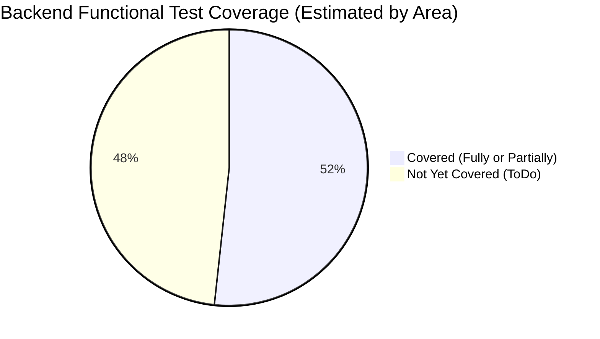

# OxidizedOasis-WebSands: Test Coverage Summary & Analysis

**Report Date:** 2025-05-22

## 1. Introduction

This document provides an analysis of the current test coverage for the OxidizedOasis-WebSands backend. It catalogues testable areas based on the project's `docs/test_coverage_and_todo.md` document, compares this to the currently implemented and passing tests, and provides an estimated functional coverage score.

**Note:** This analysis focuses on backend unit and integration tests identifiable from the project structure and test plan. It does not include frontend tests or E2E tests unless specified. Line/branch code coverage requires dedicated tools like `cargo-tarpaulin`.

## 2. Overall Test Execution Summary (from `cargo test`)

*   **Total Tests Executed (from last full `cargo test` run):** 163
*   **Passed:** 163
*   **Failed:** 0
*   **Ignored:** 0

This indicates all existing `#[test]` functions in the backend are passing.

## 3. Catalogue of Testable Backend Areas & Current Status

The following catalogue is derived from the "Detailed Test Coverage Plan" (Section 4.A Backend) in `docs/test_coverage_and_todo.md`. Each item represents a module or a significant group of functionalities planned for testing.

| # | Layer          | Module/Component                      | Planned Test Type(s) | Status (Unit/Integrated) | Notes                                                                 |
|---|----------------|---------------------------------------|----------------------|--------------------------|-----------------------------------------------------------------------|
| 1 | `common/`      | `error/` (all error files)            | Unit                 | ✅ Implemented           | Error creation, Display, conversions, status codes.                   |
| 2 | `common/`      | `utils/` (all utility files)          | Unit                 | ✅ Implemented           | All utility functions tested with various cases.                      |
| 3 | `common/`      | `validation/` (all validation files)  | Unit                 | ✅ Implemented           | Password rules, user input validation (login, register, etc.).        |
| 4 | `infrastructure/`| `config/app_config.rs`                | Unit                 | ✅ Implemented           | Config loading from env, defaults.                                    |
| 5 | `infrastructure/`| `database/connection.rs`            | Integration          | ❌ ToDo                  | Database pool creation, failure handling.                             |
| 6 | `infrastructure/`| `middleware/admin.rs`                 | Unit & Integration   | 🟡 Partially Implemented | Validator unit tests exist. Pipeline integration ToDo.                |
| 7 | `infrastructure/`| `middleware/auth.rs`                  | Unit & Integration   | 🟡 Partially Implemented | Validator unit tests exist. Pipeline integration ToDo.                |
| 8 | `infrastructure/`| `middleware/cors.rs`                  | Integration          | ❌ ToDo                  |                                                                       |
| 9 | `infrastructure/`| `middleware/csrf.rs`                  | Unit & Integration   | ❌ ToDo                  |                                                                       |
| 10| `infrastructure/`| `middleware/logger.rs`                | Integration          | ✅ Implemented           | Request logging tested.                                               |
| 11| `infrastructure/`| `middleware/rate_limit.rs`            | Unit & Integration   | ❌ ToDo                  |                                                                       |
| 12| `core/`        | `auth/jwt.rs`                         | Unit                 | ✅ Implemented           | JWT generation, validation, claims.                                   |
| 13| `core/`        | `auth/service.rs` - Registration      | Unit                 | ❌ ToDo                  | Tests commented out due to lifetime errors.                           |
| 14| `core/`        | `auth/service.rs` - Login             | Unit                 | ✅ Implemented           | All scenarios for active tests passing.                               |
| 15| `core/`        | `auth/service.rs` - Validate Auth     | Unit                 | ✅ Implemented           | All scenarios for active tests passing.                               |
| 16| `core/`        | `auth/service.rs` - Token Refresh     | Unit                 | ✅ Implemented           | All scenarios for active tests passing.                               |
| 17| `core/`        | `auth/service.rs` - Logout            | Unit                 | ✅ Implemented           | All scenarios for active tests passing.                               |
| 18| `core/`        | `auth/service.rs` - Password Change   | Unit                 | 🟡 Partially Implemented | One error case fixed; success & other errors ToDo (commented out).    |
| 19| `core/`        | `auth/service.rs` - Email Verification| Unit                 | ❌ ToDo                  | Tests commented out due to lifetime errors.                           |
| 20| `core/`        | `auth/service.rs` - Pwd Reset Request | Unit                 | 🟡 Partially Implemented | Error cases passing; success path ToDo (commented out).               |
| 21| `core/`        | `auth/service.rs` - Pwd Reset Verify  | Unit                 | ✅ Implemented           | All scenarios for active tests passing.                               |
| 22| `core/`        | `auth/service.rs` - Pwd Reset Actual  | Unit                 | ✅ Implemented           | All scenarios for active tests passing.                               |
| 23| `core/`        | `auth/active_token.rs`                | Unit                 | ❌ ToDo                  | If specific logic beyond repo calls exists.                           |
| 24| `core/`        | `auth/token_revocation.rs`            | Unit                 | ❌ ToDo                  | If specific logic beyond repo calls exists.                           |
| 25| `core/`        | `user/service.rs`                     | Unit                 | ✅ Implemented           | Most business logic scenarios covered by existing tests.              |
| 26| `core/`        | `user/repository.rs`                  | Integration          | ❌ ToDo                  | CRUD methods and finders need dedicated integration tests.            |
| 27| `core/`        | `email/templates.rs`                  | Unit                 | ❌ ToDo                  | Template rendering tests.                                             |
| 28| `core/`        | `email/service.rs`                    | Unit                 | ❌ ToDo                  | Email construction logic (mocking dispatch).                          |
| 29| `api/`         | `handlers/` (all handlers)            | Integration          | ❌ ToDo                  | Endpoint testing (success, client/server errors).                     |

**Legend:**
*   ✅ **Implemented:** All or most planned unit/integration tests for this area are in place and passing.
*   🟡 **Partially Implemented:** Some tests exist and are passing, but significant gaps remain or major scenarios are ToDo.
*   ❌ **ToDo:** Planned tests for this area have not yet been implemented or are largely non-functional.

**Summary of Catalogued Areas:**
*   **Total Catalogued Testable Areas/Major Function Groups:** 29
*   **Fully Implemented (✅):** 13
*   **Partially Implemented (🟡):** 4
*   **ToDo (❌):** 12

## 4. Estimated Functional Coverage Score

This score is an estimation of how many of the planned backend testable areas (as defined in `docs/test_coverage_and_todo.md`) have at least some passing test coverage.
*   Fully Implemented areas count as 1 point.
*   Partially Implemented areas count as 0.5 points.
*   ToDo areas count as 0 points.

*   **Implemented Score:** (13 * 1) + (4 * 0.5) = 13 + 2 = 15
*   **Total Possible Score (based on catalogued areas):** 29

**Estimated Functional Coverage:** (15 / 29) * 100% = **~51.72%**

## 5. Test Coverage Progress Visualization



## 6. Detailed Line/Branch Coverage (Requires Tooling)

The summary above is based on the functional areas outlined in the project's test plan. For precise line/branch code coverage percentages (i.e., how many lines of actual code are executed by tests), specialized tools like `cargo-tarpaulin` or `grcov` are required.

**Example (Hypothetical Output from `cargo-tarpaulin`):**
```
May 22 14:50:12.673 INFO cargo_tarpaulin::reporter: Coverage Results:
|| Uncovered Lines:
|| src/core/auth/service.rs: 950, 951, 952, ...
|| src/core/user/repository.rs: 50-150
|| Tested/Total Lines:
|| src/common/error/api_error.rs: 50/50
|| ...
|| Overall Coverage:
|| lines: 65.2%, functions: 70.1%, branches: 55.9% (these are example values)
```
*(Actual tarpaulin output would be much more detailed and provide exact figures.)*

## 7. Recommendations & Next Steps

*   **Prioritize `ToDo` (❌) Areas:** Focus on implementing tests for areas marked with ❌, particularly:
    *   Integration tests for `infrastructure/database/connection.rs`.
    *   Remaining middleware tests (`cors.rs`, `csrf.rs`, `rate_limit.rs`).
    *   The commented-out tests in `core/auth/service.rs` (requires resolving lifetime errors for registration and email verification).
    *   Integration tests for `core/user/repository.rs`.
    *   Unit tests for `core/email/`.
    *   Comprehensive integration tests for all `api/handlers/`.
*   **Complete `Partially Implemented` (🟡) Areas:**
    *   Finish all test cases for `infrastructure/middleware/admin.rs` and `auth.rs` (pipeline integration).
    *   Address remaining scenarios for `core/auth/service.rs` (Password Change, Password Reset Request success paths).
*   **Integrate Code Coverage Tool:** Add `cargo-tarpaulin` or `grcov` to the CI pipeline to get precise line/branch coverage metrics. This will help identify specific untested code paths even within modules currently marked as "Implemented".
*   **Frontend Testing:** Begin implementing the frontend testing plan outlined in `docs/test_coverage_and_todo.md`.
*   **E2E Tests:** Start developing E2E tests for critical user flows.

By systematically addressing these areas, the project can significantly improve its test coverage, leading to higher code quality and application stability.
