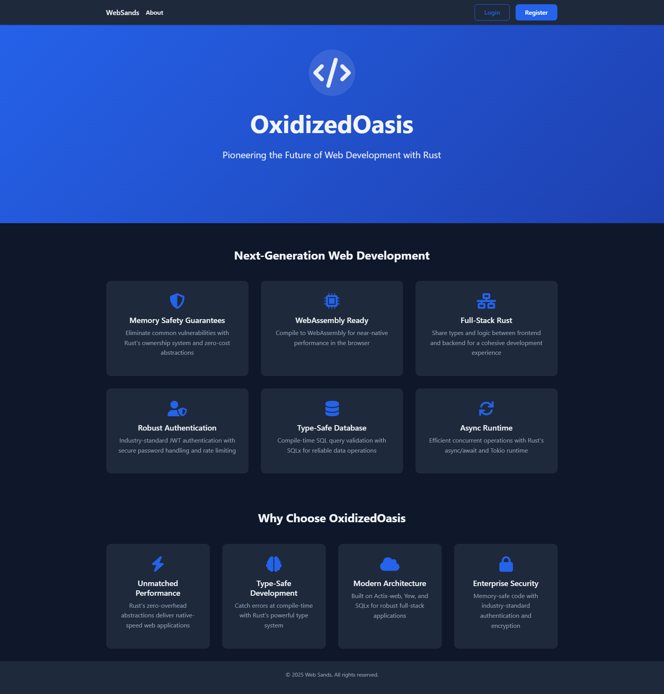
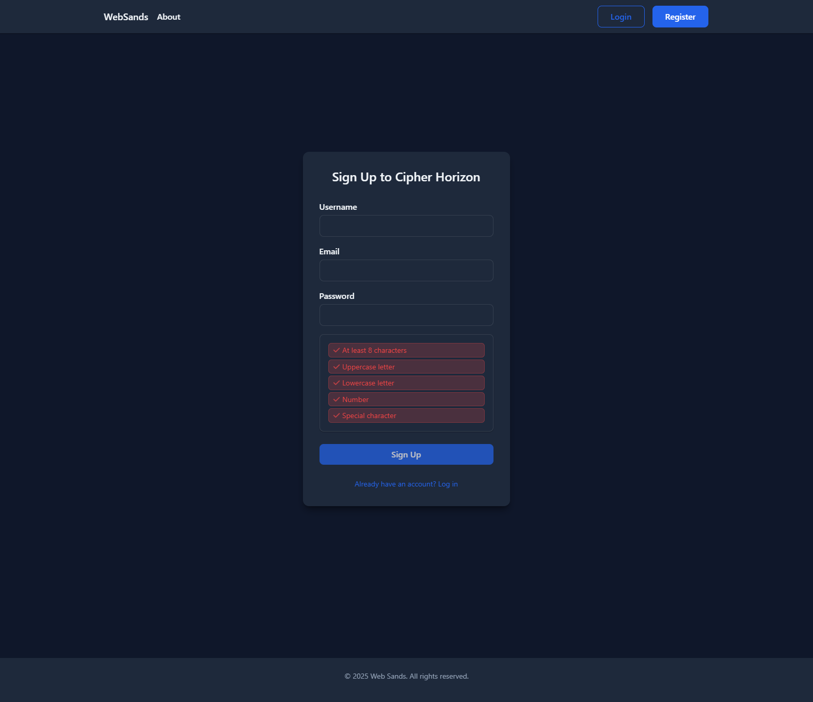
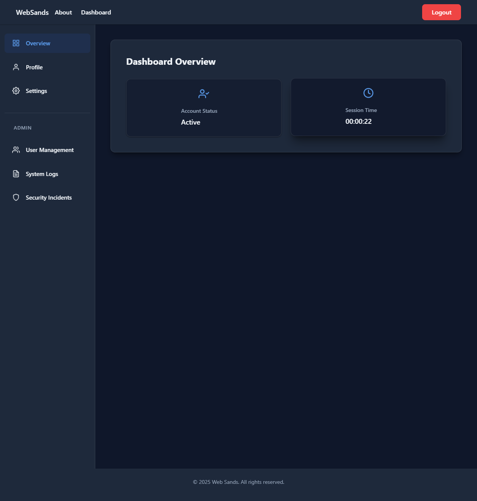

# OxidizedOasis-WebSands

OxidizedOasis-WebSands is a robust, high-performance web application built with Rust, focusing on efficient user management and authentication. 

<p align="center">
    
    <br></br>
    
    <br></br>
    
    <br></br>
    
    <br></br>
    
    <br></br>
    
    <br></br>
    
    <br></br>
    
    <br></br>
    
    <br></br>
    
    <br></br>
    
    <br></br>
</p>

## 🌟 About This Project

OxidizedOasis-WebSands is designed to provide a solid foundation for building scalable web applications with strong security features. Our goal is to showcase the capabilities of Rust in creating high-performance, secure web services while maintaining excellent developer ergonomics.
This project demonstrates the power of Rust in full-stack web development, utilizing the Actix-web framework for the backend and Yew for a dynamic frontend.

## 📚 Documentation

Comprehensive documentation for OxidizedOasis-WebSands is available to help developers, administrators, and users understand and work with the system effectively:

- [Software Development Document](docs/Software_Development_Document.md): Detailed technical specifications, architecture overview, and development guidelines.
- [Security Audit Report](docs/Security_Audit.md): In-depth analysis of the project's security measures and recommendations for improvement.
- [Security Backlog](docs/Security_Backlog.md): Ongoing security tasks and improvements planned for the project.
- [User Guide](docs/User_Guide.md): Guide for end-users on how to use the application.
- [Project Structure](docs/Project_Structure.md): Overview of the project's directory structure and file organization.
- [Logging Plan](docs/Logging_Plan.md): Detailed plan for implementing comprehensive logging in the project.
- [Testing Backlog](docs/Testing_Backlog.md): List of tests to be implemented as part of the test-driven development approach.

## ✨ Key Features

- 🔒 Advanced user authentication system with JWT (JSON Web Tokens)
- ✉️ Secure user registration with email verification
- 🔑 Secure password reset with time-limited tokens and email verification
- 🔐 Password hashing using bcrypt for enhanced security
- 🚀 High-performance database operations with SQLx and PostgreSQL
- 🛡️ Cross-Site Scripting (XSS) protection with input sanitization
- 🌐 Cross-Origin Resource Sharing (CORS) configuration for API security
- 🔍 Comprehensive input validation and error handling
- 📊 Efficient CRUD operations for user management
- 🎨 Modern, responsive frontend with Yew framework
- 📱 Mobile-friendly design for seamless user experience across devices
- 🔧 Easily extensible architecture for adding new features
- 🔄 Database migrations for easy schema management and updates
- 🧪 Test-driven development approach for improved code quality and reliability
- 🎯 BEM methodology CSS architecture for maintainable styling
- ⚡ Performance-optimized CSS with critical path rendering
- 🔄 Lazy loading for non-critical styles
- 📦 Minimized render-blocking CSS
- 💾 Browser caching optimization for styles

## 🔐 JWT Authentication System

OxidizedOasis-WebSands implements a comprehensive JWT-based authentication system with the following features:
- 🔑 Secure token generation with configurable expiration times
- 🚫 Token revocation system to immediately invalidate compromised tokens
- 📊 Active token tracking for monitoring user sessions across devices
- 🔄 Automatic token refresh mechanism to maintain seamless user experience
- 🔍 Token validation with signature verification and expiration checks
- 🔒 Role-based access control integrated with JWT claims

## 🛠️ Technology Stack

- **Backend**:
    - [Rust](https://www.rust-lang.org/) - A language empowering everyone to build reliable and efficient software
    - [Actix-web](https://actix.rs/) - A powerful, pragmatic, and extremely fast web framework for Rust
    - [SQLx](https://github.com/launchbadge/sqlx) - The Rust SQL Toolkit
    - [jsonwebtoken](https://github.com/Keats/jsonwebtoken) - JWT implementation in Rust
    - [bcrypt](https://docs.rs/bcrypt/latest/bcrypt/) - Easily hash and verify passwords using bcrypt

- **Frontend**:
    - [Yew](https://yew.rs/) - A modern web framework for creating multi-threaded frontend apps with WebAssembly
    - [Trunk](https://trunkrs.dev/) - Build, bundle & ship your Rust WASM application to the web
    - **CSS Architecture**:
        - BEM Methodology for scalable and maintainable CSS
        - Critical CSS optimization for above-the-fold content
        - Lazy loading strategies for non-critical styles
        - Performance-focused style organization
        - Browser cache optimization

- **Database**:
    - [PostgreSQL](https://www.postgresql.org/) - The World's Most Advanced Open Source Relational Database

- **Development & Deployment**:
    - [Docker](https://www.docker.com/) - For containerization and easy deployment
    - [GitHub Actions](https://github.com/features/actions) - For CI/CD pipelines

## 🚀 Getting Started

### Prerequisites

Before you begin, ensure you have the following installed:
- [Rust](https://www.rust-lang.org/tools/install) (latest stable version)
- [PostgreSQL](https://www.postgresql.org/download/) (version 13 or later)
- [Docker](https://docs.docker.com/get-docker/) (optional, for containerized deployment)
- [Trunk](https://trunkrs.dev/) (`cargo install trunk`)
- [wasm32-unknown-unknown target](https://rustwasm.github.io/docs/book/game-of-life/setup.html) (`rustup target add wasm32-unknown-unknown`)

### Installation

1. Clone the repository:
   ```sh
   git clone https://github.com/danbiocchi/oxidizedoasis-websands.git
   cd oxidizedoasis-websands
   ```

2. Set up the environment variables:
   Create two files in the project root: `.env` for development and `.env.test` for testing.

   `.env` file content:
   ```
   # Environment Configuration
    ENVIRONMENT=development
    PRODUCTION_URL=https://yourdomain.com
    DEVELOPMENT_URL=http://localhost:8080
    RUN_MIGRATIONS=true
    
    # Application Information
    APP_NAME=OxidizedOasis
    APP_VERSION=0.1.0
    APP_DOMAIN=yourdomain.com
    
    # Server Configuration
    SERVER_HOST=127.0.0.1
    SERVER_PORT=8080
    
    # Database Configuration
    DB_NAME=oxidizedoasis_db
    DB_HOST=localhost
    DB_USER=your_db_user
    DB_PASSWORD=your_db_password
    DATABASE_URL=postgres://${DB_USER}:${DB_PASSWORD}@${DB_HOST}/${DB_NAME}
    
    # Superuser Database Configuration
    SU_DB_USER=your_su_db_user
    SU_DB_PASSWORD=your_su_db_password
    SU_DATABASE_URL=postgres://${SU_DB_USER}:${SU_DB_PASSWORD}@${DB_HOST}/${DB_NAME}
    
    # JWT Configuration
    JWT_SECRET=your_jwt_secret_key
    
    # JWT Token Settings
    JWT_EXPIRATION_HOURS=24
    JWT_REFRESH_EXPIRATION_DAYS=7
    
    # Email Configuration
    SMTP_USERNAME=your_smtp_username
    SMTP_PASSWORD=your_smtp_password
    SMTP_SERVER=your_smtp_server
    FROM_EMAIL=noreply@yourdomain.com
    SUPPORT_EMAIL=support@yourdomain.com
    EMAIL_FROM_NAME="${APP_NAME} Support"
    EMAIL_VERIFICATION_SUBJECT="Verify Your ${APP_NAME} Account"
    EMAIL_PASSWORD_RESET_SUBJECT="Reset Your ${APP_NAME} Password"
    
    # Logging Configuration
    RUST_LOG=debug
    
    # Additional configurations...
   ```

   `.env.test` file content:
   ```
    # Test Environment Configuration
    ENVIRONMENT=development
    PRODUCTION_URL=https://yourdomain.com
    DEVELOPMENT_URL=http://localhost:8080
    RUN_MIGRATIONS=true
    
    # Test Application Information
    TEST_APP_NAME=OxidizedOasis-Test
    TEST_APP_VERSION=0.1.0
    TEST_APP_DOMAIN=yourdomain.com
    
    # Test Server Configuration
    TEST_SERVER_HOST=127.0.0.1
    TEST_SERVER_PORT=8080
    
    # Test Database Configuration
    TEST_DB_NAME=test_oxidizedoasis_db
    TEST_DB_HOST=localhost
    TEST_DB_USER=your_test_db_user
    TEST_DB_PASSWORD=your_test_db_password
    TEST_DATABASE_URL=postgres://${TEST_DB_USER}:${TEST_DB_PASSWORD}@${TEST_DB_HOST}/${TEST_DB_NAME}
    
    # Test Superuser Database Configuration
    TEST_DB_SUPERUSER=your_test_su_db_user
    TEST_DB_SUPERUSER_PASSWORD=your_test_su_db_password
    TEST_SU_DATABASE_URL=postgres://${TEST_DB_SUPERUSER}:${TEST_DB_SUPERUSER_PASSWORD}@${TEST_DB_HOST}/${TEST_DB_NAME}
    
    # Test JWT Configuration
    TEST_JWT_SECRET=your_test_jwt_secret_key
    
    # Test JWT Token Settings
    TEST_JWT_EXPIRATION_HOURS=24
    TEST_JWT_REFRESH_EXPIRATION_DAYS=7
    
    # Test Email Configuration
    TEST_SMTP_USERNAME=your_test_smtp_username
    TEST_SMTP_PASSWORD=your_test_smtp_password
    TEST_SMTP_SERVER=your_test_smtp_server
    TEST_FROM_EMAIL=test_noreply@yourdomain.com
    TEST_SUPPORT_EMAIL=test_support@yourdomain.com
    TEST_EMAIL_FROM_NAME="${TEST_APP_NAME} Support"
    TEST_EMAIL_VERIFICATION_SUBJECT="Verify Your ${TEST_APP_NAME} Account"
    TEST_EMAIL_PASSWORD_RESET_SUBJECT="Reset Your ${TEST_APP_NAME} Password"
    
    # Logging Configuration
    RUST_LOG=debug
    
    # Additional test configurations...
   ```
   Replace both files placeholders(.env and .env.test) with your actual database, SMTP, and other credentials.

3. Set up the database:
   ```sh
   # On Windows, run the PowerShell script to set up the database
   .\setup-database.ps1
   ```
   This script will:
   - Check if PostgreSQL is installed
   - Create the database if it doesn't exist
   - Set up proper permissions for both superuser and application user
   - Run all necessary database migrations

4. Build and run the application:
   ```sh
   # On Windows, use the batch script to build frontend and run the application
   .\build.bat
   ```
   This script will:
   - Build the frontend using Trunk
   - Run the backend server

   Alternatively, you can run these steps manually:
   ```sh
   # Build frontend
   cd frontend
   trunk build
   cd ..

   # Build and run backend
   cargo run
   ```

5. Visit `http://localhost:8080` in your browser to access the application.

## 🔧 Configuration

Refer to the [Software Development Document](docs/Software_Development_Document.md) for detailed configuration instructions and environment variable descriptions.

## 📚 Usage

Refer to the [User Guide](docs/User_Guide.md) for detailed information on how to use the application.

## 🧪 Testing

We follow a test-driven development (TDD) approach. To run the tests:

```sh
cargo test
```

For more information on our testing strategy and backlog, refer to the [Testing Backlog](docs/Testing_Backlog.md).

## 🚢 Deployment

Refer to the [Software Development Document](docs/Software_Development_Document.md) for detailed deployment instructions.

## 🤝 Contributing

Contributions are what make the open-source community such an amazing place to learn, inspire, and create. Any contributions you make are **greatly appreciated**.

1. Fork the Project
2. Create your Feature Branch (`git checkout -b feature/AmazingFeature`)
3. Commit your Changes (`git commit -m 'Add some AmazingFeature'`)
4. Push to the Branch (`git push origin feature/AmazingFeature`)
5. Open a Pull Request

Please make sure to update tests as appropriate and adhere to the [Rust Code of Conduct](https://www.rust-lang.org/policies/code-of-conduct).

## 📬 Contact

Daniel Biocchi

Project Link: [https://github.com/danbiocchi/oxidizedoasis-websands](https://github.com/danbiocchi/oxidizedoasis-websands)

## 🙏 Acknowledgements

- [Rust](https://www.rust-lang.org/)
- [Actix-web](https://actix.rs/)
- [Yew](https://yew.rs/)
- [SQLx](https://github.com/launchbadge/sqlx)
- [PostgreSQL](https://www.postgresql.org/)
- [JSON Web Tokens](https://jwt.io/)
- [bcrypt](https://en.wikipedia.org/wiki/Bcrypt)
- Diablo 2

---

<p align="center">
  Made in 🟥 🍁 🟥 with ❤️ by the OxidizedOasis-WebSands Team
</p>
